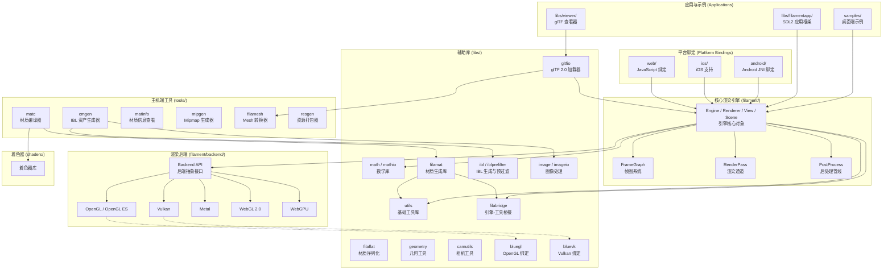
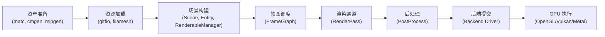

# Filament 项目总览

## 1. 模块名称和概述

**Filament** 是由 Google 开发的开源实时物理渲染 (Physically Based Rendering, PBR) 引擎，支持
Android、iOS、Linux、macOS、Windows 和 WebGL 平台。项目以高效、轻量为设计目标，尤其针对移动端
（Android）做了深度优化。

Filament 采用 C++ 编写核心代码，同时提供 Java/JNI（Android）和 JavaScript（Web）绑定。项目使用
CMake 构建系统，顶层 CMake 项目名为 `TNT`。

**核心特点：**
- 基于物理的渲染（PBR），采用 Cook-Torrance 微表面 BRDF
- 聚类前向渲染器（Clustered Forward Renderer）
- 多图形后端：OpenGL、Vulkan、Metal、WebGL、WebGPU
- 完善的材质系统，支持运行时材质编译
- 完整的 glTF 2.0 支持
- 丰富的后处理管线

---

## 2. 目录结构

以下是项目顶层目录及其用途：

| 目录 | 说明 |
|------|------|
| `filament/` | 核心渲染引擎，包含引擎主体和渲染后端（Vulkan、Metal、OpenGL/ES） |
| `libs/` | 辅助库集合（共 27 个），提供数学、图像处理、glTF 加载、材质桥接等功能 |
| `tools/` | 主机端工具集（共 18 个），包含材质编译器、IBL 生成器、Mesh 转换器等 |
| `android/` | Android 平台库和示例项目（AAR 包装、JNI 绑定） |
| `ios/` | iOS 平台示例项目 |
| `web/` | JavaScript 绑定、Web 文档和示例 |
| `samples/` | 桌面端示例应用 |
| `shaders/` | 着色器库，供 `filamat` 和 `matc` 使用 |
| `test/` | 测试基础设施 |
| `build/` | CMake 构建脚本 |
| `third_party/` | 第三方库和资源（环境贴图、模型、纹理等） |
| `assets/` | 示例应用使用的 3D 资源文件 |
| `art/` | 美术资源（Logo、PDF 手册源文件等） |
| `ide/` | IDE 配置文件（CLion 等） |
| `docs/` | 文档输出目录 |
| `docs_src/` | 文档源文件 |

---

## 3. 架构图

### 3.1 整体模块关系



### 3.2 渲染管线数据流



---

## 4. 核心功能

### 4.1 物理渲染 (PBR)

Filament 实现了完整的基于物理的渲染管线：

- **Cook-Torrance 微表面镜面反射 BRDF** -- 基于 GGX/Smith 模型
- **Lambertian 漫反射 BRDF** -- 标准漫反射模型
- **金属工作流 (Metallic Workflow)** -- 标准 PBR 金属/粗糙度参数化
- **透明涂层 (Clear Coat)** -- 模拟车漆等多层材质
- **各向异性光照 (Anisotropic)** -- 拉丝金属等方向性反射
- **次表面散射 (Subsurface)** -- 近似半透明材质
- **布料着色 (Cloth/Sheen)** -- 织物和毛皮材质
- **基于图像的光照 (IBL)** -- 环境贴图间接光照
- **物理相机模型** -- 快门速度、感光度、光圈
- **物理光源单位** -- 点光源、聚光灯、方向光

### 4.2 多后端支持

渲染后端位于 `filament/backend/`，通过统一的驱动抽象层支持多种图形 API：

| 后端 | 支持平台 |
|------|----------|
| OpenGL 4.1+ | Linux、macOS、Windows |
| OpenGL ES 3.0+ | Android、iOS |
| Vulkan 1.0 | Android、Linux、macOS、Windows |
| Metal | macOS、iOS |
| WebGL 2.0 | 所有支持的浏览器 |
| WebGPU | Android、Linux、macOS、Windows |

后端绑定库：
- `libs/bluegl/` -- OpenGL 函数加载和绑定（macOS、Linux、Windows）
- `libs/bluevk/` -- Vulkan 函数加载和绑定（全平台）

### 4.3 材质系统

Filament 拥有完善的材质编译和运行时系统：

- **matc（材质编译器）** -- 将 `.mat` 材质定义文件编译为二进制格式
- **filamat** -- 运行时材质生成库，包含完整的着色器编译器
- **filabridge** -- 引擎与工具间的材质数据共享层
- **filaflat** -- 材质数据的序列化/反序列化

材质工作流程：`.mat` 源文件 -> `matc` 编译 -> 二进制材质包 -> 引擎加载 -> `MaterialInstance`

### 4.4 帧图系统 (FrameGraph)

帧图是 Filament 的渲染组织核心，负责：

- 声明式地描述一帧内所有渲染通道及其资源依赖
- 自动管理渲染目标（Render Target）的生命周期
- 优化资源分配，支持资源复用
- 实现渲染通道的自动排序和裁剪

### 4.5 后处理管线

Filament 提供丰富的后处理效果：

- HDR Bloom（高动态范围泛光）
- 景深散焦 (Depth of Field Bokeh)
- 多种色调映射算法：PBR Neutral、AgX、ACES、Filmic 等
- 色彩分级：曝光、白平衡、通道混合、对比度、饱和度等
- 抗锯齿：TAA、FXAA、MSAA
- 屏幕空间环境光遮蔽 (SSAO)
- 屏幕空间反射 (SSR) 和折射
- 屏幕空间镜头光晕
- 全局雾效
- 动态分辨率（支持 AMD FidelityFX FSR）

### 4.6 glTF 2.0 支持

通过 `libs/gltfio/` 提供完整的 glTF 2.0 加载能力：

- 支持嵌入式和二进制编码
- 变换动画、变形动画、骨骼蒙皮动画
- 多种 KHR 扩展（clearcoat、transmission、sheen、volume 等）
- Draco 和 meshopt 压缩

---

## 5. 依赖关系

### 5.1 核心依赖链

```
filament (核心引擎)
  +-- backend (渲染后端)
  |     +-- bluegl (OpenGL 后端)
  |     +-- bluevk (Vulkan 后端)
  +-- filabridge (材质桥接)
  +-- filaflat (材质反序列化)
  +-- utils (基础工具：线程、内存、数据结构)
  +-- math (数学库)
```

### 5.2 工具依赖链

```
matc (材质编译器)
  +-- filamat (材质生成)
  |     +-- filabridge
  |     +-- utils
  +-- shaders (着色器库)

cmgen (IBL 生成器)
  +-- ibl (IBL 处理)
  +-- image (图像处理)
  +-- imageio (图像 I/O)
  +-- math
  +-- utils
```

### 5.3 应用层依赖链

```
gltfio (glTF 加载器)
  +-- filament (核心引擎)
  +-- geometry
  +-- image
  +-- math
  +-- utils

viewer (glTF 查看器)
  +-- gltfio
  +-- filament
  +-- camutils

filamentapp (示例应用框架)
  +-- filament
  +-- SDL2 (第三方)
```

### 5.4 libs/ 子库清单

| 库名 | 说明 |
|------|------|
| `bluegl` | OpenGL 函数绑定（macOS、Linux、Windows） |
| `bluevk` | Vulkan 函数绑定（全平台） |
| `camutils` | 相机操控工具（轨道相机等） |
| `fgviewer` | 帧图查看器 |
| `filabridge` | 引擎与主机工具间的共享材质数据 |
| `filaflat` | 材质的序列化/反序列化 |
| `filagui` | Dear ImGui 集成辅助库 |
| `filamat` | 材质生成库（含着色器编译器） |
| `filament-matp` | 材质解析器 |
| `filamentapp` | SDL2 示例应用骨架 |
| `filameshio` | filamesh 格式解析库 |
| `generatePrefilterMipmap` | 预过滤 Mipmap 生成 |
| `geometry` | 网格相关工具（切线计算等） |
| `gltfio` | glTF 2.0 加载器 |
| `ibl` | IBL 生成工具库 |
| `iblprefilter` | GPU 端 IBL 预过滤 |
| `image` | 图像过滤与变换 |
| `imagediff` | 图像差异比较 |
| `imageio` | 图像文件读写（内部使用） |
| `imageio-lite` | 轻量级图像 I/O |
| `ktxreader` | KTX 纹理格式读取器 |
| `matdbg` | 调试版着色器检查服务器 |
| `math` | 数学库（向量、矩阵、四元数等） |
| `mathio` | 数学类型的输出流支持 |
| `uberz` | Uber 着色器归档工具 |
| `utils` | 基础工具库（线程池、内存分配器、数据结构等） |
| `viewer` | glTF 查看器库 |

---

## 6. 关键文件说明

| 文件 | 说明 |
|------|------|
| `CMakeLists.txt` | 项目根 CMake 构建文件，定义了所有构建选项和子项目 |
| `README.md` | 项目主页文档，包含功能列表、快速入门和目录结构说明 |
| `BUILDING.md` | 详细的构建指南，涵盖各平台的编译步骤 |
| `LICENSE` | Apache 2.0 开源许可证 |
| `CONTRIBUTING.md` | 贡献指南 |
| `CODE_STYLE.md` | 代码风格规范 |
| `RELEASE_NOTES.md` | 版本发布日志 |
| `NEW_RELEASE_NOTES.md` | 即将发布版本的变更记录 |
| `build.sh` | 顶层构建脚本，支持多平台和多后端的自动化编译 |

### CMake 关键构建选项

| 选项 | 默认值 | 说明 |
|------|--------|------|
| `FILAMENT_SUPPORTS_VULKAN` | 按平台 | 启用 Vulkan 后端 |
| `FILAMENT_SUPPORTS_METAL` | 按平台 | 启用 Metal 后端 |
| `FILAMENT_ENABLE_LTO` | OFF | 启用链接时优化 |
| `FILAMENT_SKIP_SAMPLES` | OFF | 跳过示例编译 |
| `FILAMENT_ENABLE_FEATURE_LEVEL_0` | ON | 启用 Feature Level 0 支持 |
| `FILAMENT_ENABLE_MULTIVIEW` | OFF | 启用多视图渲染 |
| `FILAMENT_SUPPORTS_OSMESA` | OFF | 启用 OSMesa 无头 GL 上下文 |
| `FILAMENT_BUILD_TESTING` | ON | 构建测试 |
| `FILAMENT_DISABLE_GTAO` | OFF | 禁用 GTAO（Ground Truth AO） |

---

> 本文档基于 Filament v1.70.0 版本整理。更多技术细节请参考
> [官方文档](https://google.github.io/filament/Filament.html) 和
> [材质文档](https://google.github.io/filament/Materials.html)。
