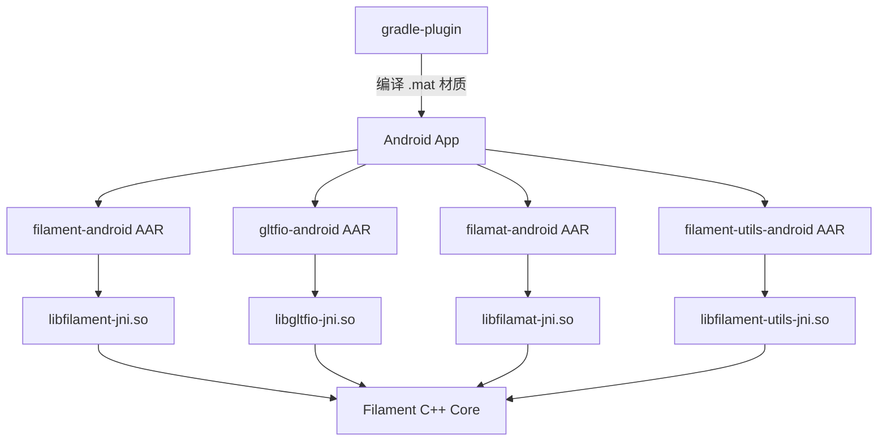

# Android 平台绑定 (`android/`)

## 模块概述

`android/` 目录包含 Filament 渲染引擎的 Android 平台绑定层。通过 JNI (Java Native Interface) 将 Filament 的 C++ 核心封装为 Android 库 (AAR)，并提供 Gradle 构建系统集成，支持发布到 Maven Central。

## 目录结构

```
android/
├── build.gradle                 # 顶层 Gradle 构建脚本 (含 CMake/NDK 配置)
├── settings.gradle              # 子项目声明 (库 + 示例)
├── gradle.properties            # Maven 发布元数据
├── proguard-rules.pro           # ProGuard 混淆规则
├── gradlew / gradlew.bat        # Gradle Wrapper 脚本
├── common/                      # JNI 公共工具类
│   ├── CallbackUtils.cpp/h      # JNI 回调辅助
│   └── NioUtils.cpp/h           # NIO Buffer 辅助
├── filament-android/            # Filament 核心引擎 Android 绑定
├── filamat-android/             # 材质编译器 Android 绑定
├── gltfio-android/              # glTF 加载器 Android 绑定
├── filament-utils-android/      # 工具库 Android 绑定
├── filament-tools/              # Gradle 材质编译插件配置
├── gradle-plugin/               # 自定义 Gradle 插件 (matc 材质编译)
└── samples/                     # Android 示例应用 (16个)
```

## 架构图



## 核心功能

- **JNI 绑定层**: 将 Filament C++ API 映射为 Java/Kotlin API，涵盖 Engine、Scene、View、Renderer 等核心类
- **多 ABI 支持**: 构建目标包括 `arm64-v8a`、`armeabi-v7a`、`x86_64`、`x86`
- **Vulkan/OpenGL ES 后端**: 支持通过构建参数切换，默认包含 Vulkan 支持
- **Gradle 材质插件**: 自动在构建期间将 `.mat` 材质文件编译为 `.filamat` 二进制格式
- **Maven 发布**: 集成 Nexus 发布插件，支持 GPG 签名和 Sonatype 部署
- **示例应用**: 包含 glTF 查看器、PBR 渲染、三角形绘制、纹理对象等 16 个完整示例

## 依赖关系

| 依赖模块 | 说明 |
|---------|------|
| `filament/` | 渲染引擎核心 C++ 库 |
| `libs/gltfio/` | glTF 2.0 资产加载与管理 |
| `libs/filamat/` | 运行时材质编译器 |
| `libs/utils/` | 通用工具库 |
| AndroidX Core | `1.13.1` |
| Kotlin | `2.0.21` |
| NDK | `29.0.14206865` |

## 关键文件说明

| 文件 | 说明 |
|-----|------|
| `build.gradle` | 顶层构建脚本，定义 NDK 版本、SDK 版本、CMake 参数、C++ 编译标志及 Maven 发布配置 |
| `settings.gradle` | 声明 5 个库模块和 16 个示例模块 |
| `common/NioUtils.cpp` | 处理 Java NIO Buffer 到 C++ 指针的转换，是 JNI 数据传递的关键基础设施 |
| `common/CallbackUtils.cpp` | 管理 JNI 回调的线程安全调度 |
| `filament-android/CMakeLists.txt` | 定义 filament-android JNI 层的 CMake 构建逻辑 |
| `gradle-plugin/` | 实现 `filament-tools` Gradle 插件，自动编译材质文件 |
| `proguard-rules.pro` | 防止 JNI 入口类被混淆的 ProGuard 规则 |
