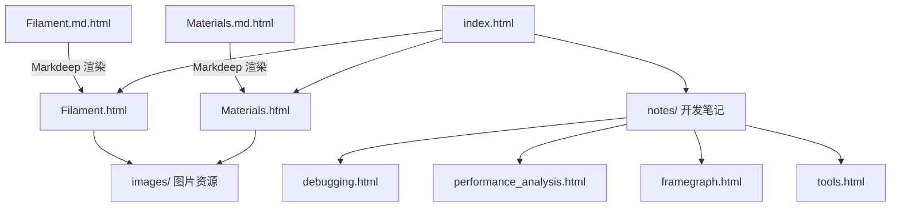

# 文档源文件 (`docs/`)

## 模块概述

`docs/` 目录是 Filament 项目的文档站点，包含完整的技术文档和开发者指南。核心文档以 Markdeep (`.md.html`) 格式编写，涵盖 PBR 渲染理论、材质系统指南、内部开发笔记等内容。目录同时托管预构建的 HTML 文档和相关的静态资源。

## 目录结构

```
docs/
├── Filament.md.html            # PBR 渲染技术白皮书 (核心文档)
├── Materials.md.html           # 材质系统使用指南
├── Filament.html               # 预渲染 HTML 版本
├── Materials.html              # 预渲染 HTML 版本
├── index.html                  # 文档站点首页
├── toc.html / toc.js           # 目录结构
├── images/                     # 文档引用的图片资源
├── main/                       # 主要文档 (HTML)
│   ├── filament.html           # 引擎核心文档
│   ├── materials.html          # 材质文档
│   └── index.html              # 主文档索引
├── notes/                      # 开发笔记和内部文档
│   ├── debugging.html          # 调试指南
│   ├── vulkan_debugging.html   # Vulkan 调试
│   ├── metal_debugging.html    # Metal 调试
│   ├── spirv_debugging.html    # SPIR-V 调试
│   ├── performance_analysis.html  # 性能分析
│   ├── framegraph.html         # Frame Graph 架构
│   ├── tools.html              # 工具使用说明
│   ├── tests.html              # 测试指南
│   ├── libs.html               # 库模块说明
│   ├── asan_ubsan.html         # 内存/未定义行为检测
│   ├── coverage.html           # 代码覆盖率
│   └── instruments.html        # 性能检测工具
├── samples/                    # 文档中的交互示例
├── build/                      # 构建相关文档
│   └── windows_android.html    # Windows 下 Android 构建
├── wip/                        # 进行中的文档
├── remote/                     # 远程相关
├── viewer/                     # 查看器文档
├── css/                        # 样式表
├── fonts/                      # 文档字体
├── FontAwesome/                # FontAwesome 图标库
├── *.js                        # 搜索和高亮脚本
└── favicon.png                 # 站点图标
```

## 架构图



## 核心功能

- **PBR 技术白皮书**: `Filament.md.html` 是详尽的 PBR 渲染理论文档，涵盖 BRDF 模型、光照方程、材质参数等
- **材质开发指南**: `Materials.md.html` 指导开发者如何定义和使用 Filament 材质
- **调试文档集**: 提供 Vulkan、Metal、SPIR-V 等不同后端的专项调试指南
- **性能分析**: 记录性能分析方法和工具使用
- **架构文档**: Frame Graph、库模块结构等内部架构说明
- **搜索功能**: 集成 `elasticlunr` 全文搜索引擎，支持文档内容检索
- **交互示例**: `samples/` 目录包含可在浏览器中运行的 WebGL 示例

## 依赖关系

| 依赖/关联 | 说明 |
|----------|------|
| Markdeep | 文档渲染引擎 (`.md.html` 格式) |
| `art/` | Logo 和架构图表来源 |
| `web/samples/` | 交互式 Web 示例 |
| `filament/` | 文档描述的核心引擎 |
| elasticlunr.js | 客户端全文搜索库 |
| highlight.js | 代码语法高亮 |

## 关键文件说明

| 文件 | 说明 |
|-----|------|
| `Filament.md.html` | Filament PBR 渲染的核心技术白皮书，由 Romain Guy 和 Mathias Agopian 撰写 |
| `Materials.md.html` | 材质系统完整指南，包括材质定义语法、着色模型、材质属性参考 |
| `notes/debugging.html` | 通用调试技巧和工具使用指南 |
| `notes/framegraph.html` | Frame Graph 渲染架构的设计文档和使用说明 |
| `notes/vulkan_debugging.html` | Vulkan 后端专项调试指南，包含验证层配置和常见问题 |
| `notes/performance_analysis.html` | 性能分析方法论和工具使用，包括 GPU 性能计数器等 |
| `index.html` | 文档站点入口，提供所有文档的导航和索引 |
