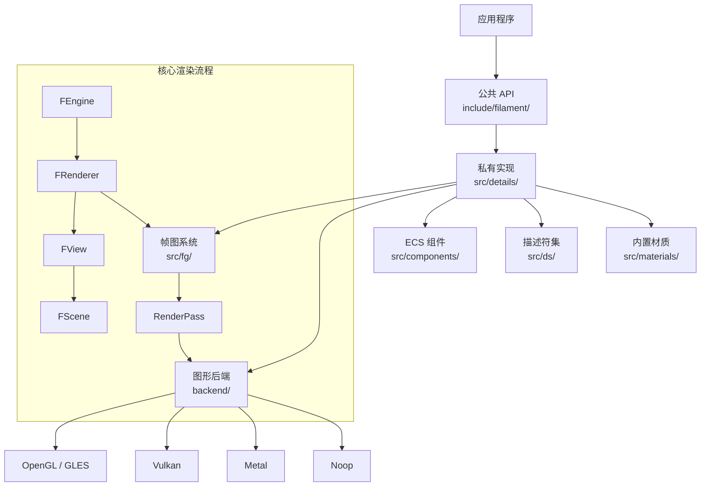

# Filament 核心渲染引擎

## 模块名称和概述

`filament/` 是 Filament 渲染引擎的核心模块，提供基于物理的实时渲染（PBR）能力。该模块实现了完整的渲染管线，包括场景管理、材质系统、光照系统、后处理以及与底层图形 API 的交互。Filament 采用 C++20 编写，支持 Android、iOS、macOS、Linux、Windows 和 WebGL 平台。

## 目录结构

```
filament/
├── CMakeLists.txt          # 核心构建脚本，编译材质和生成资源
├── README.md               # 项目使用说明
├── backend/                # 图形后端抽象层（OpenGL、Vulkan、Metal、Noop）
├── benchmark/              # 性能基准测试
├── docs/                   # Doxygen 文档配置
├── include/filament/       # 公共 API 头文件
├── src/                    # 核心实现源码
│   ├── components/         # ECS 组件管理器
│   ├── details/            # 私有实现类（Pimpl 模式）
│   ├── ds/                 # 描述符集管理系统
│   ├── fg/                 # 帧图（Frame Graph）系统
│   └── materials/          # 内置材质定义（.mat 文件）
└── test/                   # 单元测试
```

## 架构图



## 核心功能

- **基于物理的渲染（PBR）**：支持标准模型、清漆层（Clear Coat）、布料等材质模型
- **场景管理**：通过 ECS（实体-组件-系统）架构管理渲染对象、灯光和变换
- **帧图系统**：自动管理渲染通道之间的资源依赖和生命周期
- **后处理管线**：包含 FXAA/TAA 抗锯齿、Bloom、景深（DOF）、色调映射、SSAO、雾效等
- **阴影系统**：支持级联阴影贴图（CSM）和 VSM
- **材质系统**：运行时材质编译和缓存，支持材质实例化
- **多后端支持**：统一接口适配 OpenGL、Vulkan、Metal 和 WebGPU

## 依赖关系

| 依赖库 | 类型 | 说明 |
|--------|------|------|
| `backend` | PUBLIC | 图形后端抽象层 |
| `math` | PUBLIC | 数学库（向量、矩阵、四元数） |
| `utils` | PUBLIC | 通用工具库（内存、线程、实体管理） |
| `filaflat` | PUBLIC | 材质二进制格式解析 |
| `filabridge` | PUBLIC | 材质数据桥接 |
| `zstd` | PRIVATE | Zstandard 压缩（用于 DFG LUT 等资源） |
| `matdbg` | 可选 | 材质在线调试器 |
| `fgviewer` | 可选 | 帧图可视化查看器 |

## 关键文件说明

| 文件 | 说明 |
|------|------|
| `CMakeLists.txt` | 主构建脚本，定义所有源文件、材质编译规则、DFG LUT 生成和链接依赖 |
| `src/Engine.cpp` | Engine 公共接口实现，委托到 `details/Engine.cpp` |
| `src/Renderer.cpp` | 渲染器主循环，协调帧图构建和执行 |
| `src/PostProcessManager.cpp` | 后处理效果管理器，注册所有后处理通道 |
| `src/RenderPass.cpp` | 渲染通道排序和命令提交 |
| `src/ShadowMap.cpp` | 阴影贴图生成和管理 |
| `src/Froxelizer.cpp` | 光照剔除的 Froxel（视锥体 + 体素）实现 |
| `src/Material.cpp` | 材质加载和着色器编译 |
| `src/View.cpp` | 视图配置（渲染选项、相机、后处理参数） |

## 构建配置

主要 CMake 选项：
- `DFG_LUT_SIZE`：DFG 查找表分辨率（移动端 64，桌面端 128）
- `FILAMENT_ENABLE_FEATURE_LEVEL_0`：启用低功能级别材质
- `FILAMENT_ENABLE_MULTIVIEW`：启用立体渲染多视图
- `FILAMENT_ENABLE_MATDBG`：启用材质实时调试
- `FILAMENT_DISABLE_GTAO`：禁用 GTAO 环境遮蔽
