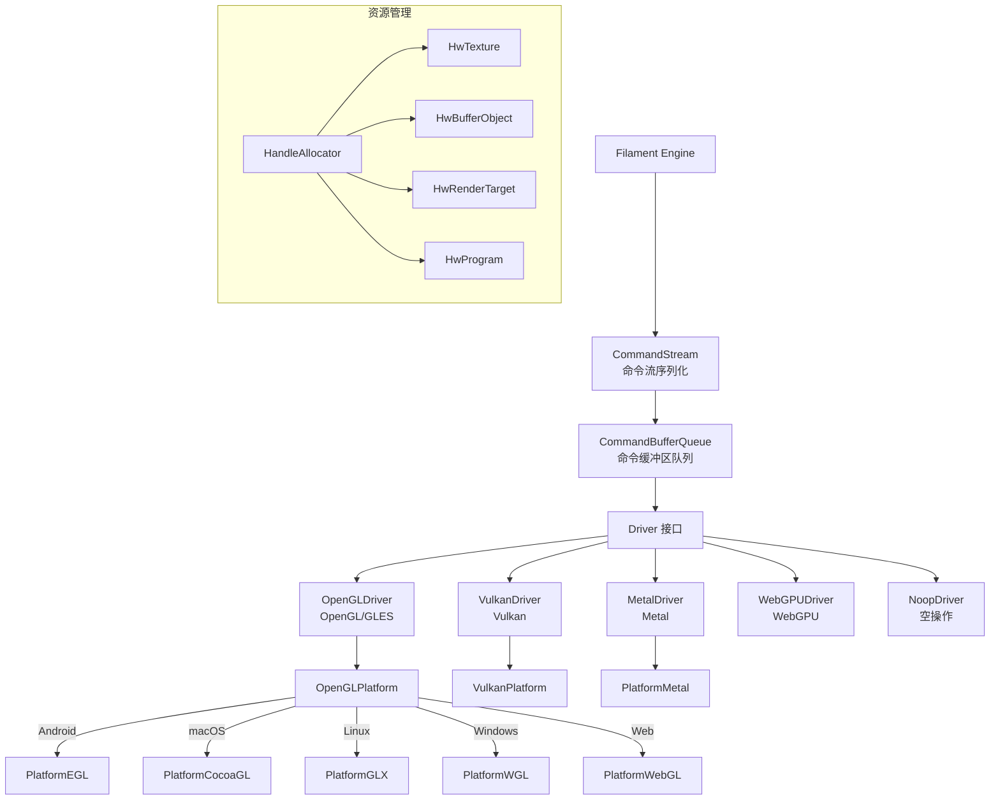
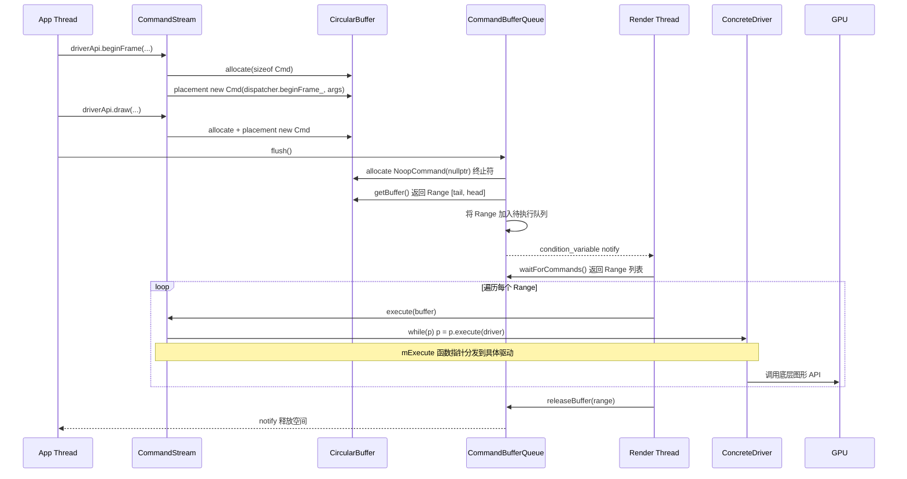

# Filament 图形后端抽象层（Backend）

## 模块名称和概述

`filament/backend/` 是 Filament 的图形后端抽象层，提供了一套统一的驱动接口（Driver API），将上层渲染逻辑与底层图形 API 解耦。支持的后端包括 OpenGL/OpenGL ES、Vulkan、Metal、WebGPU 以及用于测试的 Noop 后端。该模块负责资源管理（纹理、缓冲区、渲染目标等）、命令流序列化和跨平台窗口系统集成。

## 目录结构

```
backend/
├── CMakeLists.txt              # 后端构建脚本，按平台条件编译
├── include/
│   ├── backend/                # 公共头文件
│   │   ├── DriverEnums.h       # 驱动枚举类型定义
│   │   ├── Handle.h            # 硬件资源句柄
│   │   ├── Platform.h          # 平台抽象接口
│   │   ├── Program.h           # 着色器程序描述
│   │   └── platforms/          # 平台特定接口
│   └── private/backend/        # 内部头文件（非公共 API）
│       ├── CommandStream.h     # 命令流接口
│       ├── Driver.h            # 驱动接口基类
│       ├── DriverApi.h         # 驱动 API 完整定义
│       └── HandleAllocator.h   # 句柄分配器
├── src/
│   ├── opengl/                 # OpenGL/GLES 后端实现
│   ├── vulkan/                 # Vulkan 后端实现
│   ├── metal/                  # Metal 后端实现（Objective-C++）
│   ├── webgpu/                 # WebGPU 后端实现（实验性）
│   ├── noop/                   # 空操作后端（用于测试）
│   ├── CommandStream.cpp       # 命令流序列化
│   ├── CommandBufferQueue.cpp  # 命令缓冲区队列
│   ├── Driver.cpp              # 驱动基础实现
│   ├── PlatformFactory.cpp     # 平台工厂
│   └── HandleAllocator.cpp     # 句柄内存管理
└── test/                       # 后端测试套件
```

## 架构图



## 核心功能

- **统一驱动 API**：通过 `DriverApi.h` 和 `DriverAPI.inc` 定义了约 80+ 个驱动命令，涵盖资源创建/销毁、状态设置和绘制调用
- **命令流机制**：上层渲染线程将命令编码到 `CommandStream`，通过 `CommandBufferQueue` 传递给驱动线程异步执行
- **句柄系统**：`HandleAllocator` 提供类型安全的资源句柄管理，支持池化分配
- **着色器编译**：`CompilerThreadPool` 支持异步着色器编译，`BlobCacheKey` 支持着色器缓存
- **平台抽象**：每个图形 API 后端都有对应的 `Platform` 实现，处理窗口系统集成（EGL、Cocoa、GLX、WGL）

## 依赖关系

| 依赖库 | 类型 | 说明 |
|--------|------|------|
| `math` | PUBLIC | 数学运算库 |
| `utils` | PUBLIC | 工具库 |
| `bluegl` | PRIVATE | OpenGL 函数加载器（桌面平台） |
| `bluevk` | PUBLIC | Vulkan 函数加载器 |
| `vkmemalloc` | PUBLIC | Vulkan 内存分配器（VMA） |
| `smol-v` | PUBLIC | SPIR-V 压缩库 |
| `webgpu_dawn` | PRIVATE | Dawn WebGPU 实现（实验性） |

## 关键文件说明

| 文件 | 说明 |
|------|------|
| `include/backend/DriverEnums.h` | 定义所有后端枚举：纹理格式、采样器类型、渲染状态等 |
| `include/backend/Handle.h` | 类型安全的硬件资源句柄模板 |
| `include/backend/Platform.h` | 平台抽象基类，定义窗口系统交互接口 |
| `include/private/backend/DriverAPI.inc` | 使用宏生成所有驱动 API 方法的定义 |
| `src/CommandStream.cpp` | 将渲染命令序列化到环形缓冲区 |
| `src/PlatformFactory.cpp` | 根据编译配置和运行时参数选择合适的后端平台 |
| `src/HandleAllocator.cpp` | 分层句柄分配器，支持不同大小的资源对象 |
| `src/opengl/OpenGLDriver.cpp` | OpenGL 后端完整驱动实现 |
| `src/vulkan/VulkanDriver.cpp` | Vulkan 后端完整驱动实现 |
| `src/metal/MetalDriver.mm` | Metal 后端完整驱动实现（Objective-C++） |
| `src/noop/NoopDriver.cpp` | 空操作驱动，用于无 GPU 环境的测试 |

## 后端特性对比

| 特性 | OpenGL | Vulkan | Metal | WebGPU |
|------|--------|--------|-------|--------|
| 桌面平台 | Yes | Yes | macOS | 实验性 |
| 移动平台 | Android/iOS | Android | iOS | 实验性 |
| Web 平台 | WebGL | -- | -- | 实验性 |
| 异步着色器编译 | Yes | Yes | Yes | Yes |
| 描述符集 | Yes | Yes | Yes | Yes |

## 命令流架构：从上层调用到底层图形 API

本章详细说明 Filament 的命令录制-回放架构。上层渲染逻辑（应用线程）通过 `CommandStream` 将驱动命令序列化到环形缓冲区中，然后由渲染线程（驱动线程）取出命令并通过 `Dispatcher` 分发到具体的图形后端驱动执行。

### 整体流程图



### 核心类型一览表

| 类名 | 所在文件 | 职责 | 所属线程 |
|------|----------|------|----------|
| `DriverApi` (别名) | `DriverApiForward.h:24` | `using DriverApi = CommandStream;` 上层使用的统一接口别名 | 应用线程 |
| `CommandStream` | `CommandStream.h:206-305` | 命令录制器，通过 X-Macro 生成所有驱动 API 方法 | 应用线程 |
| `CommandBase` | `CommandStream.h:57-86` | 命令基类，持有 `Execute` 函数指针 `mExecute` | 两线程 |
| `Command<>` | `CommandStream.h:127-161` | 命令模板，用 `std::tuple` 保存参数，execute 时展开调用 | 两线程 |
| `NoopCommand` | `CommandStream.h:181-189` | 空操作命令，用作缓冲区终止符或空间填充 | 两线程 |
| `CircularBuffer` | `CircularBuffer.h:27-93` | 环形缓冲区，使用 mmap 虚拟内存镜像实现无缝回绕 | 两线程 |
| `CommandBufferQueue` | `CommandBufferQueue.h:35-94` | 生产者-消费者队列，包装 CircularBuffer | 两线程 |
| `Dispatcher` | `Dispatcher.h:38-46` | 纯函数指针结构体，每个异步 API 对应一个 `Execute` 指针 | 两线程（值拷贝） |
| `ConcreteDispatcher<T>` | `CommandStreamDispatcher.h:49-88` | 模板类，为具体驱动填充 Dispatcher 所有函数指针 | 初始化时 |
| `Driver` | `Driver.h:63-130` | 抽象基类，通过 DriverAPI.inc 生成方法签名 | 渲染线程 |
| `DriverBase` | `DriverBase.h:180-256` | 基础实现（回调管理、ServiceThread） | 渲染线程 |
| `OpenGLDriver` / `VulkanDriver` / `MetalDriver` / `NoopDriver` | `src/opengl/` `src/vulkan/` `src/metal/` `src/noop/` | 具体图形 API 驱动实现 | 渲染线程 |
| `FEngine` | `Engine.h:134` / `Engine.cpp` | 引擎核心，管理双线程协调和命令缓冲区生命周期 | 两线程 |

### 各类详解

#### CommandStream（即 DriverApi）

**文件位置**: `backend/include/private/backend/CommandStream.h:206-305`, `backend/src/CommandStream.cpp`

`DriverApiForward.h` 中定义了别名：
```cpp
using DriverApi = CommandStream;    // DriverApiForward.h:24
```

上层代码通过 `FEngine::getDriverApi()` 获取 `DriverApi&` 引用，实际就是 `CommandStream` 实例。

**核心成员**：
```cpp
Driver& UTILS_RESTRICT mDriver;           // 驱动引用（用于同步调用）
CircularBuffer& UTILS_RESTRICT mCurrentBuffer;  // 环形缓冲区引用
Dispatcher mDispatcher;                    // 值拷贝的分发表（消除间接寻址）
```

**三种命令生成模式**（通过 `DriverAPI.inc` X-Macro 自动展开）：

1. **异步命令** (`DECL_DRIVER_API`)：在 CircularBuffer 中 placement new 一个 Command 对象
   ```cpp
   // CommandStream.h:223-230  展开后的伪代码：
   inline void beginFrame(int64_t monotonic_clock_ns, ...) noexcept {
       using Cmd = COMMAND_TYPE(beginFrame);
       void* const p = allocateCommand(CommandBase::align(sizeof(Cmd)));
       new(p) Cmd(mDispatcher.beginFrame_, std::move(monotonic_clock_ns), ...);
   }
   ```

2. **同步命令** (`DECL_DRIVER_API_SYNCHRONOUS`)：直接通过 `apply()` 调用 Driver 虚方法
   ```cpp
   // CommandStream.h:232-239  展开后的伪代码：
   inline bool isTextureFormatSupported(TextureFormat format) noexcept {
       return apply(&Driver::isTextureFormatSupported, mDriver, std::forward_as_tuple(format));
   }
   ```

3. **两阶段命令** (`DECL_DRIVER_API_RETURN`)：先调用 `methodNameS()` 同步获取句柄，再将 `methodNameR` 命令入队
   ```cpp
   // CommandStream.h:241-250  展开后的伪代码：
   inline TextureHandle createTexture(...) noexcept {
       TextureHandle result = mDriver.createTextureS();  // 同步：分配句柄
       using Cmd = COMMAND_TYPE(createTextureR);
       void* const p = allocateCommand(CommandBase::align(sizeof(Cmd)));
       new(p) Cmd(mDispatcher.createTexture_, TextureHandle(result), ...);  // 异步：初始化资源
       return result;
   }
   ```

#### CommandBase 与 Command<>

**文件位置**: `backend/include/private/backend/CommandStream.h:57-161`

`CommandBase` 是所有命令的基类，持有一个函数指针 `mExecute`：
```cpp
class CommandBase {
    using Execute = Dispatcher::Execute;  // void (*)(Driver&, CommandBase*, intptr_t*)
    Execute mExecute;

public:
    CommandBase* execute(Driver& driver) {
        intptr_t next;
        mExecute(driver, this, &next);  // 调用分发函数
        return reinterpret_cast<CommandBase*>(reinterpret_cast<intptr_t>(this) + next);
    }
};
```

`Command<>` 是通过 `CommandType<>` 嵌套定义的模板类，用 `std::tuple` 保存调用参数：
```cpp
template<void(Driver::*)(ARGS...)>
class Command : public CommandBase {
    using SavedParameters = std::tuple<std::remove_reference_t<ARGS>...>;
    SavedParameters mArgs;

    template<typename M, typename D>
    static void execute(M&& method, D&& driver, CommandBase* base, intptr_t* next) {
        Command* self = static_cast<Command*>(base);
        *next = align(sizeof(Command));   // 返回下一个命令的偏移
        apply(method, driver, std::move(self->mArgs));  // 展开 tuple 调用驱动方法
        self->~Command();                 // 手动析构
    }
};
```

`COMMAND_TYPE` 宏将 Driver 方法名映射为具体的 Command 类型：
```cpp
#define COMMAND_TYPE(method) CommandType<decltype(&Driver::method)>::Command<&Driver::method>
```

#### CircularBuffer

**文件位置**: `backend/include/private/backend/CircularBuffer.h:27-93`

环形缓冲区通过 mmap 虚拟内存镜像技术实现无缝回绕——将同一块物理内存映射到两段连续的虚拟地址空间，使得写入超过末尾时自动回绕到开头，无需特殊的边界处理逻辑。

**核心接口**：
```cpp
class CircularBuffer {
    void* mData;   // 缓冲区起始地址
    size_t mSize;  // 缓冲区总大小
    void* mTail;   // 已录制数据的起始指针
    void* mHead;   // 下一个可用位置

    void* allocate(size_t s) noexcept {
        char* const cur = static_cast<char*>(mHead);
        mHead = cur + s;   // 推进 mHead
        return cur;
    }

    Range getBuffer() noexcept;  // 返回 {mTail, mHead}，重置 mTail = mHead
    bool empty() const noexcept { return mTail == mHead; }
    size_t getUsed() const noexcept { return intptr_t(mHead) - intptr_t(mTail); }
};
```

#### CommandBufferQueue

**文件位置**: `backend/include/private/backend/CommandBufferQueue.h:35-94`, `backend/src/CommandBufferQueue.cpp`

生产者-消费者队列，包装 `CircularBuffer`，用 mutex + condition variable 实现线程同步。

**关键方法**：

- **`flush()`**（应用线程调用）：
  ```
  1. 在 CircularBuffer 末尾追加 NoopCommand(nullptr) 作为终止符
  2. 调用 circularBuffer.getBuffer() 获取 {begin, end} Range
  3. 将 Range 加入 mCommandBuffersToExecute 向量
  4. 通知消费者线程 (condition.notify_one)
  5. 如果剩余空间 < mRequiredSize，阻塞等待渲染线程释放空间
  ```

- **`waitForCommands()`**（渲染线程调用）：
  ```
  阻塞等待 mCommandBuffersToExecute 非空 && 未暂停
  返回 std::move(mCommandBuffersToExecute)
  ```

- **`releaseBuffer(Range)`**（渲染线程调用）：
  ```
  计算 Range 大小，归还给 mFreeSpace，唤醒可能阻塞的应用线程
  ```

#### Dispatcher

**文件位置**: `backend/include/private/backend/Dispatcher.h:38-46`

纯函数指针结构体，通过 `DriverAPI.inc` X-Macro 展开生成成员：

```cpp
class Dispatcher {
public:
    using Execute = void (*)(Driver& driver, CommandBase* self, intptr_t* next);

    // 由 DriverAPI.inc 展开生成（仅异步和两阶段命令）：
    Execute tick_;
    Execute beginFrame_;
    Execute endFrame_;
    Execute flush_;
    Execute createTexture_;   // 两阶段命令也生成一个 Execute
    Execute draw_;
    // ... 所有异步/两阶段 API 各一个
};
```

同步命令（`DECL_DRIVER_API_SYNCHRONOUS`）不生成 Dispatcher 成员，因为它们直接调用 Driver 虚方法。

#### ConcreteDispatcher<T>

**文件位置**: `backend/src/CommandStreamDispatcher.h:49-88`

模板类，为具体驱动类型 `T` 生成所有静态分发函数，并在 `make()` 中填充 Dispatcher：

```cpp
template<typename ConcreteDriver>
class ConcreteDispatcher {
    // 由 DriverAPI.inc 展开生成的静态分发函数：
    static void beginFrame(Driver& driver, CommandBase* base, intptr_t* next) {
        using Cmd = COMMAND_TYPE(beginFrame);
        ConcreteDriver& concreteDriver = static_cast<ConcreteDriver&>(driver);
        Cmd::execute(&ConcreteDriver::beginFrame, concreteDriver, base, next);
    }
    // ... 每个异步/两阶段 API 各一个

    static Dispatcher make() noexcept {
        Dispatcher dispatcher;
        dispatcher.beginFrame_ = &ConcreteDispatcher::beginFrame;
        dispatcher.draw_ = &ConcreteDispatcher::draw;
        // ...
        return dispatcher;
    }
};
```

关键设计：`static_cast<ConcreteDriver&>` 将 `Driver&` 向下转型为具体驱动类型，然后直接调用非虚成员函数。这意味着异步命令的执行路径中**没有虚函数调用开销**。

#### Driver 与 DriverBase

**文件位置**: `backend/include/private/backend/Driver.h:63-130`, `backend/src/DriverBase.h:180-256`

`Driver` 是抽象基类，通过 `DriverAPI.inc` 生成三类方法签名：

```cpp
class Driver {
    // 异步命令：空的非虚函数体（仅提供类型签名给 CommandStream）
    #define DECL_DRIVER_API(methodName, paramsDecl, params) \
        void methodName(paramsDecl) {}

    // 同步命令：纯虚函数（由 CommandStream 直接调用）
    #define DECL_DRIVER_API_SYNCHRONOUS(RetType, methodName, paramsDecl, params) \
        virtual RetType methodName(paramsDecl) = 0;

    // 两阶段命令：纯虚 methodNameS() + 空的 methodNameR()
    #define DECL_DRIVER_API_RETURN(RetType, methodName, paramsDecl, params) \
        virtual RetType methodName##S() noexcept = 0; \
        void methodName##R(RetType, paramsDecl) {}

    virtual Dispatcher getDispatcher() const noexcept = 0;
    virtual void execute(std::function<void(void)> const& fn);
};
```

`DriverBase` 继承 `Driver`，提供基础实现：
- `purge()`：执行主线程上的用户回调
- `scheduleCallback()`：将回调调度到 ServiceThread
- `debugCommandBegin/End()`：命令调试支持

具体驱动（如 `OpenGLDriver`）继承 `DriverBase`，实现所有异步/两阶段方法的具体版本（非虚，直接调用底层图形 API），以及所有同步方法（虚方法 override）。

#### FEngine 双线程协调

**文件位置**: `filament/src/details/Engine.h:134`, `filament/src/details/Engine.cpp`

**核心成员**：
```cpp
class FEngine {
    backend::Driver* mDriver;
    backend::CommandBufferQueue mCommandBufferQueue;       // Engine.h:666
    std::aligned_storage<...>::type mDriverApiStorage;     // Engine.h:667
    std::thread mDriverThread;                             // Engine.h:665
};
```

**初始化过程**（`Engine.cpp:153-203`）：
```
FEngine::create():
  1. 构造 FEngine → 创建 CommandBufferQueue
  2. 启动 mDriverThread = std::thread(&FEngine::loop, instance)
  3. 等待 mDriverBarrier（渲染线程完成驱动初始化）
  4. 调用 init() → placement new CommandStream 到 mDriverApiStorage
     CommandStream 构造时调用 driver.getDispatcher() 获取 Dispatcher 值拷贝
```

**应用线程**：
```
通过 getDriverApi() 获取 CommandStream 引用
录制命令：driverApi.beginFrame(), driverApi.draw(), ...
提交命令：flushCommandBuffer() → purge() + commandBufferQueue.flush()
```

**渲染线程** (`FEngine::loop()`, `Engine.cpp:860-953`)：
```cpp
int FEngine::loop() {
    mDriver = mPlatform->createDriver(...);
    mDriverBarrier.latch();   // 通知应用线程驱动已就绪
    while (true) {
        if (!execute()) break;   // 循环执行命令
    }
    getDriverApi().terminate();
    return 0;
}
```

**命令执行** (`FEngine::execute()`, `Engine.cpp:1589-1606`)：
```cpp
bool FEngine::execute() {
    // 1. 阻塞等待命令
    auto buffers = mCommandBufferQueue.waitForCommands();
    if (buffers.empty()) return false;   // 收到退出请求

    // 2. 遍历执行所有命令缓冲区
    auto& driver = getDriverApi();
    for (auto& item : buffers) {
        if (item.begin) {
            driver.execute(item.begin);         // → CommandStream::execute()
            mCommandBufferQueue.releaseBuffer(item);  // 释放已执行的空间
        }
    }
    return true;
}
```

`CommandStream::execute()` 的内部循环 (`CommandStream.cpp:88-127`)：
```cpp
void CommandStream::execute(void* buffer) {
    CommandBase* base = static_cast<CommandBase*>(buffer);
    mDriver.execute([&driver, base] {
        auto p = base;
        while (p) {
            p = p->execute(driver);   // 逐个执行命令，直到遇到 nullptr 终止符
        }
    });
}
```

### beginFrame 完整调用链示例

以 `beginFrame` 为例，追踪从应用层到 GPU 的完整路径：

**Step 1 — 应用线程录制命令**
```
Renderer::beginFrame()
  → driverApi.beginFrame(monotonic_clock_ns, refreshIntervalNs, frameId)
```

这里 `driverApi` 类型是 `CommandStream&`。

**Step 2 — CommandStream 宏展开**

`DriverAPI.inc:146-149` 中定义：
```cpp
DECL_DRIVER_API_N(beginFrame,
    int64_t, monotonic_clock_ns,
    int64_t, refreshIntervalNs,
    uint32_t, frameId)
```

经 `CommandStream.h:223-230` 的 `DECL_DRIVER_API` 宏展开为：
```cpp
inline void beginFrame(int64_t monotonic_clock_ns,
                       int64_t refreshIntervalNs,
                       uint32_t frameId) noexcept {
    using Cmd = COMMAND_TYPE(beginFrame);   // → CommandType<...>::Command<&Driver::beginFrame>
    void* const p = allocateCommand(CommandBase::align(sizeof(Cmd)));
    new(p) Cmd(mDispatcher.beginFrame_,     // Execute 函数指针
               std::move(monotonic_clock_ns),
               std::move(refreshIntervalNs),
               std::move(frameId));
}
```

**Step 3 — Command 对象在 CircularBuffer 中构造**

`allocateCommand()` 调用 `mCurrentBuffer.allocate(size)` 推进 `mHead`，返回可用内存地址。

`Cmd` 构造函数将 `mDispatcher.beginFrame_` 存入 `CommandBase::mExecute`，参数存入 `std::tuple<int64_t, int64_t, uint32_t> mArgs`。

**Step 4 — flush() 提交命令缓冲区**

应用线程调用 `FEngine::flushCommandBuffer()` → `CommandBufferQueue::flush()`：
1. 追加 `NoopCommand(nullptr)` 终止符
2. 获取 Range `{tail, head}`
3. 加入 `mCommandBuffersToExecute`
4. 唤醒渲染线程

**Step 5 — 渲染线程取出命令**

`FEngine::execute()` → `mCommandBufferQueue.waitForCommands()` 被唤醒，返回 Range 列表。

**Step 6 — 逐命令执行**

`CommandStream::execute(buffer)` 进入循环：
```
p = base;   // 指向第一个 Command
p->execute(driver):
    mExecute(driver, this, &next);   // 调用 mDispatcher.beginFrame_ 存入的函数指针
```

**Step 7 — Dispatcher 分发到具体驱动**

`mExecute` 指向 `ConcreteDispatcher<OpenGLDriver>::beginFrame`（以 OpenGL 为例）：
```cpp
static void beginFrame(Driver& driver, CommandBase* base, intptr_t* next) {
    using Cmd = COMMAND_TYPE(beginFrame);
    OpenGLDriver& concreteDriver = static_cast<OpenGLDriver&>(driver);
    Cmd::execute(&OpenGLDriver::beginFrame, concreteDriver, base, next);
}
```

**Step 8 — Command::execute() 展开参数**
```cpp
static void execute(M&& method, D&& driver, CommandBase* base, intptr_t* next) {
    Command* self = static_cast<Command*>(base);
    *next = align(sizeof(Command));
    apply(method, driver, std::move(self->mArgs));  // → openGLDriver.beginFrame(args...)
    self->~Command();
}
```

`apply()` → `trampoline()` → `invoke()` 最终调用：
```
openGLDriver.beginFrame(monotonic_clock_ns, refreshIntervalNs, frameId)
```

**Step 9 — 底层图形 API 调用**

`OpenGLDriver::beginFrame()` 内部调用 OpenGL 函数（如 `glBindFramebuffer`、`glClear` 等），向 GPU 提交工作。

### 设计要点总结

1. **X-Macro 一次定义、多处展开**：`DriverAPI.inc` 中每个 API 只定义一次参数列表，通过不同的宏定义在 `CommandStream`（命令录制）、`Dispatcher`（函数指针声明）、`ConcreteDispatcher`（静态分发函数）、`Driver`（方法签名）中分别展开，保证接口一致性。

2. **异步命令零虚函数调用**：`ConcreteDispatcher` 通过 `static_cast` 将 `Driver&` 向下转型为具体驱动类型，直接调用非虚成员函数。虚函数调用仅在初始化时 `getDispatcher()` 中发生一次。

3. **CircularBuffer 内存复用**：基于 mmap 虚拟内存镜像的环形缓冲区避免了频繁的内存分配/释放。命令对象通过 placement new 直接构造在缓冲区中，执行后由手动析构回收。

4. **Dispatcher 值拷贝消除间接寻址**：`CommandStream` 持有 `Dispatcher` 的值拷贝（而非指针），每次录制命令时直接从本地 `mDispatcher` 成员读取函数指针，避免一次额外的指针解引用。源码注释（`CommandStream.h:293`）明确说明了这一设计决策。

5. **两阶段命令支持同步句柄返回**：资源创建类命令（如 `createTexture`）需要立即返回句柄给应用层，因此拆分为同步的 `S` 阶段（分配句柄）和异步的 `R` 阶段（初始化 GPU 资源），兼顾了响应性和异步执行。
