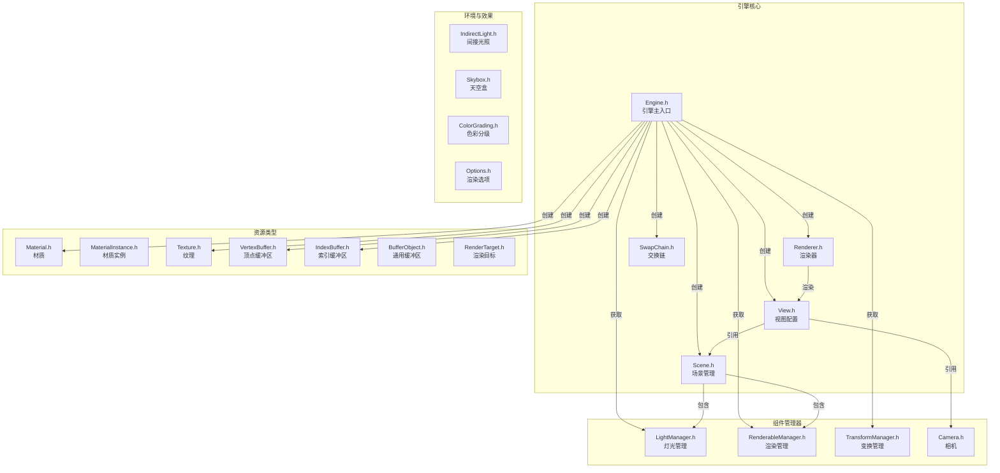

# Filament 公共 API 头文件（include/filament）

## 模块名称和概述

`filament/include/filament/` 包含了 Filament 渲染引擎暴露给应用程序开发者的全部公共 API 头文件。这些头文件定义了引擎的核心类、资源类型、管理器接口和配置选项，是应用程序与 Filament 交互的唯一入口。所有公共类都继承自 `FilamentAPI`，使用 Builder 模式创建资源，真正的实现位于 `src/details/` 中。

## 目录结构

```
include/filament/
├── Box.h                   # 轴对齐包围盒（AABB）
├── BufferObject.h          # 通用 GPU 缓冲区对象
├── Camera.h                # 相机接口
├── Color.h                 # 颜色类型和转换
├── ColorGrading.h          # 色彩分级配置
├── ColorSpace.h            # 色彩空间定义
├── DebugRegistry.h         # 运行时调试参数注册
├── Engine.h                # 引擎主入口（最重要的头文件）
├── Exposure.h              # 曝光计算工具
├── Fence.h                 # GPU 同步栅栏
├── FilamentAPI.h           # 公共 API 基类
├── Frustum.h               # 视锥体（用于剔除）
├── IndexBuffer.h           # 索引缓冲区
├── IndirectLight.h         # 基于图像的间接光照（IBL）
├── InstanceBuffer.h        # 实例化数据缓冲区
├── LightManager.h          # 灯光组件管理器
├── Material.h              # 材质接口
├── MaterialInstance.h      # 材质实例接口
├── MorphTargetBuffer.h     # 变形目标缓冲区
├── Options.h               # 渲染选项结构体集合
├── RenderableManager.h     # 可渲染组件管理器
├── Renderer.h              # 渲染器接口
├── RenderTarget.h          # 离屏渲染目标
├── Scene.h                 # 场景接口
├── SkinningBuffer.h        # 骨骼蒙皮缓冲区
├── Skybox.h                # 天空盒接口
├── Stream.h                # 外部纹理流（如 Android 相机）
├── SwapChain.h             # 交换链（关联原生窗口）
├── Sync.h                  # GPU 同步原语
├── Texture.h               # 纹理接口
├── TextureSampler.h        # 纹理采样器参数
├── ToneMapper.h            # 色调映射算子
├── TransformManager.h      # 变换组件管理器
├── VertexBuffer.h          # 顶点缓冲区
├── View.h                  # 视图接口（渲染配置）
└── Viewport.h              # 视口定义
```

## 架构图



## 核心功能

- **Engine**：引擎主入口，负责创建和管理所有 Filament 对象，管理渲染线程和驱动接口
- **Renderer**：驱动渲染循环，执行 `beginFrame()`/`render()`/`endFrame()` 流程
- **View**：定义渲染视图的所有配置，包括相机、场景、视口和渲染质量选项
- **Scene**：场景容器，管理可渲染实体和灯光实体的集合
- **Material / MaterialInstance**：材质定义和参数实例化，支持 PBR 材质模型
- **组件管理器**：`LightManager`、`RenderableManager`、`TransformManager` 管理实体的各类属性
- **Options**：`Options.h` 集中定义了所有渲染选项结构体（AO、Bloom、DOF、雾效等）

## 依赖关系

| 依赖 | 说明 |
|------|------|
| `backend/DriverEnums.h` | 后端枚举类型（纹理格式、像素类型等） |
| `backend/Platform.h` | 平台接口（用于 Engine 创建时指定自定义平台） |
| `utils/Entity.h` | 实体标识符 |
| `utils/compiler.h` | 编译器相关宏定义 |
| `math/` | 向量、矩阵等数学类型 |

## 关键文件说明

| 文件 | 说明 |
|------|------|
| `Engine.h` | 最核心的头文件。定义了 `Engine::create()` 静态工厂方法以及所有资源创建/销毁方法。Engine 是线程安全的单例式对象 |
| `View.h` | 视图配置接口，设置抗锯齿、SSAO、Bloom、景深等渲染选项；关联 Scene 和 Camera |
| `Renderer.h` | 渲染器接口，`render(View*)` 触发一帧的渲染，支持帧回调和帧率控制 |
| `Scene.h` | 场景接口，`addEntity()`/`remove()` 管理实体集合，设置间接光照和天空盒 |
| `Material.h` | 材质接口，`Builder` 从 `.filamat` 数据创建材质，`createInstance()` 创建材质实例 |
| `MaterialInstance.h` | 材质实例接口，设置具体的材质参数值（颜色、粗糙度、金属度、纹理等） |
| `LightManager.h` | 灯光管理器，`Builder` 链式构建各类灯光（点光、方向光、聚光灯、太阳光） |
| `RenderableManager.h` | 渲染组件管理器，`Builder` 设置网格图元、材质、包围盒、蒙皮、变形等 |
| `TransformManager.h` | 变换管理器，设置实体的局部变换矩阵和父子层级关系 |
| `Texture.h` | 纹理接口，支持 2D、3D、CubeMap、外部纹理等多种类型 |
| `Options.h` | 集中定义所有渲染质量选项的结构体，如 `AmbientOcclusionOptions`、`BloomOptions`、`DepthOfFieldOptions`、`FogOptions` |
| `FilamentAPI.h` | 公共 API 基类，重载 `new`/`delete` 运算符，确保所有 Filament 对象通过引擎管理的内存分配器创建 |

## 使用模式

典型的 Filament 应用程序使用公共 API 的流程：

1. 通过 `Engine::create()` 创建引擎实例
2. 创建 `SwapChain`（关联原生窗口）、`Renderer`、`View`、`Scene`
3. 使用各管理器的 `Builder` 创建实体和组件（灯光、可渲染对象、变换）
4. 加载材质（`Material::Builder`）并创建材质实例
5. 在渲染循环中调用 `renderer->beginFrame()` / `renderer->render(view)` / `renderer->endFrame()`
6. 使用 `engine->destroy()` 清理资源
