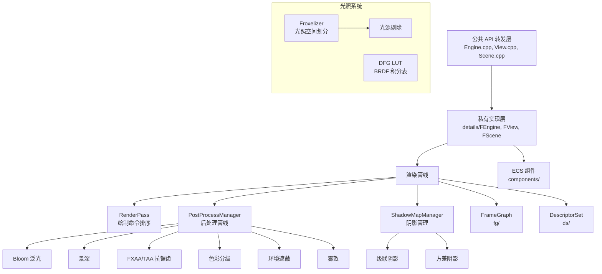

# Filament 核心实现（src）

## 模块名称和概述

`filament/src/` 包含了 Filament 渲染引擎的核心实现代码。这里实现了从公共 API 到底层渲染的所有逻辑，包括场景管理、渲染管线、材质系统、光照计算、阴影映射、后处理等功能。代码采用 Pimpl（指向实现的指针）模式，将公共接口与内部实现分离。

## 目录结构

```
src/
├── components/             # ECS 组件管理器
├── details/                # 私有实现类（FEngine, FView, FScene 等）
├── ds/                     # 描述符集管理系统
├── fg/                     # 帧图（Frame Graph）渲染通道调度
├── materials/              # 内置材质定义文件
├── Engine.cpp              # 引擎公共接口转发
├── Renderer.cpp            # 渲染器公共接口
├── View.cpp                # 视图公共接口
├── Scene.cpp               # 场景公共接口
├── Material.cpp            # 材质公共接口
├── RenderPass.cpp/h        # 渲染通道排序和执行
├── PostProcessManager.cpp/h # 后处理管线管理器
├── ShadowMap.cpp/h         # 阴影贴图生成
├── ShadowMapManager.cpp/h  # 阴影贴图调度和分配
├── Froxelizer.cpp/h        # Froxel 光照剔除
├── Culler.cpp/h            # 视锥体和遮挡剔除
├── DFG.cpp/h               # DFG 查找表生成
├── MaterialParser.cpp/h    # 材质二进制数据解析
├── MaterialCache.cpp/h     # 材质缓存
├── TextureCache.cpp/h      # 纹理缓存
├── Allocators.h            # 自定义线性/竞技场分配器
├── downcast.h              # 公共类到私有实现类的安全向下转型
└── FrameSkipper.cpp/h      # 帧节流控制
```

## 架构图



## 核心功能

- **渲染通道排序**：`RenderPass` 实现高效的绘制命令排序，按材质、深度和混合模式分组
- **后处理管线**：`PostProcessManager` 管理所有后处理效果，通过帧图动态编排
- **阴影系统**：`ShadowMapManager` 协调多个阴影贴图的分配和渲染
- **Froxel 光照剔除**：`Froxelizer` 将视锥体划分为 3D 单元格，高效分配光源
- **材质解析**：`MaterialParser` 解析 `.filamat` 二进制格式，提取着色器和参数信息
- **DFG 查找表**：预计算 BRDF 积分表，加速 PBR 光照计算
- **帧节流**：`FrameSkipper` 控制 CPU/GPU 同步，避免过度排队

## 依赖关系

| 模块 | 说明 |
|------|------|
| `details/` | 所有公共 API 的私有实现类 |
| `components/` | ECS 组件管理器（Light、Renderable、Transform、Camera） |
| `fg/` | 帧图系统，管理渲染通道依赖 |
| `ds/` | 描述符集系统，管理 GPU 资源绑定 |
| `materials/` | 内置材质的 `.mat` 定义文件 |
| `backend/` | 图形后端抽象层 |

## 关键文件说明

| 文件 | 说明 |
|------|------|
| `Engine.cpp` | Engine 公共方法转发到 `FEngine`，是所有资源创建的入口 |
| `Renderer.cpp` | 渲染器接口，负责帧的开始/结束、SwapChain 管理 |
| `RenderPass.cpp` | 渲染命令的排序键编码与提交，是绘制性能关键路径 |
| `PostProcessManager.cpp` | 后处理管线核心，注册并执行所有后处理通道 |
| `ShadowMap.cpp` | 单个阴影贴图的视图矩阵和投影矩阵计算 |
| `Froxelizer.cpp` | Froxel 数据结构的构建和光源分配算法 |
| `MaterialParser.cpp` | 材质二进制格式解析，提取着色器代码和材质参数 |
| `Allocators.h` | 定义线性分配器和竞技场分配器，用于帧内临时数据分配 |
| `downcast.h` | 提供安全的公共类型到内部实现类型的向下转型宏 |
| `DFG.cpp` | 加载或生成 BRDF 积分查找表 |
| `ColorSpaceUtils.cpp` | 色彩空间转换工具函数 |
