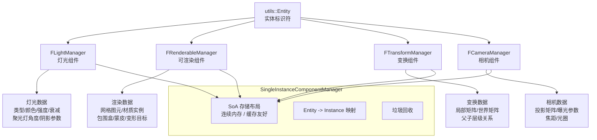

# Filament ECS 组件管理器（Components）

## 模块名称和概述

`filament/src/components/` 实现了 Filament 的 ECS（实体-组件-系统）组件管理器。每个管理器使用 `utils::SingleInstanceComponentManager` 模板，以结构化数组（SoA）的方式高效存储组件数据。这些管理器将实体（Entity）与其属性数据（灯光参数、渲染网格、变换矩阵、相机参数）关联起来。

## 目录结构

```
components/
├── CameraManager.cpp       # 相机组件管理器实现
├── CameraManager.h         # 相机组件管理器头文件
├── LightManager.cpp        # 灯光组件管理器实现
├── LightManager.h          # 灯光组件管理器头文件
├── RenderableManager.cpp   # 可渲染组件管理器实现
├── RenderableManager.h     # 可渲染组件管理器头文件
├── TransformManager.cpp    # 变换组件管理器实现
└── TransformManager.h      # 变换组件管理器头文件
```

## 架构图



## 核心功能

- **FLightManager**：管理场景中所有灯光实体的属性数据，支持点光源、聚光灯、方向光和太阳光，提供光源颜色、强度、衰减范围、阴影参数等的存取
- **FRenderableManager**：管理所有可渲染实体的几何和材质数据，包括渲染图元（顶点/索引缓冲区 + 材质实例）、包围盒、蒙皮骨骼、变形目标、实例化参数
- **FTransformManager**：管理实体的空间变换层级，支持父子关系的局部/世界矩阵变换，在每帧更新时批量计算世界矩阵
- **FCameraManager**：管理相机实体的投影参数和曝光设置，支持透视/正交投影、自定义投影矩阵

## 依赖关系

| 依赖 | 说明 |
|------|------|
| `utils::SingleInstanceComponentManager` | 通用组件管理器模板，提供 SoA 存储和实体映射 |
| `utils::Entity` / `utils::EntityManager` | 实体标识和管理 |
| `filament/LightManager.h` | LightManager 公共 API 基类 |
| `filament/RenderableManager.h` | RenderableManager 公共 API 基类 |
| `filament/TransformManager.h` | TransformManager 公共 API 基类 |
| `filament/Camera.h` | Camera 公共 API 基类 |
| `ds/DescriptorSet.h` | RenderableManager 使用描述符集绑定材质参数 |
| `backend/DriverApiForward.h` | 后端驱动 API 前向声明 |

## 关键文件说明

| 文件 | 说明 |
|------|------|
| `LightManager.h` | `FLightManager` 声明，继承自公共 `LightManager`，使用 SoA 存储灯光属性（类型、颜色、强度、位置、方向、衰减、阴影选项等） |
| `LightManager.cpp` | 灯光组件的创建/销毁、Builder 模式实现、灯光参数校验和存储 |
| `RenderableManager.h` | `FRenderableManager` 声明，管理渲染图元列表、包围盒、可见性、蒙皮和变形目标等数据 |
| `RenderableManager.cpp` | 渲染组件的 Builder 实现、图元设置、材质实例绑定、蒙皮和变形目标配置 |
| `TransformManager.h` | `FTransformManager` 声明，实现场景图中的父子变换层级结构 |
| `TransformManager.cpp` | 变换组件的创建/更新、父子关系设置、世界矩阵的批量重新计算 |
| `CameraManager.h` | `FCameraManager` 声明，管理相机投影和曝光参数 |
| `CameraManager.cpp` | 相机组件的创建和参数存取 |

## 设计模式

所有组件管理器遵循相同的模式：

1. **SoA 数据布局**：属性以独立数组存储（Structure of Arrays），相比 AoS 更有利于缓存局部性
2. **Entity-Instance 映射**：通过 `getInstance(Entity)` 将实体 ID 转换为组件实例索引
3. **垃圾回收**：`gc()` 方法检查已销毁实体并清理对应的组件数据
4. **Builder 模式**：通过 `Builder` 类链式设置参数后一次性创建组件
