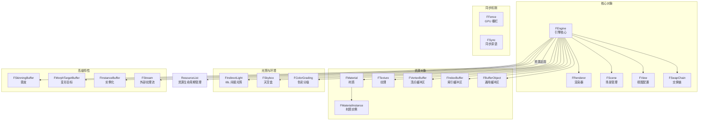

# Filament 私有实现类（Details）

## 模块名称和概述

`filament/src/details/` 包含了 Filament 所有公共 API 类的私有实现。采用 Pimpl（Pointer to Implementation）模式，公共头文件中的类（如 `Engine`、`View`、`Scene`）仅暴露接口，而实际的逻辑和数据都封装在以 `F` 为前缀的实现类中（如 `FEngine`、`FView`、`FScene`）。通过 `downcast.h` 中的宏实现公共类到实现类的安全向下转型。

## 目录结构

```
details/
├── AsyncHelpers.h          # 异步操作辅助工具
├── BufferAllocator.cpp/h   # GPU 缓冲区分配器
├── BufferObject.cpp/h      # FBufferObject 实现
├── Camera.cpp/h            # FCamera 实现
├── ColorGrading.cpp/h      # FColorGrading 色彩分级实现
├── DebugRegistry.cpp/h     # FDebugRegistry 调试注册表
├── Engine.cpp/h            # FEngine 核心引擎实现
├── Fence.cpp/h             # FFence GPU 同步栅栏
├── IndexBuffer.cpp/h       # FIndexBuffer 索引缓冲区
├── IndirectLight.cpp/h     # FIndirectLight 间接光照（IBL）
├── InstanceBuffer.cpp/h    # FInstanceBuffer 实例化缓冲区
├── Material.cpp/h          # FMaterial 材质实现
├── MaterialInstance.cpp/h  # FMaterialInstance 材质实例实现
├── MorphTargetBuffer.cpp/h # FMorphTargetBuffer 变形目标
├── Renderer.cpp/h          # FRenderer 渲染器实现
├── RenderTarget.cpp/h      # FRenderTarget 渲染目标
├── Scene.cpp/h             # FScene 场景实现
├── SkinningBuffer.cpp/h    # FSkinningBuffer 蒙皮缓冲区
├── Skybox.cpp/h            # FSkybox 天空盒
├── Stream.cpp/h            # FStream 外部纹理流
├── SwapChain.cpp/h         # FSwapChain 交换链
├── Sync.cpp/h              # FSync GPU 同步对象
├── Texture.cpp/h           # FTexture 纹理实现
├── UboManager.cpp/h        # Uniform Buffer Object 管理器
├── VertexBuffer.cpp/h      # FVertexBuffer 顶点缓冲区
└── View.cpp/h              # FView 视图实现
```

## 架构图



## 核心功能

- **FEngine**：引擎的核心实现，管理渲染线程、驱动接口、资源创建/销毁追踪、ECS 组件管理器实例化
- **FRenderer**：帧渲染的主循环实现，协调帧图构建、渲染通道执行、后处理和呈现
- **FView**：视图的完整配置，包括渲染选项（抗锯齿、SSAO、Bloom 等）、相机、后处理参数
- **FScene**：管理场景中的实体集合，维护可渲染对象和灯光列表
- **FMaterial / FMaterialInstance**：材质的着色器程序管理和参数实例化
- **UboManager**：管理 Uniform Buffer Object 的分配和更新

## 依赖关系

| 依赖 | 说明 |
|------|------|
| `include/filament/` | 公共 API 头文件（基类定义） |
| `components/` | ECS 组件管理器 |
| `ds/` | 描述符集绑定管理 |
| `fg/` | 帧图系统（在 FRenderer 中使用） |
| `backend/` | 驱动 API 调用 |
| `downcast.h` | `FILAMENT_DOWNCAST()` 宏定义公共类到实现类的转换 |

## 关键文件说明

| 文件 | 说明 |
|------|------|
| `Engine.h/cpp` | `FEngine` 是最重要的类，持有驱动接口、作业系统、所有管理器实例以及资源追踪列表，负责渲染线程的创建和销毁 |
| `Renderer.h/cpp` | `FRenderer` 实现 `beginFrame()`/`endFrame()`/`render()` 循环，构建帧图并执行所有渲染通道 |
| `View.h/cpp` | `FView` 存储完整的视图状态：相机、可见性掩码、渲染质量选项、后处理开关和参数 |
| `Scene.h/cpp` | `FScene` 维护实体列表，在每帧准备阶段收集可见的渲染对象和灯光 |
| `Material.h/cpp` | `FMaterial` 管理材质的着色器变体、参数描述和默认材质实例 |
| `MaterialInstance.h/cpp` | `FMaterialInstance` 管理单个材质实例的参数值和描述符集 |
| `Texture.h/cpp` | `FTexture` 封装纹理创建、Mipmap 生成和像素数据上传 |
| `SwapChain.h/cpp` | `FSwapChain` 封装与原生窗口关联的交换链 |
| `BufferAllocator.h/cpp` | 高效的 GPU 缓冲区子分配器，减少缓冲区创建开销 |
| `UboManager.h/cpp` | 管理 Uniform Buffer 的分配、更新和绑定 |

## 设计模式

- **Pimpl 模式**：每个公共类（如 `Engine`）都有对应的 `FEngine` 实现类，通过 `downcast()` 函数将公共指针转换为实现指针
- **资源追踪**：`FEngine` 通过 `ResourceList` 追踪所有创建的资源，确保引擎销毁时可以清理未释放的资源
- **Builder 模式**：大多数资源通过 Builder 类创建（如 `Material::Builder`），内部实现在对应的 `F*` 类中
