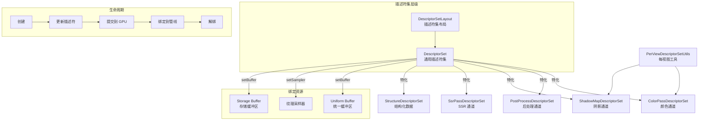

# Filament 描述符集系统（Descriptor Set）

## 模块名称和概述

`filament/src/ds/` 实现了 Filament 的描述符集（Descriptor Set）管理系统。描述符集是现代图形 API（Vulkan、Metal、WebGPU）中用于将 GPU 资源（Uniform Buffer、纹理采样器、存储缓冲区）绑定到着色器的核心机制。本模块封装了描述符集的创建、更新、提交和绑定逻辑，并为不同的渲染通道提供了专门的描述符集管理类。

## 目录结构

```
ds/
├── ColorPassDescriptorSet.cpp/h      # 颜色通道描述符集
├── DescriptorSet.cpp/h               # 通用描述符集基础类
├── DescriptorSetLayout.cpp/h         # 描述符集布局定义
├── PerViewDescriptorSetUtils.cpp/h   # 每视图描述符集工具函数
├── PostProcessDescriptorSet.cpp/h    # 后处理通道描述符集
├── ShadowMapDescriptorSet.cpp/h      # 阴影贴图通道描述符集
├── SsrPassDescriptorSet.cpp/h        # 屏幕空间反射通道描述符集
├── StructureDescriptorSet.cpp/h      # 结构化缓冲区描述符集
├── TypedBuffer.h                     # 类型安全的缓冲区包装
└── TypedUniformBuffer.h              # 类型安全的 Uniform Buffer 包装
```

## 架构图



## 核心功能

- **DescriptorSet**：通用描述符集类，管理描述符的脏标记、提交和绑定。支持 UBO、纹理采样器和存储缓冲区三类描述符
- **DescriptorSetLayout**：定义描述符集中各绑定点的类型和数量，对应着色器中的绑定声明
- **ColorPassDescriptorSet**：主颜色渲染通道的描述符集，包含视图矩阵、光照数据、IBL 纹理、阴影贴图等资源绑定
- **PostProcessDescriptorSet**：后处理通道的描述符集，包含输入纹理和后处理参数
- **ShadowMapDescriptorSet**：阴影贴图渲染通道的描述符集，包含阴影视图矩阵和相关参数
- **SsrPassDescriptorSet**：屏幕空间反射通道专用描述符集
- **PerViewDescriptorSetUtils**：在多个通道之间共享的每视图数据设置工具

## 依赖关系

| 依赖 | 说明 |
|------|------|
| `backend/DriverApi` | 使用后端驱动 API 创建和操作硬件描述符集 |
| `backend/Handle.h` | GPU 资源句柄（HwBufferObject、HwTexture、HwDescriptorSet） |
| `backend/DriverEnums.h` | 描述符类型、采样器参数等枚举定义 |
| `backend/DescriptorSetOffsetArray.h` | 动态偏移数组（用于动态 UBO） |
| `private/filament/EngineEnums.h` | 描述符集绑定点枚举 |
| `utils/bitset.h` | 位集合，用于跟踪脏描述符 |

## 关键文件说明

| 文件 | 说明 |
|------|------|
| `DescriptorSet.h/cpp` | 核心描述符集类。使用 `bitset64` 跟踪脏标记，`commit()` 方法仅在有变更时才提交到 GPU，`bind()` 方法将描述符集绑定到指定的绑定点 |
| `DescriptorSetLayout.h/cpp` | 描述符集布局，定义每个绑定点的描述符类型（UBO/采样器/SSBO）和绑定索引 |
| `ColorPassDescriptorSet.h/cpp` | 主渲染通道描述符集管理，设置视图/投影矩阵、灯光数据、IBL 纹理、阴影贴图、雾效参数等 |
| `PostProcessDescriptorSet.h/cpp` | 后处理描述符集，管理后处理效果所需的输入纹理和参数缓冲区 |
| `ShadowMapDescriptorSet.h/cpp` | 阴影渲染描述符集，管理阴影通道的视图和投影矩阵 |
| `SsrPassDescriptorSet.h/cpp` | 屏幕空间反射的描述符集，包含场景颜色和深度纹理 |
| `PerViewDescriptorSetUtils.h/cpp` | 公共工具函数，在颜色通道和阴影通道之间共享每视图数据的设置逻辑 |
| `TypedBuffer.h` | 类型安全的缓冲区模板包装，确保缓冲区数据与着色器结构体匹配 |
| `TypedUniformBuffer.h` | 类型安全的 Uniform Buffer 包装，提供结构化的数据存取接口 |

## 设计要点

- **延迟提交**：描述符集使用脏标记位（`bitset64`），只有在调用 `commit()` 时才将变更提交到 GPU，避免不必要的 API 调用
- **绑定点分组**：不同类型的通道使用不同的描述符集绑定点（`DescriptorSetBindingPoints`），减少绑定切换
- **动态偏移**：支持通过 `DescriptorSetOffsetArray` 使用动态 UBO 偏移，允许多个绘制调用共享同一个 UBO
