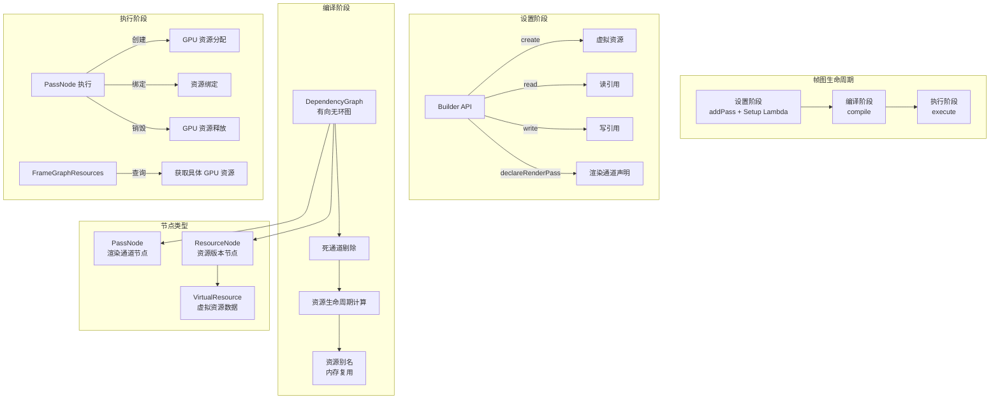

# Filament 帧图系统（Frame Graph）

## 模块名称和概述

`filament/src/fg/` 实现了 Filament 的帧图（Frame Graph）系统，这是一种受 Frostbite 引擎启发的渲染通道管理框架。帧图允许以声明式方式定义渲染通道之间的资源依赖关系，系统在编译阶段自动推导资源生命周期、执行死通道剔除，并在执行阶段按依赖顺序分配和释放 GPU 资源。

## 目录结构

```
fg/
├── Blackboard.cpp/h            # 全局资源名称注册表
├── DependencyGraph.cpp         # 有向无环图（DAG）核心实现
├── FrameGraph.cpp/h            # 帧图主接口
├── FrameGraphDummyLink.h       # 虚拟资源连接辅助
├── FrameGraphId.h              # 类型安全的资源句柄
├── FrameGraphPass.cpp/h        # 渲染通道基类和模板
├── FrameGraphRenderPass.h      # 渲染通道描述结构
├── FrameGraphResources.cpp/h   # 资源查询接口（执行阶段）
├── FrameGraphTexture.cpp/h     # 纹理资源类型定义
├── PassNode.cpp                # 通道节点实现
├── Resource.cpp                # 虚拟资源实现
├── ResourceCreationContext.cpp # 资源创建上下文
├── ResourceNode.cpp            # 资源节点实现
└── details/                    # 内部实现细节
    ├── DependencyGraph.h       # DAG 类声明
    ├── PassNode.h              # 通道节点声明
    ├── Resource.h              # 虚拟资源模板
    ├── ResourceAllocator.h     # 资源分配器接口
    ├── ResourceNode.h          # 资源节点声明
    └── Utilities.h             # 帧图内部工具
```

## 架构图



## 核心功能

- **声明式通道定义**：通过 `addPass()` 的 Setup Lambda 声明通道的资源读写需求
- **自动资源生命周期**：编译阶段根据依赖图自动计算每个资源的首次使用和最后使用时间
- **死通道剔除**：未被引用的通道和资源在编译阶段被自动剔除
- **资源别名**：生命周期不重叠的资源可以共享同一块 GPU 内存
- **Blackboard 机制**：全局命名资源表，方便跨通道传递渲染目标等中间资源
- **类型安全**：`FrameGraphId<T>` 模板提供编译时资源类型检查
- **导入外部资源**：通过 `import()` 将外部创建的 GPU 资源引入帧图管理

## 依赖关系

| 依赖 | 说明 |
|------|------|
| `Allocators.h` | 线性分配器（LinearAllocatorArena），帧图所有内部对象都使用帧内线性分配 |
| `backend/DriverApi` | 执行阶段使用后端驱动 API 创建和操作 GPU 资源 |
| `backend/Handle.h` | GPU 资源句柄类型 |
| `TextureCache` | 纹理缓存接口，帧图通过它分配和释放纹理资源 |

## 关键文件说明

| 文件 | 说明 |
|------|------|
| `FrameGraph.h/cpp` | 帧图主接口。`addPass()` 注册通道，`compile()` 构建依赖并剔除，`execute()` 执行所有有效通道 |
| `FrameGraphId.h` | `FrameGraphId<T>` 模板，带版本号的类型安全资源句柄，防止使用过期句柄 |
| `FrameGraphPass.h` | `FrameGraphPass<Data, Execute>` 模板类，封装通道数据和执行 Lambda |
| `FrameGraphResources.h/cpp` | 执行阶段的资源查询接口，将虚拟句柄解析为具体 GPU 资源 |
| `FrameGraphTexture.h/cpp` | `FrameGraphTexture` 定义纹理资源的描述符和使用方式 |
| `FrameGraphRenderPass.h` | 渲染通道描述结构，包含颜色和深度附件配置 |
| `Blackboard.h/cpp` | 键值对存储，通过字符串名称注册和查询帧图资源 |
| `details/DependencyGraph.h` | DAG 核心实现，提供节点和边的管理、环检测、拓扑遍历和引用计数剔除 |
| `details/Resource.h` | `Resource<T>` 和 `ImportedResource<T>` 模板，封装虚拟资源的描述符和具体 GPU 资源 |
| `details/PassNode.h` | 通道节点，存储通道的读写资源引用、渲染通道配置和执行回调 |
| `details/ResourceNode.h` | 资源版本节点，每次 write 都创建新版本，形成资源使用链 |

## 使用模式

帧图的典型使用流程：
1. **创建帧图**：每帧创建新的 `FrameGraph` 实例
2. **添加通道**：调用 `addPass()` 定义各个渲染通道（如阴影、颜色、后处理等）
3. **编译**：调用 `compile()` 进行依赖分析和资源生命周期优化
4. **执行**：调用 `execute()` 按依赖顺序执行所有有效通道
