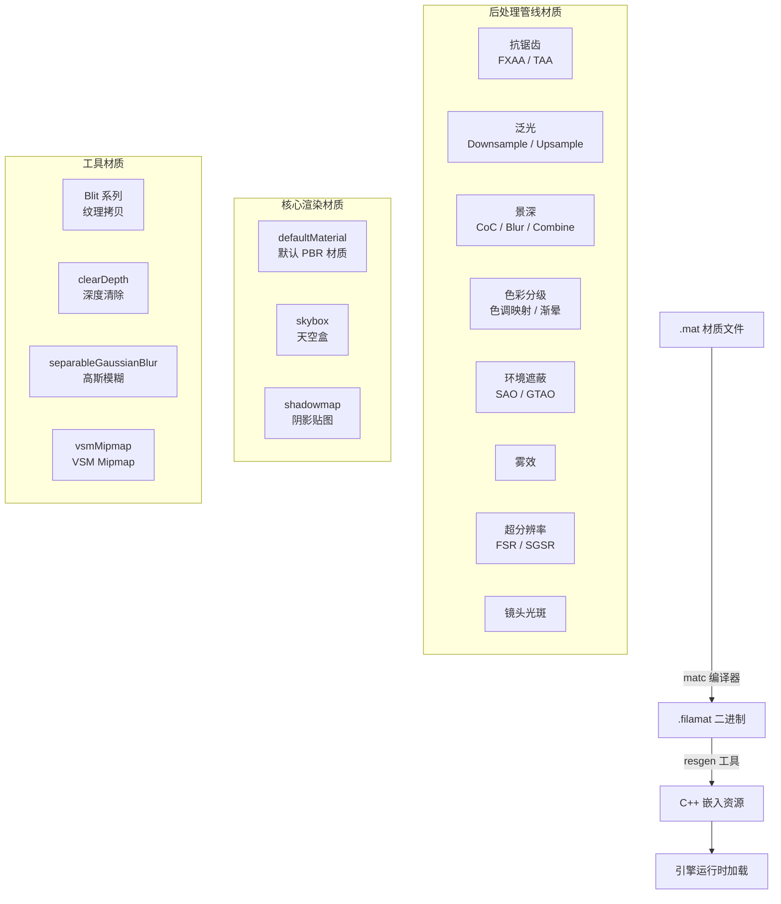

# Filament 内置材质（Materials）

## 模块名称和概述

`filament/src/materials/` 包含了 Filament 渲染引擎的所有内置材质定义文件。这些材质以 `.mat` 格式编写，通过 `matc` 编译器编译为 `.filamat` 二进制格式，最终通过 `resgen` 工具嵌入到引擎库中。内置材质主要用于后处理效果（Bloom、DOF、SSAO、色调映射等）、默认渲染和引擎内部功能。

## 目录结构

```
materials/
├── antiAliasing/               # 抗锯齿材质
│   ├── fxaa/                   #   FXAA 快速近似抗锯齿
│   │   ├── fxaa.mat            #   FXAA 材质定义
│   │   └── fxaa.fs             #   FXAA 片段着色器
│   └── taa/                    #   TAA 时间抗锯齿
│       └── taa.mat             #   TAA 材质定义
├── bloom/                      # 泛光效果
│   ├── bloomDownsample.mat     #   泛光下采样
│   ├── bloomDownsample2x.mat   #   2x 下采样变体
│   ├── bloomDownsample9.mat    #   9-tap 下采样
│   └── bloomUpsample.mat       #   泛光上采样
├── colorGrading/               # 色彩分级
│   ├── colorGrading.mat        #   主色彩分级材质
│   ├── colorGradingAsSubpass.mat # 子通道色彩分级
│   └── customResolveAsSubpass.mat # 自定义 MSAA 解析
├── dof/                        # 景深效果
│   ├── dof.mat                 #   主景深散焦
│   ├── dofCoc.mat              #   Circle of Confusion 计算
│   ├── dofCombine.mat          #   景深合成
│   ├── dofDilate.mat           #   CoC 膨胀
│   ├── dofDownsample.mat       #   景深下采样
│   ├── dofMedian.mat           #   中值滤波
│   ├── dofMipmap.mat           #   Mipmap 生成
│   ├── dofTiles.mat            #   Tile 分类
│   └── dofUtils.fs             #   景深通用工具着色器
├── flare/                      # 镜头光斑
│   └── flare.mat               #   镜头光斑材质
├── fog/                        # 雾效
│   └── fog.mat                 #   体积雾材质
├── fsr/                        # AMD FidelityFX Super Resolution
│   ├── fsr_easu.mat            #   EASU 边缘自适应上采样
│   ├── fsr_easu_mobile.mat     #   EASU 移动端变体
│   ├── fsr_easu_mobileF.mat    #   EASU 移动端浮点变体
│   ├── fsr_rcas.mat            #   RCAS 锐化
│   ├── ffx_a.h                 #   FFX 通用工具头
│   └── ffx_fsr1.h              #   FSR1 算法头文件
├── sgsr/                       # Snapdragon Game Super Resolution
│   └── sgsr1.mat               #   SGSR 材质
├── ssao/                       # 屏幕空间环境遮蔽
│   ├── sao.mat                 #   Scalable AO
│   ├── saoBentNormals.mat      #   带弯曲法线的 SAO
│   ├── gtao.mat                #   Ground Truth AO
│   ├── gtaoBentNormals.mat     #   带弯曲法线的 GTAO
│   ├── bilateralBlur.mat       #   双边模糊
│   ├── mipmapDepth.mat         #   深度 Mipmap
│   └── ssaoUtils.fs            #   SSAO 通用工具着色器
├── utils/                      # 共享工具着色器
│   ├── depthUtils.fs           #   深度相关工具函数
│   └── geometry.fs             #   几何计算工具函数
├── defaultMaterial.mat         # 默认 PBR 材质
├── skybox.mat                  # 天空盒材质
├── shadowmap.mat               # 阴影贴图材质
├── blitArray.mat               # 纹理数组 Blit
├── blitDepth.mat               # 深度 Blit
├── blitLow.mat                 # 低精度 Blit
├── clearDepth.mat              # 深度清除
├── resolveDepth.mat            # 深度解析
├── separableGaussianBlur.mat   # 可分离高斯模糊
├── vsmMipmap.mat               # VSM Mipmap 生成
├── debugShadowCascades.mat     # 阴影级联调试可视化
└── StaticMaterialInfo.h        # 内置材质信息常量
```

## 架构图



## 核心功能

- **后处理效果材质**：实现所有后处理管线的着色器，包括抗锯齿、泛光、景深、色彩分级、SSAO、雾效和超分辨率
- **默认渲染材质**：`defaultMaterial.mat` 提供基础 PBR 材质，`skybox.mat` 渲染环境天空盒
- **阴影材质**：`shadowmap.mat` 用于阴影通道的深度渲染，`vsmMipmap.mat` 用于 VSM 的 Mipmap 生成
- **工具材质**：提供纹理 Blit、深度清除/解析、高斯模糊等通用操作
- **多特性级别**：支持 Feature Level 0（低端设备）和 Multiview（立体渲染）变体

## 依赖关系

| 依赖 | 说明 |
|------|------|
| `matc` | 材质编译器，将 `.mat` 编译为 `.filamat` |
| `resgen` | 资源生成器，将二进制文件嵌入 C++ 代码 |
| `shaders/` | 引擎着色器库（如 `inline_dithering.fs`、`surface_fog.fs`） |
| `PostProcessManager` | 后处理管理器在运行时加载和使用这些材质 |

## 关键文件说明

| 文件 | 说明 |
|------|------|
| `defaultMaterial.mat` | 引擎默认材质，当用户未指定材质时使用，实现基础 PBR 着色 |
| `skybox.mat` | 天空盒渲染材质，从立方体贴图采样环境 |
| `shadowmap.mat` | 阴影通道深度渲染，支持标准和 VSM 阴影模式 |
| `colorGrading/colorGrading.mat` | 最终色彩分级通道，包含色调映射、抖动和渐晕效果 |
| `ssao/sao.mat` | Scalable Ambient Obscurance 算法实现 |
| `ssao/gtao.mat` | Ground Truth Ambient Occlusion 算法实现（可禁用） |
| `bloom/bloomDownsample.mat` | 泛光效果的下采样通道，提取高亮区域 |
| `dof/dof.mat` | 景深主散焦通道，实现光圈散景效果 |
| `fsr/fsr_easu.mat` | AMD FSR 的边缘自适应空间上采样，用于超分辨率渲染 |
| `StaticMaterialInfo.h` | 定义内置材质的常量标识符，供引擎代码索引材质资源 |

## 材质编译流程

1. `.mat` 文件由 `matc` 编译器处理，生成包含多后端着色器变体的 `.filamat` 文件
2. 按目录分组，每组通过 `resgen` 生成一个 C++ 资源包（头文件 + 源文件）
3. 资源包在编译时链接到 `filament` 静态库中
4. 引擎在初始化时从嵌入资源中加载这些材质
