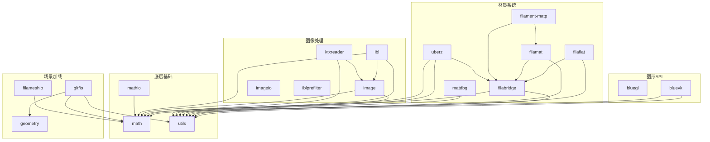

# Filament 库模块总览

本文档对 Filament 渲染引擎 `libs/` 目录下的全部 27 个库模块进行概述。这些库共同构成了 Filament 的基础设施，涵盖图形 API 加载、材质编译、图像处理、场景加载等方面。

## 分类概览

### 图形 API 加载层

| 库名 | 说明 |
|------|------|
| [bluegl](bluegl/README.md) | OpenGL 函数动态加载器，通过汇编跳板（trampoline）机制实现跨平台 GL 函数绑定 |
| [bluevk](bluevk/README.md) | Vulkan 函数动态加载器，运行时加载 Vulkan 共享库并绑定所有函数指针 |

### 材质系统

| 库名 | 说明 |
|------|------|
| [filabridge](filabridge/README.md) | Filament 与材质编译器之间的桥接层，定义材质枚举、接口块和变体等共享数据结构 |
| [filaflat](filaflat/README.md) | 材质包的扁平化序列化/反序列化库，负责 Chunk 容器的读取与解析 |
| [filamat](filamat/README.md) | 材质编译器核心库，将 GLSL 着色器代码编译为多后端材质包 |
| [filament-matp](filament-matp/) | 材质文本解析器（Material Parser），解析 `.mat` 格式的材质定义文件 |
| [matdbg](matdbg/) | 材质调试器，提供 HTTP 服务用于实时检查和替换运行中的着色器 |
| [uberz](uberz/) | Uber-archive 材质归档系统，支持材质包的压缩存储与读取（基于 zstd） |

### 相机与交互

| 库名 | 说明 |
|------|------|
| [camutils](camutils/README.md) | 相机操控工具库，提供轨道（Orbit）、地图（Map）和自由飞行（Free Flight）三种交互模式 |

### 调试与可视化

| 库名 | 说明 |
|------|------|
| [fgviewer](fgviewer/README.md) | Frame Graph 可视化调试器，通过内嵌 Web 服务实时查看渲染管线中的 Pass 和资源 |
| [viewer](viewer/) | 通用场景查看器库，提供 GUI 控件、自动化测试引擎和远程控制服务 |

### 图像处理

| 库名 | 说明 |
|------|------|
| [image](image/) | 图像基础库，提供线性图像（LinearImage）表示、KTX1 容器支持和颜色空间转换 |
| [imagediff](imagediff/) | 图像差异比较工具库，用于渲染回归测试中的图像对比 |
| [imageio](imageio/) | 图像编解码库，支持 HDR、PNG、EXR 等多种格式以及 Basis 纹理编码 |
| [imageio-lite](imageio-lite/) | 轻量级图像编解码库，仅包含基本的 PNG 编解码功能 |

### 纹理与 IBL

| 库名 | 说明 |
|------|------|
| [ibl](ibl/) | 基于图像的照明（IBL）核心库，提供立方体贴图、球谐函数和预滤波计算 |
| [iblprefilter](iblprefilter/) | IBL 预滤波 GPU 加速库，使用 Filament 计算着色器在设备端生成预滤波环境贴图 |
| [generatePrefilterMipmap](generatePrefilterMipmap/) | 预滤波 Mipmap 生成库，用于创建粗糙度预滤波的 Mipmap 链 |
| [ktxreader](ktxreader/) | KTX 纹理读取器，支持 KTX1 和 KTX2 格式，集成 Basis Universal 转码 |

### 几何与网格

| 库名 | 说明 |
|------|------|
| [geometry](geometry/) | 几何处理库，提供切线空间计算（Mikktspace）、表面方向和网格转码功能 |
| [filameshio](filameshio/) | Filament 自有网格格式（filamesh）的读写库 |
| [gltfio](gltfio/) | glTF 2.0 资产加载库，支持动画、材质、纹理等完整 glTF 特性 |

### 数学基础

| 库名 | 说明 |
|------|------|
| [math](math/) | 数学基础库，提供向量、矩阵、四元数、半精度浮点等类型 |
| [mathio](mathio/) | 数学类型的格式化输出库，为 math 库中的类型提供流式输出支持 |

### 通用工具

| 库名 | 说明 |
|------|------|
| [utils](utils/) | 核心工具库，提供内存分配器、作业系统、实体管理、字符串、互斥锁等基础设施 |

### UI 集成

| 库名 | 说明 |
|------|------|
| [filagui](filagui/README.md) | ImGui 与 Filament 的集成层，将 ImGui 绘制命令转换为 Filament 渲染原语 |

### 示例应用框架

| 库名 | 说明 |
|------|------|
| [filamentapp](filamentapp/) | 示例应用程序框架，封装窗口管理（SDL2）、IBL 加载和基本场景设置 |

## 依赖关系总览



## 构建说明

所有库均使用 CMake 构建系统，作为 Filament 主项目的子目录自动编译。大多数库生成静态库（`.a` / `.lib`），部分库（如 `filamat`、`fgviewer`）在安装时会将依赖合并为单一静态库以简化链接。

```bash
# 完整构建（包含所有库）
./build.sh release

# 仅构建特定目标
cmake --build out/release --target filamat
```

## 平台支持

| 平台 | bluegl | bluevk | 其他库 |
|------|--------|--------|--------|
| Windows | 支持 | 支持 | 支持 |
| macOS | 支持 | 支持（MoltenVK） | 支持 |
| Linux | 支持 | 支持 | 支持 |
| Android | 不适用 | 支持 | 支持 |
| iOS | 不适用 | 部分支持 | 支持 |
| WebGL | 不适用 | 不适用 | 部分支持 |
