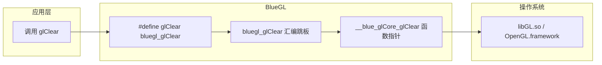

# BlueGL -- OpenGL 函数动态加载器

## 模块概述

BlueGL 是 Filament 的 OpenGL 函数动态加载库。它在运行时通过 `dlopen`/`dlsym`（或平台等价物）从操作系统的 OpenGL 共享库中加载所有 GL Core 函数指针，并通过汇编语言实现的跳板（trampoline）函数进行间接调用。这种设计使得 Filament 无需在编译时链接 OpenGL 库，同时保持了与标准 GL 调用完全一致的使用方式。

## 目录结构

```
libs/bluegl/
  CMakeLists.txt              # 构建配置，按平台选择源文件
  bluegl-gen.py               # 代码生成脚本，自动生成头文件和汇编跳板
  README.md                   # 原始英文文档（内部机制说明）
  include/bluegl/
    BlueGL.h                  # 公共 API 头文件（bind/unbind）
    BlueGLDefines.h           # 宏定义，将 glXxx 重定向为 bluegl_glXxx
  src/
    BlueGL.cpp                # 核心实现（平台无关的函数指针管理）
    BlueGLDarwin.cpp          # macOS 平台加载实现
    BlueGLLinux.cpp           # Linux/X11 平台加载实现
    BlueGLLinuxEGL.cpp        # Linux/EGL 平台加载实现
    BlueGLWindows.cpp         # Windows 平台加载实现
    BlueGLOSMesa.cpp          # OSMesa 软件渲染加载实现
    BlueGLCore*Impl.S         # 各平台汇编跳板文件（x86_64/AArch64）
    private_BlueGL.h          # 内部函数指针声明
  tests/
    test_bluegl.cpp           # 单元测试
```

## 架构图



## 核心功能

1. **动态函数加载** -- 通过 `bluegl::bind()` 在运行时从系统 GL 库中查找并绑定所有 OpenGL Core 函数指针。使用引用计数管理生命周期，支持多次 bind/unbind。

2. **汇编跳板机制** -- 使用平台特定的汇编代码生成跳板函数（trampoline），通过 `jmp` 指令间接调用真正的 GL 函数。这种方式的开销极小，仅多一次间接跳转。

3. **宏重定向** -- `BlueGLDefines.h` 将所有标准 GL 函数名通过 `#define` 重定向为 `bluegl_` 前缀版本，使应用代码无需任何修改即可透明使用。

4. **跨平台支持** -- 支持 Windows（WGL）、macOS（NSOpenGL / OSMesa）、Linux（GLX / EGL / OSMesa），同时支持 x86_64 和 AArch64 架构。

5. **代码自动生成** -- `bluegl-gen.py` 脚本根据 GL 规范自动生成头文件、宏定义和汇编跳板代码，确保完整覆盖所有 GL Core 函数。

## 依赖关系

- **无外部依赖** -- BlueGL 是一个底层库，不依赖 Filament 的其他模块
- **系统依赖**:
  - Windows: `opengl32.lib`, `gdi32.lib`
  - Linux: `libdl`（用于 `dlopen`/`dlsym`）
  - macOS: 系统 OpenGL Framework

## 关键文件说明

| 文件 | 说明 |
|------|------|
| `include/bluegl/BlueGL.h` | 公共 API，仅暴露 `bluegl::bind()` 和 `bluegl::unbind()` 两个函数 |
| `include/bluegl/BlueGLDefines.h` | 自动生成的宏定义，将 `glXxx` 映射为 `bluegl_glXxx` |
| `src/BlueGL.cpp` | 核心逻辑：管理函数指针数组和引用计数 |
| `src/BlueGLDarwin.cpp` | macOS 上通过 `dlopen("libGL.dylib")` 或 NSOpenGL 加载 GL 函数 |
| `src/BlueGLLinux.cpp` | Linux 上通过 `glXGetProcAddress` 加载 GL 函数 |
| `src/BlueGLWindows.cpp` | Windows 上通过 `wglGetProcAddress` 加载 GL 函数 |
| `src/BlueGLCore*Impl.S` | 各平台的汇编跳板实现，每个 GL 函数对应一个跳板入口 |
| `bluegl-gen.py` | Python 代码生成器，解析 GL 头文件并输出所有自动生成的代码 |

## 使用方式

```cpp
#include <bluegl/BlueGLDefines.h>
#include <bluegl/BlueGL.h>

// 初始化（加载所有 GL 函数）
int result = bluegl::bind();

// 之后可以正常调用任何 GL 函数
glClear(GL_COLOR_BUFFER_BIT);
glDrawArrays(GL_TRIANGLES, 0, 3);

// 释放
bluegl::unbind();
```
