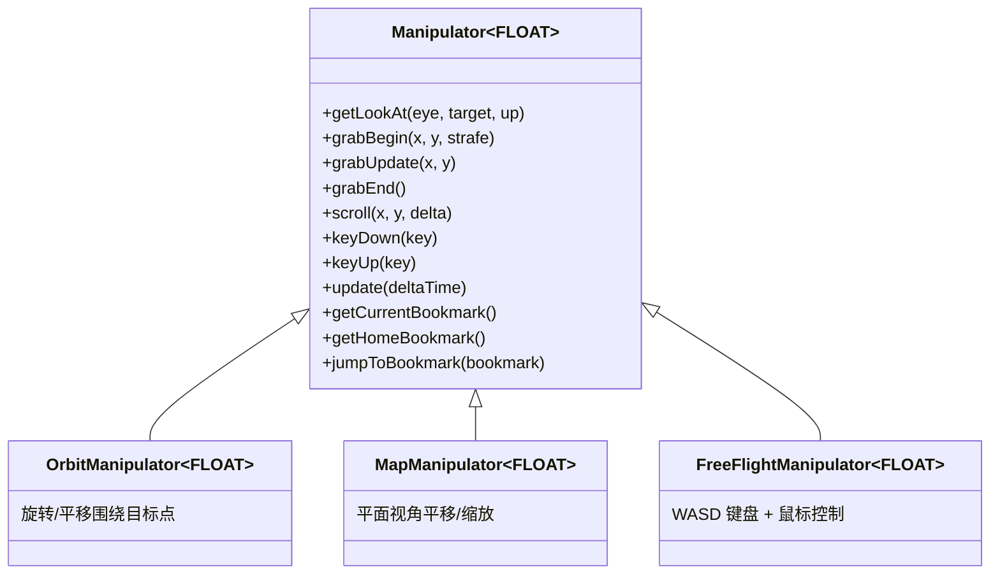

# camutils -- 相机操控工具库

## 模块概述

camutils 提供了一套通用的相机操控器（Camera Manipulator），支持三种交互模式：轨道模式（Orbit）、地图模式（Map）和自由飞行模式（Free Flight）。用户通过通知操控器鼠标或触摸事件，然后每帧查询 `getLookAt()` 来获取相机的位置和朝向。这种设计类似于 Sketchfab 或 Google Maps 的相机操控体验。

## 目录结构

```
libs/camutils/
  CMakeLists.txt                    # 构建配置
  include/camutils/
    Bookmark.h                      # 相机书签（快照）类型定义
    compiler.h                      # 导出宏定义
    Manipulator.h                   # 核心公共头文件：Manipulator 模板类
  src/
    Bookmark.cpp                    # 书签序列化实现
    Manipulator.cpp                 # Manipulator 基类实现
    OrbitManipulator.h              # 轨道模式具体实现
    MapManipulator.h                # 地图模式具体实现
    FreeFlightManipulator.h         # 自由飞行模式具体实现
  tests/
    test_camutils.cpp               # 单元测试
```

## 架构图



## 核心功能

1. **三种交互模式**:
   - **Orbit（轨道模式）** -- 围绕目标点旋转和平移，适用于 3D 模型查看器
   - **Map（地图模式）** -- 俯视视角的平移和缩放，适用于地图或 2D 场景浏览
   - **Free Flight（自由飞行模式）** -- WASD 键盘控制移动 + 鼠标控制视角，适用于第一人称漫游

2. **Builder 模式构建** -- 通过链式 Builder 配置视口尺寸、初始位置、缩放速度、FOV 等，调用 `build(mode)` 创建操控器。

3. **书签系统** -- 保存/恢复相机状态，适用于相机动画和预设视角切换。

4. **光线投射支持** -- 可选的 `RayCallback` 回调函数和地面平面方程，用于精确的抓取拖拽操作。模板化设计支持 `float` 或 `double` 精度。

## 依赖关系

- **math** -- 使用 `vec2`、`vec3`、`vec4` 等数学类型（公共依赖）
- 无其他 Filament 模块依赖

## 关键文件说明

| 文件 | 说明 |
|------|------|
| `include/camutils/Manipulator.h` | 核心头文件，定义 `Manipulator` 基类、`Builder` 和 `Config` |
| `include/camutils/Bookmark.h` | 定义 `Bookmark` 类，用于保存和恢复相机状态 |
| `src/Manipulator.cpp` | 基类实现（`getLookAt()`、`raycast()` 等） |
| `src/OrbitManipulator.h` | 轨道模式：围绕目标点旋转和平移 |
| `src/MapManipulator.h` | 地图模式：正交/透视投影下的平移和缩放 |
| `src/FreeFlightManipulator.h` | 自由飞行模式：WASD 移动和视角旋转 |

## 使用示例

```cpp
using CameraManipulator = filament::camutils::Manipulator<float>;

auto* manip = CameraManipulator::Builder()
    .viewport(1024, 768)
    .orbitHomePosition(0, 0, 5)
    .build(filament::camutils::Mode::ORBIT);

// 每帧查询相机参数
filament::math::float3 eye, center, up;
manip->getLookAt(&eye, &center, &up);
```
