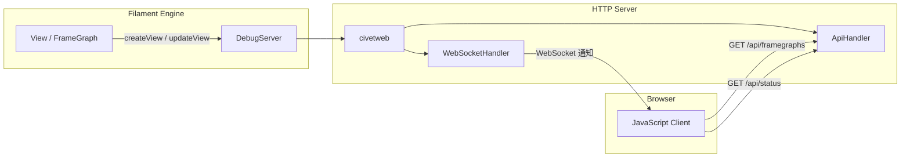

# fgviewer -- Frame Graph 可视化调试器

## 模块概述

fgviewer 是 Filament 的 Frame Graph（帧图）实时可视化调试工具。它由一个 C++ HTTP 服务端和一个 JavaScript Web 客户端组成，能够在浏览器中实时展示 Filament 渲染管线中的活跃 Pass（渲染通道）和 Resource（资源）信息。开发者可以用它来分析和优化渲染管线的资源分配与通道依赖。

## 目录结构

```
libs/fgviewer/
  CMakeLists.txt                    # 构建配置（含资源嵌入和静态库合并）
  README.md                         # 原始英文文档（详细的架构和 API 说明）
  include/fgviewer/
    DebugServer.h                   # 调试服务器公共接口
    FrameGraphInfo.h                # Frame Graph 信息数据结构
    JsonWriter.h                    # JSON 序列化工具
  src/
    ApiHandler.cpp / .h             # HTTP REST API 处理器
    DebugServer.cpp                 # 服务器核心实现
    FrameGraphInfo.cpp              # 帧图信息管理
    JsonWriter.cpp                  # JSON 输出实现
    WebSocketHandler.cpp / .h       # WebSocket 连接处理（用于推送更新通知）
  web/
    api.js                          # API 通信层
    app.js                          # Web 客户端应用（LitElement）
    index.html                      # 入口页面
```

## 架构图



## 核心功能

1. **内嵌 HTTP 服务器** -- 基于 civetweb 库实现轻量级 HTTP 服务，启动后监听指定端口（桌面端由 `FILAMENT_FGVIEWER_PORT` 环境变量控制，Android 默认 8085 端口）。

2. **REST API 接口**:
   - `GET /api/framegraphs` -- 返回所有帧图的 JSON 数组
   - `GET /api/framegraph?fg={id}` -- 返回指定帧图的详细信息
   - `GET /api/status` -- 长轮询，通知客户端帧图是否有更新

3. **实时视图管理** -- Filament 引擎通过 `DebugServer` 的三个方法与调试器交互：
   - `createView()` -- 注册新视图
   - `update()` -- 更新视图的帧图信息
   - `destroyView()` -- 移除视图

4. **Web 可视化客户端** -- 使用 LitElement 构建的 Web 组件，展示 Pass 列表、资源依赖关系和属性信息。客户端数据库在断线后仍保持有效。

5. **资源嵌入** -- Web 前端文件（HTML、JS）通过 `resgen` 工具嵌入到 C++ 静态库中，无需外部文件即可运行。

## 依赖关系

- **civetweb** -- 嵌入式 HTTP/WebSocket 服务器（第三方库）
- **utils** -- Filament 工具库（互斥锁、字符串等）
- **fgviewer_resources** -- 内嵌的 Web 前端资源

安装时这些依赖会合并为单一静态库 `libfgviewer_combined.a`。

## 关键文件说明

| 文件 | 说明 |
|------|------|
| `include/fgviewer/DebugServer.h` | 公共接口，定义 `DebugServer` 类及其 `createView`/`update`/`destroyView` 方法 |
| `include/fgviewer/FrameGraphInfo.h` | 定义帧图信息的数据结构（Pass 列表、Resource 列表、属性等） |
| `src/DebugServer.cpp` | 服务器实现，初始化 civetweb 并注册 API 和 WebSocket 处理器 |
| `src/ApiHandler.cpp` | REST API 实现，处理 `/api/framegraphs`、`/api/framegraph`、`/api/status` 请求 |
| `src/WebSocketHandler.cpp` | WebSocket 连接管理，用于向客户端推送帧图更新通知 |
| `web/app.js` | 浏览器端应用逻辑，管理帧图数据库并渲染可视化界面 |

## 启用方式

```bash
# 桌面端：启用 fgviewer 构建选项
./build.sh -ft debug gltf_viewer

# 设置端口
export FILAMENT_FGVIEWER_PORT=8050

# 运行应用后，在浏览器中打开
# http://localhost:8050
```

Android 端需要在 CMake 中启用 `FILAMENT_ENABLE_FGVIEWER`，并使用 `adb forward tcp:8085 tcp:8085` 进行端口转发。
