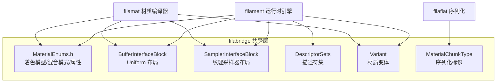

# filabridge -- Filament 与材质编译器的桥接层

## 模块概述

filabridge 是 Filament 渲染引擎与材质编译器（filamat/matc）之间的共享数据定义层。它定义了材质系统的核心枚举类型（着色模型、混合模式、顶点属性等）、Uniform/Sampler 接口块结构、描述符集布局和变体（Variant）系统。filabridge 确保引擎运行时和编译时使用完全一致的材质数据格式。

## 目录结构

```
libs/filabridge/
  CMakeLists.txt                          # 构建配置
  include/
    filament/
      MaterialChunkType.h                 # 材质 Chunk 类型枚举
      MaterialEnums.h                     # 材质核心枚举（Shading, BlendingMode 等）
    private/filament/
      BufferInterfaceBlock.h              # Uniform Buffer 接口块定义
      ConstantInfo.h                      # 常量参数信息
      DescriptorSets.h                    # 描述符集布局定义
      EngineEnums.h                       # 引擎内部枚举
      PushConstantInfo.h                  # Push Constant 信息
      SamplerBindingsInfo.h               # 采样器绑定信息
      SamplerInterfaceBlock.h             # 采样器接口块定义
      SibStructs.h                        # 采样器接口块结构
      SubpassInfo.h                       # Subpass 信息
      UibStructs.h                        # Uniform 接口块结构
      Variant.h                           # 材质变体定义
  src/
    BufferInterfaceBlock.cpp              # Uniform Buffer 接口块实现
    DescriptorSets.cpp                    # 描述符集实现
    SamplerInterfaceBlock.cpp             # 采样器接口块实现
    Variant.cpp                           # 变体计算和过滤实现
```

## 架构图



## 核心功能

1. **材质枚举定义（MaterialEnums.h）** -- 定义 Filament 材质系统的所有核心枚举:
   - `Shading` -- 着色模型（Unlit、Lit、Subsurface、Cloth、Specular Glossiness）
   - `BlendingMode` -- 混合模式（Opaque、Transparent、Add、Masked、Fade 等）
   - `VertexAttribute` -- 顶点属性（Position、Tangents、Color、UV、骨骼等）
   - `Property` -- 材质属性（BaseColor、Roughness、Metallic 等 31 种属性）
   - `MaterialDomain` -- 材质域（Surface、Post-process、Compute）

2. **接口块系统**:
   - `BufferInterfaceBlock` -- 描述 Uniform Buffer 的内存布局（字段名、类型、偏移、对齐）
   - `SamplerInterfaceBlock` -- 描述纹理采样器的绑定信息（名称、类型、格式、精度）

3. **描述符集（DescriptorSets）** -- 定义 Vulkan/Metal 风格的描述符集布局，管理 Uniform Buffer 和 Sampler 的绑定点分配。

4. **变体系统（Variant）** -- 管理材质着色器的编译变体组合（方向光、动态光源、阴影接收、蒙皮、雾效、VSM 等），支持变体过滤以减少编译时间和二进制大小。

5. **材质版本控制** -- `MATERIAL_VERSION` 常量（当前为 70）确保引擎与材质包的兼容性。

## 依赖关系

- **utils** -- 基础工具（bitset、BitmaskEnum、compiler 宏等）
- **math** -- 数学类型
- **backend_headers** -- 后端驱动枚举定义（ShaderModel、UniformType 等）

## 关键文件说明

| 文件 | 说明 |
|------|------|
| `include/filament/MaterialEnums.h` | 最重要的公共头文件，定义所有材质相关枚举和 `MATERIAL_VERSION` |
| `include/filament/MaterialChunkType.h` | 定义材质二进制格式中各 Chunk 的类型标识 |
| `include/private/filament/Variant.h` | 变体系统，定义变体位掩码和过滤规则 |
| `include/private/filament/BufferInterfaceBlock.h` | Uniform Buffer 接口块，描述 UBO 的内存布局 |
| `include/private/filament/SamplerInterfaceBlock.h` | 采样器接口块，描述纹理绑定的元数据 |
| `include/private/filament/DescriptorSets.h` | 描述符集布局定义，用于 Vulkan/Metal 后端 |
| `src/Variant.cpp` | 变体计算逻辑，包括变体过滤和有效性验证 |
| `src/BufferInterfaceBlock.cpp` | UBO 布局计算，处理 std140/std430 对齐规则 |
