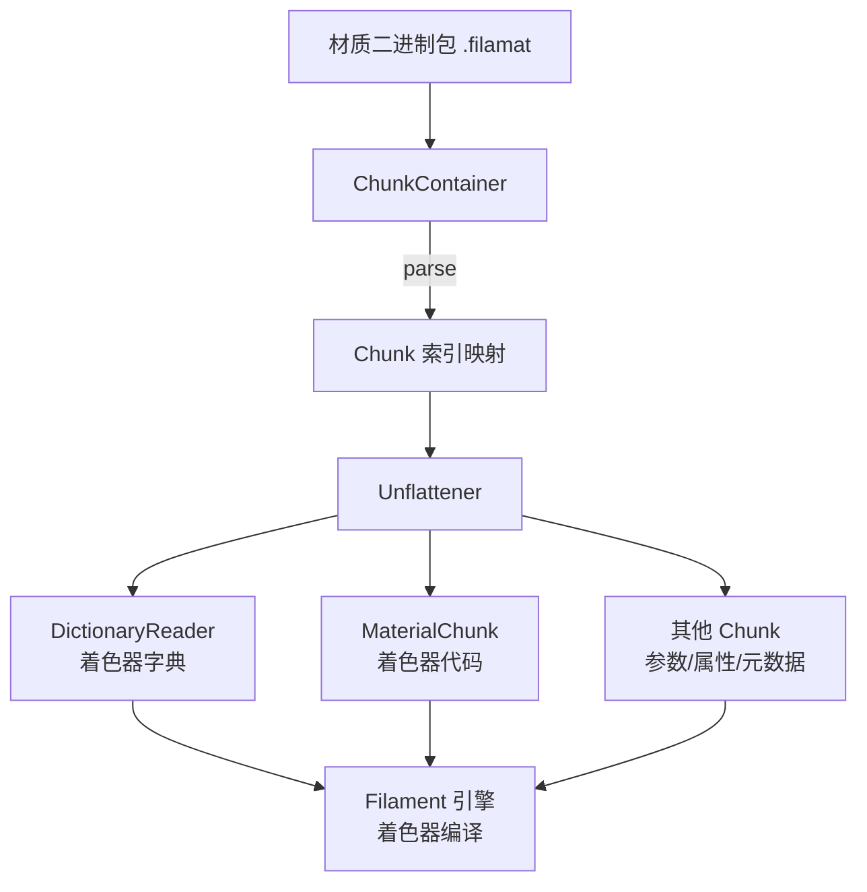

# filaflat -- 材质包扁平化序列化库

## 模块概述

filaflat 是 Filament 材质包（Material Package）的反序列化库。材质包是由 `matc` 工具或 `filamat` 库编译生成的二进制文件，包含着色器代码、材质参数定义和其他元数据。filaflat 提供了基于 Chunk 容器的解析机制，能够高效地从扁平化的二进制数据中读取各个数据块，供 Filament 引擎运行时使用。

## 目录结构

```
libs/filaflat/
  CMakeLists.txt                    # 构建配置
  include/filaflat/
    ChunkContainer.h                # Chunk 容器（核心解析器）
    DictionaryReader.h              # 字典读取器（着色器字符串/二进制字典）
    MaterialChunk.h                 # 材质着色器 Chunk 读取器
    Unflattener.h                   # 二进制反扁平化工具
  src/
    ChunkContainer.cpp              # Chunk 容器实现
    DictionaryReader.cpp            # 字典反序列化实现
    MaterialChunk.cpp               # 材质 Chunk 读取实现
    Unflattener.cpp                 # 基础类型反序列化实现
```

## 架构图



## 核心功能

1. **Chunk 容器解析（ChunkContainer）** -- 材质包采用基于 Chunk 的二进制格式。`ChunkContainer` 解析整个包，建立 ChunkType 到数据偏移的索引映射，支持按类型快速查找和随机访问。

2. **二进制反扁平化（Unflattener）** -- 提供从原始字节流中顺序读取各种基础类型（uint8、uint32、string、bool 等）的工具，处理字节对齐和边界检查。

3. **字典读取（DictionaryReader）** -- 材质包使用字典压缩技术存储着色器代码。字典将重复出现的字符串或二进制块（如 SPIR-V）存储为索引引用。`DictionaryReader` 负责重建这些字典。

4. **材质 Chunk 读取（MaterialChunk）** -- 根据着色器模型（ShaderModel）和变体（Variant）信息，从已解析的字典中查找并提取对应的着色器代码。

5. **SPIR-V 压缩支持** -- 当启用 Vulkan 后端时，链接 `smol-v` 库以支持 SPIR-V 着色器的压缩/解压缩。

## 依赖关系

- **filabridge** -- 使用 `MaterialChunkType` 枚举标识各种 Chunk 类型
- **utils** -- 基础工具（`FixedCapacityVector`、编译器宏等）
- **smol-v**（可选） -- SPIR-V 压缩库，仅在支持 Vulkan 时链接

## 关键文件说明

| 文件 | 说明 |
|------|------|
| `include/filaflat/ChunkContainer.h` | 核心类，解析材质二进制包并建立 Chunk 类型到数据区域的映射 |
| `include/filaflat/Unflattener.h` | 低层反序列化工具，从字节流中读取基本类型 |
| `include/filaflat/DictionaryReader.h` | 读取着色器字典，支持文本字典和 SPIR-V 二进制字典 |
| `include/filaflat/MaterialChunk.h` | 按 ShaderModel 和 Variant 从字典中提取着色器代码 |
| `src/ChunkContainer.cpp` | Chunk 解析循环，验证 Chunk 完整性和大小有效性 |
| `src/DictionaryReader.cpp` | 字典重建逻辑，处理压缩字符串的解压 |
| `src/MaterialChunk.cpp` | 着色器查找逻辑，实现变体到着色器代码的映射查询 |
| `src/Unflattener.cpp` | 基础类型读取实现，包含边界检查和字节序处理 |

## 数据格式

材质包的二进制格式遵循 EIFF（Engine Interchange File Format）结构：

```
[包头]
[Chunk 0: 类型 | 大小 | 数据...]
[Chunk 1: 类型 | 大小 | 数据...]
...
[Chunk N: 类型 | 大小 | 数据...]
```

每个 Chunk 由以下部分组成：
- **类型**（ChunkType） -- 标识 Chunk 内容（如着色器字典、材质参数、变体信息等）
- **大小**（size_t） -- 数据区域的字节数
- **数据**（uint8_t[]） -- 实际的扁平化数据
