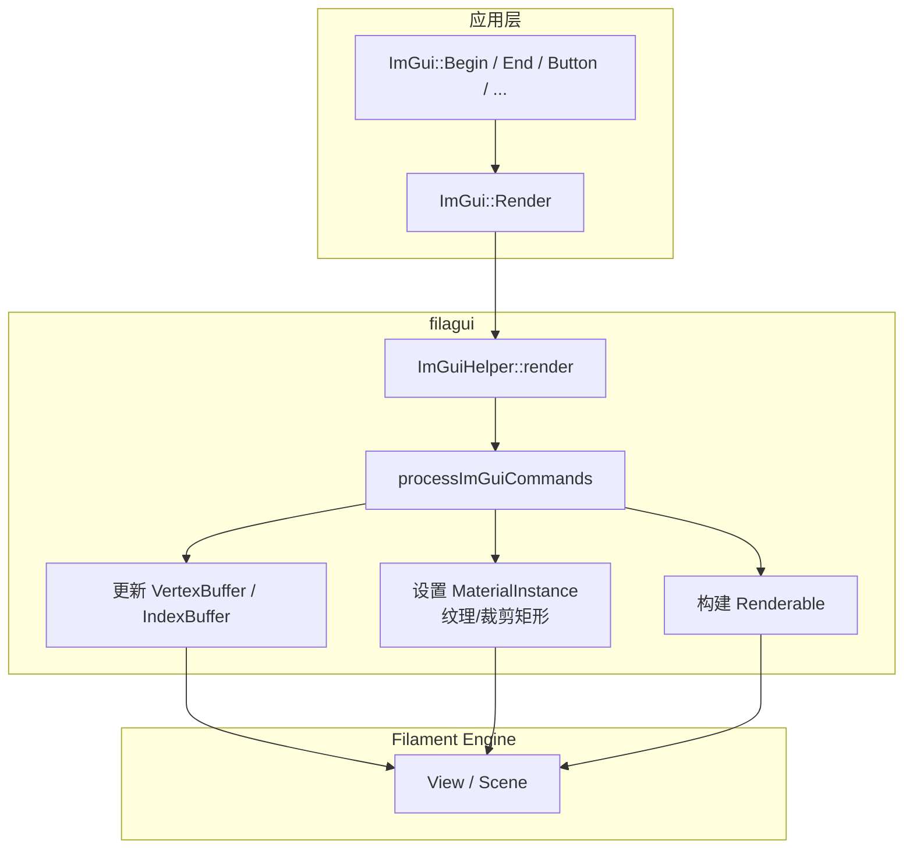

# filagui -- ImGui 与 Filament 集成层

## 模块概述

filagui 将 [Dear ImGui](https://github.com/ocornut/imgui) 即时模式 GUI 框架与 Filament 渲染引擎集成。它将 ImGui 生成的绘制命令（顶点缓冲、索引缓冲、纹理和裁剪矩形）转换为 Filament 的渲染原语（VertexBuffer、IndexBuffer、MaterialInstance、Renderable），使开发者可以在 Filament 应用中方便地创建调试 UI 和工具面板。

## 目录结构

```
libs/filagui/
  CMakeLists.txt                        # 构建配置（含材质编译和资源嵌入）
  include/filagui/
    ImGuiHelper.h                       # 核心集成类
    ImGuiExtensions.h                   # ImGui 扩展控件
    ImGuiMath.h                         # ImGui 与 Filament 数学类型互操作
  src/
    ImGuiHelper.cpp                     # ImGuiHelper 实现
    ImGuiExtensions.cpp                 # 扩展控件实现
    materials/
      uiBlit.mat                        # UI 渲染材质定义
      uiBlitExternal.mat               # Android 外部纹理材质（仅 Android）
```

## 架构图



## 核心功能

1. **ImGuiHelper 集成类** -- 核心类 `ImGuiHelper` 管理整个 UI 渲染生命周期：
   - 构造时创建专用的 Scene 和 Camera
   - `setDisplaySize()` 通知视口尺寸变化
   - `render()` 接受回调函数，在其中编写 ImGui 代码
   - `processImGuiCommands()` 将 ImGui 绘制命令转换为 Filament 调用

2. **动态缓冲管理** -- 根据 ImGui 的绘制数据动态创建和更新 Filament 的 VertexBuffer 和 IndexBuffer，支持多缓冲区以处理大量 UI 元素。

3. **字体纹理** -- 自动将 ImGui 字体图集创建为 Filament Texture，支持自定义字体路径加载。

4. **材质编译** -- 内置 `uiBlit.mat` 材质文件，在构建时由 `matc` 编译并通过 `resgen` 嵌入到库中。Android 平台额外包含 `uiBlitExternal.mat` 用于外部纹理支持。

5. **扩展控件（ImGuiExtensions）** -- 提供超出标准 ImGui 的自定义控件，如颜色选择器增强和 Filament 特定的参数编辑器。

6. **数学类型桥接（ImGuiMath）** -- 提供 ImGui 的 `ImVec2`/`ImVec4` 与 Filament 的 `float2`/`float4` 之间的隐式转换。

## 依赖关系

- **imgui** -- Dear ImGui 库（公共依赖）
- **filament** -- Filament 渲染引擎（公共依赖，用于 Engine、View、Material 等类型）
- **matc** -- 材质编译器（构建时依赖，用于编译 `.mat` 文件）
- **resgen** -- 资源生成工具（构建时依赖，用于嵌入编译后的材质）

## 关键文件说明

| 文件 | 说明 |
|------|------|
| `include/filagui/ImGuiHelper.h` | 核心公共接口，定义 `ImGuiHelper` 类及其 `render()`、`processImGuiCommands()` 等方法 |
| `include/filagui/ImGuiExtensions.h` | 扩展控件定义，提供额外的 UI 组件 |
| `include/filagui/ImGuiMath.h` | 数学类型互操作，简化 ImGui 与 Filament 数学类型之间的转换 |
| `src/ImGuiHelper.cpp` | 核心实现：管理缓冲区、材质实例和 Renderable 的创建与更新 |
| `src/ImGuiExtensions.cpp` | 扩展控件实现 |
| `src/materials/uiBlit.mat` | UI 渲染材质，定义了半透明混合和纹理采样的着色器 |

## 使用示例

```cpp
auto* helper = new filagui::ImGuiHelper(engine, view, fontPath);
helper->setDisplaySize(width, height);
helper->render(deltaTime, [](filament::Engine*, filament::View*) {
    ImGui::Begin("Debug");
    ImGui::Text("FPS: %.1f", ImGui::GetIO().Framerate);
    ImGui::End();
});
```
