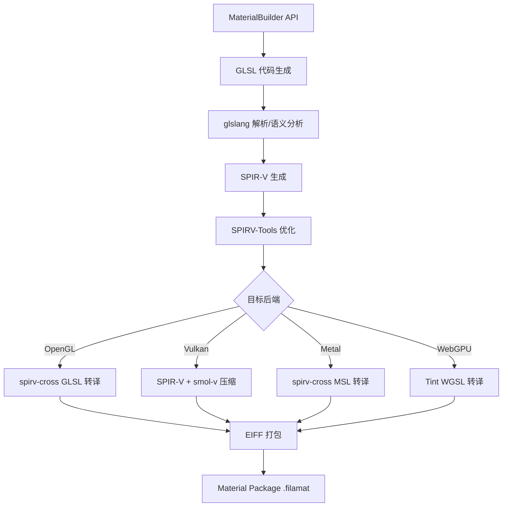

# filamat -- 材质编译器核心库

## 模块概述

filamat 是 Filament 的材质编译器库。它将 GLSL 着色器代码和材质属性定义编译为 Filament 运行时可用的材质包（Material Package）。filamat 支持多目标后端（OpenGL、Vulkan、Metal、WebGPU），通过 glslang 解析 GLSL、SPIRV-Tools 优化 SPIR-V、spirv-cross 进行跨语言转译，最终生成包含所有变体着色器的紧凑二进制包。该库既可在主机端（`matc` 命令行工具）使用，也可在设备端运行时动态编译材质。

## 目录结构

```
libs/filamat/
  CMakeLists.txt                    # 构建配置（含 SPIRV 工具链链接）
  include/filamat/
    MaterialBuilder.h               # 核心公共 API：MaterialBuilder 类
    Package.h                       # 编译输出的材质包容器
    Enums.h                         # 材质枚举的字符串转换
  src/
    MaterialBuilder.cpp             # 编译流水线主逻辑
    GLSLPostProcessor.cpp           # GLSL 后处理（SPIR-V 优化/跨语言转译）
    MaterialVariants.cpp            # 变体生成和过滤
    ShaderMinifier.cpp              # 着色器代码压缩
    SpirvFixup.cpp                  # SPIR-V 修正
    shaders/                        # 着色器代码生成（CodeGenerator, ShaderGenerator 等）
    eiff/                           # EIFF 二进制格式序列化（Chunk, Dictionary, Flattener 等）
    sca/                            # 静态代码分析（AST 遍历, GLSL 语义检查）
  tests/                            # 单元测试
```

## 架构图



## 核心功能

1. **MaterialBuilder API** -- 链式调用风格的材质构建器，支持配置:
   - 着色器代码（`material()`、`materialVertex()`）
   - 着色模型、混合模式、剔除模式等材质属性
   - 参数（Uniform、Sampler、常量）和自定义变量
   - 目标平台（Desktop/Mobile）和后端 API（OpenGL/Vulkan/Metal/WebGPU）
   - 优化级别（None/Preprocessor/Size/Performance）

2. **多后端着色器编译**:
   - **OpenGL** -- 生成 ESSL 3.0 / GLSL 4.1 代码
   - **Vulkan** -- 生成优化的 SPIR-V 字节码
   - **Metal** -- 通过 spirv-cross 转译为 MSL
   - **WebGPU** -- 通过 Tint 转译为 WGSL

3. **变体系统** -- 自动为方向光、动态光源、阴影、蒙皮、雾效等特性生成着色器变体组合，支持变体过滤以减少输出大小。

4. **着色器压缩** -- 使用行级字典压缩文本着色器，使用 smol-v 压缩 SPIR-V 字节码，辅以 zstd 进行整体压缩。

5. **静态代码分析（SCA）** -- 通过遍历 glslang AST 自动检测材质代码中使用的属性（如 baseColor、roughness 等），无需手动声明。

6. **EIFF 序列化** -- 将编译后的着色器、材质参数和元数据打包为 Filament 的自定义二进制格式（Engine Interchange File Format）。

## 依赖关系

- **filabridge** / **utils** / **backend_headers** / **shaders** -- Filament 内部模块
- **glslang** -- GLSL 解析和 SPIR-V 生成
- **SPIRV-Tools** / **spirv-cross** -- SPIR-V 优化和跨语言转译
- **smol-v** / **zstd** -- 压缩库
- **libtint**（可选） -- WebGPU WGSL 转译

安装时所有依赖合并为 `libfilamat_combined.a`。

## 关键文件说明

| 文件 | 说明 |
|------|------|
| `include/filamat/MaterialBuilder.h` | 核心公共 API，定义 `MaterialBuilder` 类接口 |
| `include/filamat/Package.h` | 编译输出容器，封装材质包二进制数据 |
| `src/MaterialBuilder.cpp` | 编译流水线：解析、分析、代码生成、优化、打包 |
| `src/GLSLPostProcessor.cpp` | GLSL 后处理：SPIR-V 优化和跨语言转译 |
| `src/shaders/ShaderGenerator.cpp` | 将用户代码与 Filament 内置着色器合并 |
| `src/sca/GLSLTools.cpp` | 静态代码分析，AST 遍历检测属性使用 |
| `src/eiff/ChunkContainer.cpp` | EIFF 格式序列化和 Chunk 输出 |

## 使用示例

```cpp
filamat::MaterialBuilder::init();
filamat::MaterialBuilder builder;
builder.name("Red").material("void material(inout MaterialInputs material) {"
    "  prepareMaterial(material); material.baseColor.rgb = float3(1,0,0); }")
    .shading(filamat::MaterialBuilder::Shading::LIT)
    .targetApi(filamat::MaterialBuilder::TargetApi::ALL);
filamat::Package pkg = builder.build(engine->getJobSystem());
filamat::MaterialBuilder::shutdown();
```
