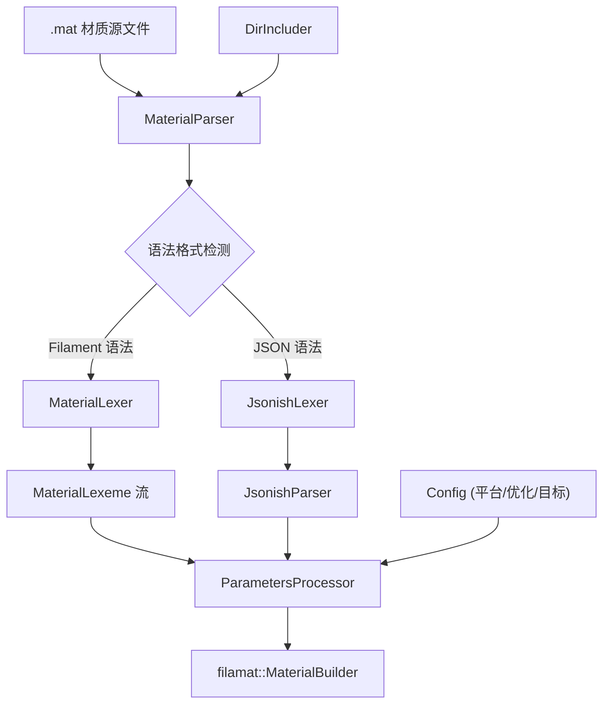

# filament-matp -- 材质文本解析库

## 模块概述

`filament-matp`（目标名 `matp`）是 Filament 的材质文本解析库，负责将 `.mat` 格式的材质源文件解析为 `MaterialBuilder` 可消费的中间表示。它支持自定义 Filament 材质语法和 JSON 语法两种格式，并处理 `#include` 指令解析、模板替换和参数校验等功能。该库是 `matc` 材质编译命令行工具的核心组件。

## 目录结构

```
libs/filament-matp/
├── CMakeLists.txt                # 构建配置
├── include/
│   └── filament-matp/
│       ├── Config.h              # 编译配置（平台、优化、输出格式等）
│       └── MaterialParser.h      # 材质解析器公共接口
├── src/
│   ├── DirIncluder.h/cpp         # 基于目录的 include 解析器
│   ├── IncludeCallback.h         # include 回调接口
│   ├── Includes.h/cpp            # include 指令处理
│   ├── JsonishLexeme.h           # JSON-like 词法单元
│   ├── JsonishLexer.h/cpp        # JSON-like 词法分析器
│   ├── JsonishParser.h/cpp       # JSON-like 语法分析器
│   ├── Lexeme.h                  # 通用词法单元基类
│   ├── Lexer.h                   # 通用词法分析器基类
│   ├── MaterialLexeme.h          # 材质专用词法单元
│   ├── MaterialLexer.h/cpp       # 材质词法分析器
│   ├── MaterialParser.cpp        # 材质解析器实现
│   └── ParametersProcessor.h/cpp # 材质参数处理器
└── tests/                        # 单元测试
```

## 架构图



## 核心功能

1. **Include 指令解析** -- `resolveIncludes()` 递归处理 `#include` 指令，支持行号指令插入以便调试
2. **双语法支持** -- 同时支持 Filament 自定义材质语法和纯 JSON 语法
3. **词法/语法分析** -- 完整的词法分析器（`MaterialLexer`、`JsonishLexer`）和语法分析器（`JsonishParser`）
4. **模板替换** -- `processTemplateSubstitutions()` 支持通过 `-T` 参数进行宏关键字替换
5. **参数处理** -- `ParametersProcessor` 验证和应用材质参数到 `MaterialBuilder`
6. **配置管理** -- `Config` 类封装平台目标、优化级别、变体过滤器、特性级别等编译选项
7. **Command 模式** -- 内部使用函数指针映射表实现材质配置块的分发处理

## 依赖关系

| 依赖模块 | 类型 | 说明 |
|---------|------|------|
| `filamat` | PUBLIC | 材质编译库，提供 `MaterialBuilder` |
| `filabridge` | PRIVATE | 材质桥接层（通过 filamat 间接依赖） |
| `utils` | PUBLIC | 基础工具（Path、Status、CString） |

## 关键文件说明

- **`MaterialParser.h`** -- 公共 API 入口，提供 `resolveIncludes()`、`parse()`、`processTemplateSubstitutions()` 三个主要方法
- **`Config.h`** -- 定义编译配置抽象类，包含平台（`Platform`）、目标 API（`TargetApi`）、优化级别（`Optimization`）、输出格式（`OutputFormat`）等参数
- **`MaterialLexer.cpp`** -- Filament 自定义语法的词法分析实现
- **`JsonishParser.cpp`** -- JSON 变体语法的解析实现
- **`ParametersProcessor.cpp`** -- 将解析后的键值对映射到 `MaterialBuilder` 的具体方法调用
- **`Includes.cpp`** -- `#include` 指令的递归展开与行号指令注入逻辑
