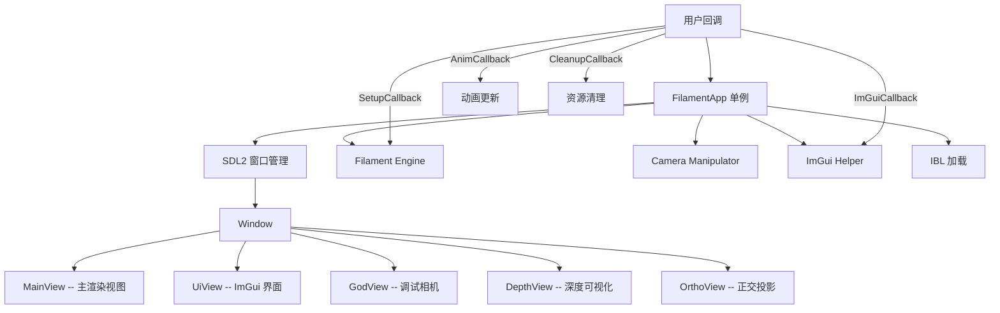

# filamentapp -- 示例应用程序框架

## 模块概述

`filamentapp` 是 Filament 的示例应用程序框架库，提供了一个基于 SDL2 的跨平台窗口管理和渲染循环基础设施。它封装了引擎初始化、窗口创建、相机操控、IBL 加载、ImGui 集成等常见功能，使开发者可以通过回调函数快速构建 Filament 演示和测试程序。该库仅在构建示例时启用（`FILAMENT_SKIP_SAMPLES` 时跳过）。

## 目录结构

```
libs/filamentapp/
├── CMakeLists.txt                      # 构建配置
├── include/filamentapp/
│   ├── Config.h                        # 应用配置参数
│   ├── Cube.h                          # 立方体调试几何体
│   ├── Grid.h                          # 网格调试几何体
│   ├── FilamentApp.h                   # 主应用程序类
│   ├── IBL.h                           # IBL 环境光加载器
│   ├── IcoSphere.h                     # 二十面体球体
│   ├── MeshAssimp.h                    # Assimp 网格加载封装
│   ├── NativeWindowHelper.h            # 原生窗口辅助（跨平台）
│   └── Sphere.h                        # 球体几何体
├── materials/                          # 内置材质定义
│   ├── aiDefaultMat.mat                # Assimp 默认不透明材质
│   ├── aiDefaultTrans.mat              # Assimp 默认透明材质
│   ├── depthVisualizer.mat             # 深度可视化材质
│   └── transparentColor.mat            # 透明颜色材质
└── src/                                # 源码实现
    ├── FilamentApp.cpp                 # 主应用循环实现
    ├── NativeWindowHelperCocoa.mm      # macOS 原生窗口
    ├── NativeWindowHelperLinux.cpp     # Linux 原生窗口
    ├── NativeWindowHelperWindows.cpp   # Windows 原生窗口
    └── VulkanPlatformHelper*.cpp       # Vulkan 平台辅助
```

## 架构图



## 核心功能

1. **跨平台窗口管理** -- 基于 SDL2 实现 macOS、Linux、Windows 的窗口创建和事件处理
2. **回调式渲染循环** -- 通过 `SetupCallback`、`CleanupCallback`、`AnimCallback`、`ImGuiCallback` 等回调自定义渲染行为
3. **相机操控** -- 集成 `camutils::Manipulator` 支持鼠标旋转、平移、缩放操作
4. **多视图支持** -- 内置主视图、UI 视图、God 调试视图、深度视图、正交视图
5. **IBL 环境光** -- 自动加载和管理 IBL 环境贴图，支持运行时切换
6. **ImGui 集成** -- 通过 `filagui` 提供即时模式 UI 调试面板
7. **Vulkan/WebGPU 支持** -- 条件编译支持 Vulkan 和 WebGPU 后端的平台初始化
8. **资源编译** -- 构建时自动编译内置 `.mat` 材质为 `.filamat` 二进制资源

## 依赖关系

| 依赖模块 | 说明 |
|---------|------|
| `filament` | 核心渲染引擎 |
| `filamat` | 材质编译（运行时） |
| `filagui` | ImGui 集成 |
| `camutils` | 相机操控器 |
| `geometry` | 几何工具 |
| `image` / `imageio` | 图像处理与 I/O |
| `iblprefilter` | IBL 预滤波 |
| `sdl2` | 跨平台窗口 |
| `assimp` | 3D 模型加载 |
| `imgui` / `stb` | UI 和图像解码 |

## 关键文件说明

- **`FilamentApp.h`** -- 核心单例类，定义 `run()` 方法及所有回调类型（`SetupCallback`、`AnimCallback` 等）
- **`FilamentApp.cpp`** -- 实现渲染主循环、SDL 事件分发、多视图管理和相机配置
- **`IBL.h`** -- IBL 环境光管理器，负责加载 KTX 格式的辐照度和反射贴图
- **`MeshAssimp.h`** -- 通过 Assimp 库加载 OBJ、FBX 等格式的 3D 模型
- **`NativeWindowHelper.h`** -- 抽象原生窗口句柄获取接口，各平台提供不同实现
- **`Config.h`** -- 应用启动配置，包括后端选择、IBL 路径、渲染选项等
