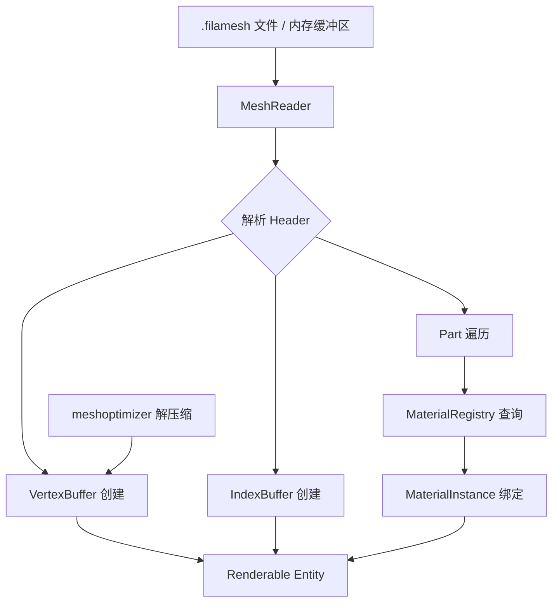

# filameshio -- Mesh I/O 库

## 模块概述

`filameshio` 是 Filament 的网格输入/输出库，提供对 `filamesh` 二进制格式的读取支持。`filamesh` 是 Filament 自定义的高效网格文件格式，由同名命令行工具生成。该库可以从文件或内存缓冲区加载网格数据，自动创建 Filament 的 `VertexBuffer`、`IndexBuffer` 和可渲染实体（Renderable Entity）。

## 目录结构

```
libs/filameshio/
├── CMakeLists.txt              # 构建配置
├── include/filameshio/
│   ├── filamesh.h              # filamesh 文件格式定义
│   └── MeshReader.h            # 网格读取器公共接口
├── src/
│   └── MeshReader.cpp          # 网格读取器实现
└── tests/
    └── test_filamesh.cpp       # 单元测试
```

## 架构图



## 核心功能

1. **文件格式解析** -- 解析 `filamesh` 二进制格式，包括头部信息、顶点数据、索引数据和子网格分块
2. **文件加载** -- `loadMeshFromFile()` 从文件路径直接加载网格
3. **内存加载** -- `loadMeshFromBuffer()` 从内存缓冲区加载网格，支持自定义析构回调
4. **材质注册表** -- `MaterialRegistry` 管理命名材质实例，支持注册、查询和反注册操作
5. **默认材质回退** -- 未匹配的材质自动使用 `DefaultMaterial` 或内置默认材质
6. **压缩支持** -- 通过 `meshoptimizer` 支持顶点数据压缩（`COMPRESSION` 标志）
7. **灵活索引类型** -- 支持 16 位和 32 位索引格式
8. **SNORM16 纹理坐标** -- 支持压缩的 SNORM16 格式纹理坐标（`TEXCOORD_SNORM16` 标志）

## 依赖关系

| 依赖模块 | 类型 | 说明 |
|---------|------|------|
| `filament` | PUBLIC | 核心引擎（Box.h、VertexBuffer、IndexBuffer） |
| `meshoptimizer` | PRIVATE | 网格数据压缩/解压缩 |

## 关键文件说明

- **`MeshReader.h`** -- 公共 API，定义 `MeshReader` 类及其 `Mesh` 结构体（包含 renderable entity、VertexBuffer、IndexBuffer）和 `MaterialRegistry` 材质注册表
- **`filamesh.h`** -- 定义 filamesh 二进制文件格式：
  - `Header` -- 文件头，包含版本号、顶点/索引布局信息、AABB 等
  - `Part` -- 子网格分块，包含索引偏移、索引数量和材质引用
  - `CompressionHeader` -- 压缩模式下各属性的字节大小
  - 魔术标识 `FILAMESH`，当前版本号为 1
  - 标志位：`INTERLEAVED`（交错布局）、`TEXCOORD_SNORM16`、`COMPRESSION`
- **`MeshReader.cpp`** -- 解析实现，处理头部验证、顶点/索引缓冲区创建和 meshoptimizer 解压缩
