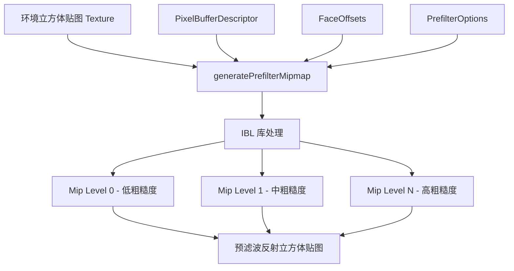

# generatePrefilterMipmap -- 预滤波 Mipmap 生成库

## 模块概述

`filament-generatePrefilterMipmap` 是 Filament 的预滤波 Mipmap 生成库，用于在运行时为立方体贴图（Cubemap）纹理生成预滤波的 Mipmap 层级。这些预滤波的 Mipmap 用于基于图像的光照（IBL）中的反射贴图，每个 Mipmap 级别对应不同的粗糙度值。该库在 GPU 端工作，直接操作 Filament 的 `Texture` 对象。

## 目录结构

```
libs/generatePrefilterMipmap/
├── CMakeLists.txt                                    # 构建配置
├── include/
│   └── filament-generatePrefilterMipmap/
│       └── generatePrefilterMipmap.h                 # 公共 API 头文件
└── src/
    └── generatePrefilterMipmap.cpp                   # 实现
```

## 架构图



## 核心功能

1. **预滤波 Mipmap 生成** -- 核心函数 `generatePrefilterMipmap()` 为立方体贴图纹理生成基于粗糙度的预滤波 Mipmap，每个 Mip 层级对应逐步增大的粗糙度值
2. **面偏移管理** -- `FaceOffsets` 结构体管理立方体贴图 6 个面（+x、-x、+y、-y、+z、-z）在缓冲区中的字节偏移，支持通过面大小自动计算连续偏移
3. **可配置采样** -- `PrefilterOptions` 支持配置采样数（`sampleCount`，默认 8）和水平镜像（`mirror`，默认 true）
4. **引擎集成** -- 直接使用 Filament `Engine` 和 `Texture` 对象，无需额外的离线处理步骤
5. **像素缓冲区输入** -- 通过 `PixelBufferDescriptor` 传递原始像素数据，支持移动语义以高效转移缓冲区所有权
6. **与 IBL 管线配合** -- 生成的预滤波立方体贴图可直接用于 `IndirectLight` 的反射分量

## 依赖关系

| 依赖模块 | 类型 | 说明 |
|---------|------|------|
| `math` | PUBLIC | 数学运算 |
| `utils` | PUBLIC | 基础工具 |
| `ibl` | PUBLIC | IBL 预滤波核心算法 |
| `filament` | PRIVATE | Filament 引擎（Texture、Engine） |

## 关键文件说明

- **`generatePrefilterMipmap.h`** -- 公共 API，定义：
  - `FaceOffsets` -- 立方体贴图 6 面的缓冲区偏移结构，支持按面大小自动计算偏移
  - `PrefilterOptions` -- 预滤波配置选项（采样数和镜像设置）
  - `generatePrefilterMipmap()` -- 核心自由函数，接收 Texture 指针、Engine 引用、像素缓冲描述符和面偏移参数
- **`generatePrefilterMipmap.cpp`** -- 实现预滤波 Mipmap 的具体生成逻辑，利用 `ibl` 库的 CubemapIBL 算法对每个 Mipmap 层级进行重要性采样卷积

## 使用说明

该库的典型使用场景是在运行时将 HDR 环境贴图处理为可用于 IBL 渲染的预滤波反射贴图。调用流程如下：

1. 创建一个带有完整 Mip 层级的立方体贴图 `Texture`
2. 准备包含 6 个面像素数据的 `PixelBufferDescriptor`
3. 构造 `FaceOffsets` 指定各面在缓冲区中的偏移
4. 调用 `generatePrefilterMipmap()` 执行预滤波
5. 将处理后的纹理传递给 `IndirectLight::Builder::reflections()`
