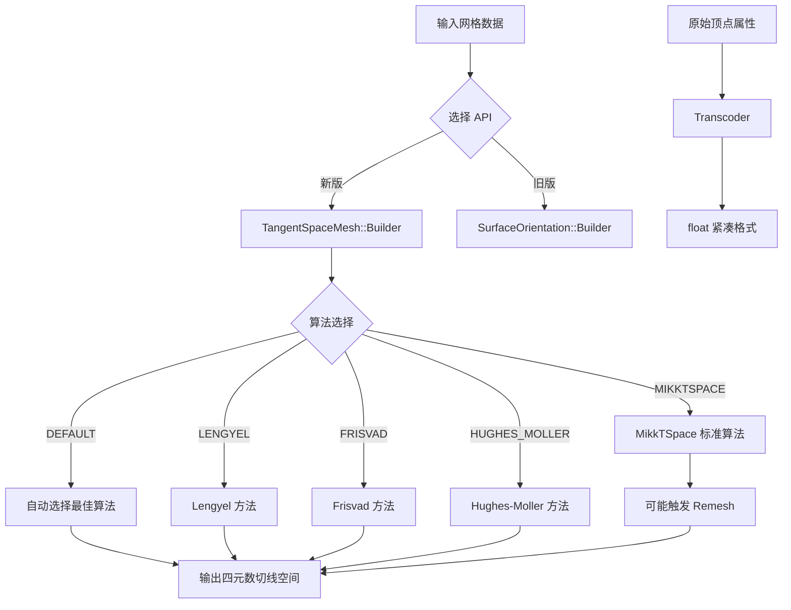

# geometry -- 几何工具库

## 模块概述

`geometry` 是 Filament 的几何实用工具库，提供切线空间（Tangent Space）计算、表面方向生成和顶点属性格式转码等功能。该库是网格预处理的核心组件，支持多种切线空间生成算法（MikkTSpace、Lengyel、Frisvad、Hughes-Moller），并可用于填充 Filament 渲染所需的 TANGENTS 顶点缓冲区。

## 目录结构

```
libs/geometry/
├── CMakeLists.txt                        # 构建配置
├── include/geometry/
│   ├── SurfaceOrientation.h              # 表面方向计算器（旧版 API）
│   ├── TangentSpaceMesh.h                # 切线空间网格（新版 API）
│   └── Transcoder.h                      # 顶点属性格式转码器
├── src/
│   ├── MikktspaceImpl.cpp                # MikkTSpace 算法实现
│   ├── SurfaceOrientation.cpp            # 表面方向实现
│   ├── TangentSpaceMesh.cpp              # 切线空间网格实现
│   └── Transcoder.cpp                    # 转码器实现
└── tests/
    ├── test_transcoder.cpp               # 转码器测试
    └── test_tangent_space_mesh.cpp       # 切线空间网格测试
```

## 架构图



## 核心功能

1. **TangentSpaceMesh（推荐）** -- 新版切线空间计算 API，支持多种算法选择：
   - `MIKKTSPACE` -- 行业标准算法，glTF 推荐，可能触发重新网格化
   - `LENGYEL` -- 基于 Lengyel 的方法，不触发重新网格化
   - `FRISVAD` -- 仅需法线输入的快速方法
   - `HUGHES_MOLLER` -- 仅需法线输入的替代方法
   - `DEFAULT` -- 根据可用输入自动选择最佳算法
2. **SurfaceOrientation（旧版）** -- 原始表面方向计算器，支持法线+切线、法线+UV+位置+索引等输入组合
3. **Transcoder** -- 顶点属性格式转码器，将 BYTE/UBYTE/SHORT/USHORT/HALF 等格式转为紧凑 float 数组
4. **辅助属性映射** -- TangentSpaceMesh 在重新网格化时自动映射 UV1、颜色、关节权重等辅助属性
5. **多输出格式** -- 切线空间结果支持 `quatf`（32 位浮点）、`short4`（16 位整数）、`quath`（16 位浮点）输出

## 依赖关系

| 依赖模块 | 类型 | 说明 |
|---------|------|------|
| `math` | PUBLIC | 数学类型（vec3、quat 等） |
| `utils` | PUBLIC | 基础工具 |
| `meshoptimizer` | PRIVATE | 网格优化 |
| `mikktspace` | PRIVATE | MikkTSpace 标准切线空间算法 |

## 关键文件说明

- **`TangentSpaceMesh.h`** -- 新版 API，定义 `TangentSpaceMesh` 类和 `Builder` 模式，支持 5 种算法和辅助属性映射。取代 `SurfaceOrientation`
- **`SurfaceOrientation.h`** -- 旧版 API，通过 `Builder` 模式接收法线、切线、UV、位置等数据，输出四元数格式的切线空间
- **`Transcoder.h`** -- 定义 `Transcoder` 函数对象，配置组件类型、归一化标志和组件数量后可批量转码顶点属性数据
- **`MikktspaceImpl.cpp`** -- MikkTSpace 算法的 Filament 适配实现，与 `TangentSpaceMesh` 集成
- **`TangentSpaceMesh.cpp`** -- 切线空间网格的核心实现，包含所有算法的分发和重新网格化逻辑
