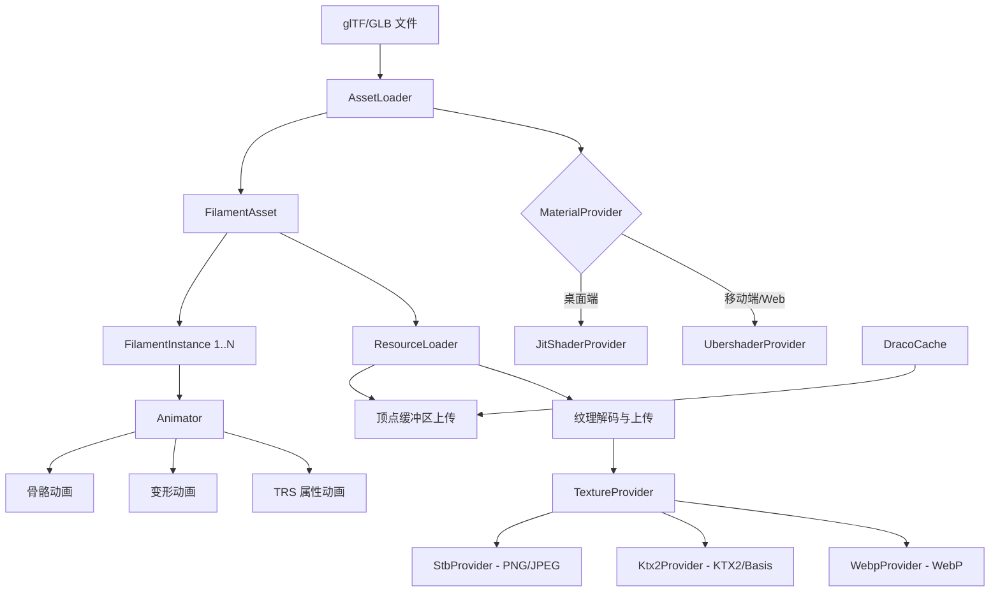

# gltfio -- glTF 2.0 加载库

## 模块概述

`gltfio` 是 Filament 的 glTF 2.0 资产加载和管理库，负责消费 glTF/GLB 文件并生成 Filament 可渲染的实体、纹理、顶点缓冲区等对象。它由两层构成：`gltfio_core`（核心库，使用预编译 Ubershader 材质）和 `gltfio`（完整库，额外支持 JIT 即时材质编译）。该库支持 glTF 2.0 的绝大部分特性，包括 PBR 材质、骨骼动画、变形动画、Draco 压缩等。

## 目录结构

```
libs/gltfio/
├── CMakeLists.txt                  # 构建配置
├── README.md                       # 原始说明
├── include/gltfio/
│   ├── Animator.h                  # 动画控制器
│   ├── AssetLoader.h               # 资产加载器
│   ├── FilamentAsset.h             # 资产对象
│   ├── FilamentInstance.h          # 资产实例
│   ├── MaterialProvider.h          # 材质提供者接口
│   ├── NodeManager.h               # 节点管理器
│   ├── TrsTransformManager.h       # TRS 变换管理器
│   ├── ResourceLoader.h            # 资源加载器
│   ├── TextureProvider.h           # 纹理提供者接口
│   └── math.h                      # 数学工具
├── materials/                      # Ubershader 材质模板
├── src/
│   ├── AssetLoader.cpp             # 资产加载实现
│   ├── Animator.cpp                # 动画实现
│   ├── ResourceLoader.cpp          # 资源加载实现
│   ├── MaterialProvider.cpp        # 材质提供实现
│   ├── UbershaderProvider.cpp      # Ubershader 提供者
│   ├── JitShaderProvider.cpp       # JIT 材质编译提供者
│   ├── DracoCache.cpp              # Draco 解压缓存
│   ├── TangentsJob.cpp             # 切线空间计算
│   ├── extended/                   # 扩展功能（MikkTSpace 等）
│   └── ...
└── test/                           # 测试代码
```

## 架构图



## 核心功能

1. **glTF 2.0 完整支持** -- 支持 JSON 和 GLB 二进制格式，包括嵌入式和外部资源引用
2. **资产实例化** -- `createInstancedAsset()` 创建共享纹理/材质的多实例资产，节省内存
3. **双模式材质系统** -- `JitShaderProvider`（运行时编译精简着色器）和 `UbershaderProvider`（预编译通用着色器）
4. **异步资源加载** -- `ResourceLoader` 支持同步 `loadResources()` 和异步 `asyncBeginLoad()` 两种模式
5. **多格式纹理解码** -- 支持 PNG、JPEG（Stb）、KTX2/Basis Universal、WebP 纹理格式
6. **Draco 网格压缩** -- 通过 `DracoCache` 支持 Draco 压缩网格的解码
7. **完整动画系统** -- `Animator` 支持骨骼蒙皮、Morph Target 变形和 TRS 节点动画
8. **19 种 Ubershader 变体** -- 预构建涵盖 lit/unlit/specularGlossiness/transmission/volume/sheen/specular 的 opaque/fade/masked 组合
9. **MikkTSpace 切线** -- 通过扩展模块支持标准 MikkTSpace 切线空间计算

## 依赖关系

| 依赖模块 | 说明 |
|---------|------|
| `filament` | 核心渲染引擎 |
| `math` / `utils` | 数学和基础工具 |
| `geometry` | 切线空间计算 |
| `cgltf` | glTF JSON 解析（第三方） |
| `dracodec` | Draco 网格解压缩 |
| `meshoptimizer` | 网格优化 |
| `stb` | PNG/JPEG 解码 |
| `ktxreader` | KTX2 读取 |
| `filamat` | JIT 材质编译（仅完整版） |
| `uberzlib` | Ubershader 归档 |

## 关键文件说明

- **`AssetLoader.h`** -- 资产加载入口，定义 `AssetConfiguration` 和 `AssetLoader` 工厂类，负责解析 glTF 并创建 Filament 实体
- **`ResourceLoader.h`** -- 资源上传器，将顶点数据和纹理数据上传到 GPU，支持同步和异步模式
- **`MaterialProvider.h`** -- 材质提供者抽象接口，定义 `MaterialKey`（20 字节 POD）描述 glTF 材质需求，提供 `createJitShaderProvider()` 和 `createUbershaderProvider()` 工厂函数
- **`Animator.h`** -- 动画系统，支持关键帧插值、骨骼矩阵更新和形变目标混合
- **`FilamentAsset.h`** -- 资产对象，持有实体列表、资源 URI、包围盒等，通过 `releaseSourceData()` 释放 CPU 端数据
