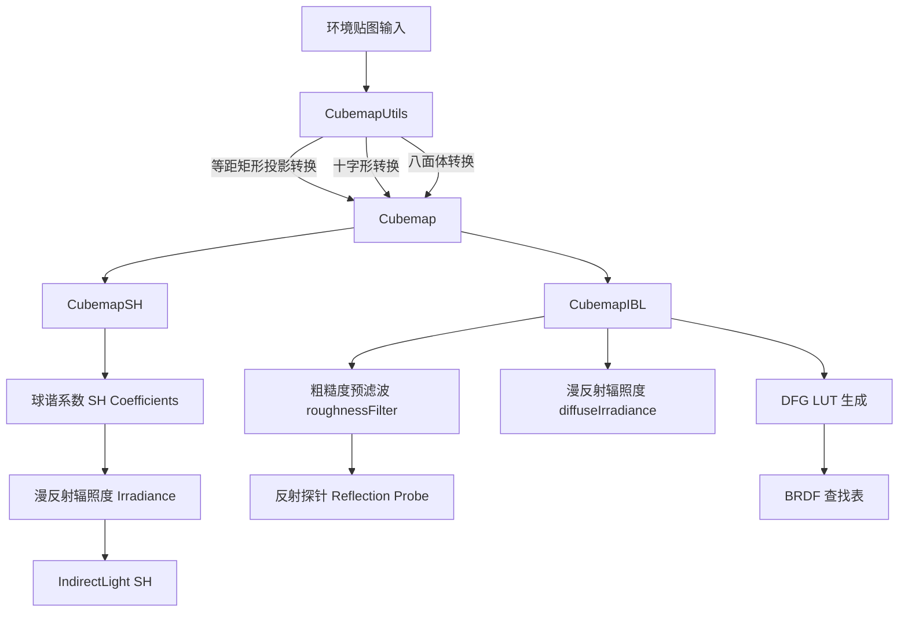

# ibl -- 基于图像的光照库

## 模块概述

`ibl` 是 Filament 的基于图像的光照（Image-Based Lighting）核心库，提供立方体贴图操作、球谐函数计算、IBL 预滤波卷积等离线处理功能。它是 `cmgen`（Cubemap Generator）命令行工具的底层实现，也被 `generatePrefilterMipmap` 和 `iblprefilter` 等运行时库使用。该库提供标准版（`ibl`）和精简版（`ibl-lite`）两个构建目标。

## 目录结构

```
libs/ibl/
├── CMakeLists.txt              # 构建配置
├── include/ibl/
│   ├── Cubemap.h               # 立方体贴图类
│   ├── CubemapIBL.h            # IBL 预滤波卷积
│   ├── CubemapSH.h             # 球谐函数计算
│   ├── CubemapUtils.h          # 立方体贴图工具函数
│   ├── Image.h                 # IBL 图像容器
│   └── utilities.h             # 通用工具函数
└── src/
    ├── Cubemap.cpp             # 立方体贴图实现
    ├── CubemapIBL.cpp          # IBL 卷积实现
    ├── CubemapSH.cpp           # 球谐函数实现
    ├── CubemapUtils.cpp        # 工具函数实现
    ├── CubemapUtilsImpl.h      # 模板实现细节
    └── Image.cpp               # 图像容器实现
```

## 架构图



## 核心功能

1. **Cubemap 立方体贴图** -- 6 面立方体贴图的读写、采样（最近邻和双线性过滤）、无缝访问、三线性插值
2. **CubemapIBL 预滤波**:
   - `roughnessFilter()` -- 基于重要性采样 GGX 的粗糙度 LOD 预滤波
   - `diffuseIrradiance()` -- 漫反射辐照度计算
   - `DFG()` -- "Split-Sum" 近似的 DFG 查找表生成，支持多散射和布料模型
3. **CubemapSH 球谐函数**:
   - `computeSH()` -- 立方体贴图的球谐分解
   - `renderSH()` -- 将球谐系数渲染回立方体贴图
   - `preprocessSHForShader()` -- 为着色器预缩放球谐系数
   - `windowSH()` -- 球谐窗函数
4. **CubemapUtils 格式转换**:
   - 等距矩形投影 (Equirectangular) <-> 立方体贴图 (Cubemap) 互转
   - 十字形 (Cross) -> 立方体贴图
   - 立方体贴图 -> 八面体 (Octahedron)
   - 镜像、降采样（Box Filter）、UV 网格调试
5. **多线程处理** -- 所有处理函数基于 `utils::JobSystem` 实现并行化

## 依赖关系

| 依赖模块 | 类型 | 说明 |
|---------|------|------|
| `math` | PUBLIC | 向量、矩阵运算 |
| `utils` | PUBLIC | JobSystem 并行化、编译器宏 |

## 关键文件说明

- **`Cubemap.h`** -- 立方体贴图视图类（不拥有数据），支持 6 面的读写、方向采样和无缝边界处理
- **`CubemapIBL.h`** -- IBL 的核心卷积算法，实现 GGX 粗糙度预滤波和漫反射辐照度的重要性采样
- **`CubemapSH.h`** -- 球谐函数计算，支持最多 5 阶球谐分解和着色器友好的预缩放格式
- **`CubemapUtils.h`** -- 立方体贴图的创建和格式转换工具，精简版（`ibl-lite`，`FILAMENT_IBL_LITE=1`）不包含格式转换功能
- **`Image.h`** -- IBL 专用图像容器，与 `image::LinearImage` 不同，使用 `float3` 像素格式
