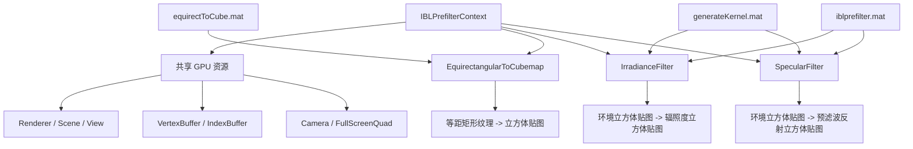

# iblprefilter -- IBL GPU 预滤波库

## 模块概述

`filament-iblprefilter` 是 Filament 的 GPU 加速 IBL 预滤波库，提供运行时的环境贴图预处理功能。与离线 CPU 处理的 `ibl` 库不同，该库利用 Filament 渲染管线在 GPU 上执行等距矩形到立方体贴图的转换、漫反射辐照度滤波和镜面反射预滤波，适合动态环境光照场景。每个 Filament Engine 实例通常只需创建一个 `IBLPrefilterContext`。

## 目录结构

```
libs/iblprefilter/
├── CMakeLists.txt                            # 构建配置
├── include/filament-iblprefilter/
│   └── IBLPrefilterContext.h                 # 公共 API
└── src/
    ├── IBLPrefilterContext.cpp                # 实现
    └── materials/
        ├── equirectToCube.mat                # 等距矩形到立方体材质
        ├── generateKernel.mat                # 核函数生成材质
        └── iblprefilter.mat                  # IBL 预滤波计算材质
```

## 架构图



## 核心功能

1. **IBLPrefilterContext** -- 上下文管理器，创建和管理 GPU 共享资源（Renderer、Scene、View、全屏四边形等）
2. **EquirectangularToCubemap** -- 将等距矩形投影纹理转换为立方体贴图：
   - 支持水平镜像选项
   - 可自动创建默认输出纹理（256x256，9 个 Mip 层级）
   - 输出纹理需具有 `SAMPLEABLE` 和 `COLOR_ATTACHMENT` 用途标志
3. **IrradianceFilter** -- 漫反射辐照度预滤波：
   - 基于 D_GGX（Trowbridge-Reitz）核函数
   - 可配置采样数（最多 2048）
   - 支持 HDR 压缩（`hdrLinear`/`hdrMax` 选项）
   - 支持 LOD 偏移和自动 Mipmap 生成
4. **SpecularFilter** -- 镜面反射预滤波：
   - 按粗糙度级别（`levelCount`，默认 5）生成预滤波立方体贴图
   - 每个粗糙度级别存储在对应的 Mip 层级中
   - 同样支持 HDR 压缩和采样数配置
5. **内置 GPU 材质** -- 三个专用计算材质在构建时自动编译为 `.filamat` 二进制资源

## 依赖关系

| 依赖模块 | 类型 | 说明 |
|---------|------|------|
| `math` | PUBLIC | 数学运算 |
| `utils` | PUBLIC | 基础工具（Entity 等） |
| `filament` | PUBLIC | 核心渲染引擎（Texture、Engine、Renderer 等） |

## 关键文件说明

- **`IBLPrefilterContext.h`** -- 公共 API，定义：
  - `IBLPrefilterContext` -- GPU 资源上下文（可移动，不可复制）
  - `EquirectangularToCubemap` -- 等距矩形到立方体贴图转换器，通过 `operator()` 调用
  - `IrradianceFilter` -- 漫反射辐照度滤波器，通过 `operator()` 调用
  - `SpecularFilter` -- 镜面反射预滤波器，通过 `operator()` 调用
  - `Kernel` 枚举 -- 当前仅支持 `D_GGX`（Trowbridge-Reitz 分布）
- **`IBLPrefilterContext.cpp`** -- 核心实现，管理全屏四边形渲染、材质实例创建和多 Mip 级别的渲染遍历
- **`equirectToCube.mat`** -- 等距矩形投影到立方体贴图的 GPU 材质着色器
- **`generateKernel.mat`** -- 预计算采样核函数纹理的 GPU 材质
- **`iblprefilter.mat`** -- 执行预滤波卷积运算的 GPU 材质
