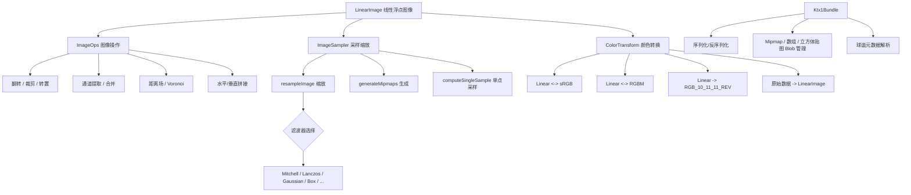

# image -- 图像处理库

## 模块概述

`image` 是 Filament 的核心图像处理库，提供线性浮点图像容器、颜色空间转换、图像采样/缩放、Mipmap 生成和 KTX1 纹理容器等功能。该库设计为低依赖（仅依赖 `math` 和 `utils`），可同时用于离线工具和运行时渲染器。所有图像数据以线性浮点格式存储，确保颜色空间处理的准确性。

## 目录结构

```
libs/image/
├── CMakeLists.txt                # 构建配置
├── include/image/
│   ├── ColorTransform.h          # 颜色空间转换（sRGB/Linear/RGBM 等）
│   ├── ImageOps.h                # 图像操作（翻转/裁剪/拼接/距离场等）
│   ├── ImageSampler.h            # 图像采样与缩放
│   ├── Ktx1Bundle.h              # KTX1 纹理容器
│   └── LinearImage.h             # 线性浮点图像容器
├── src/
│   ├── ImageOps.cpp              # 图像操作实现
│   ├── ImageSampler.cpp          # 采样器实现
│   ├── Ktx1Bundle.cpp            # KTX1 序列化/反序列化
│   └── LinearImage.cpp           # 线性图像实现
└── tests/
    └── test_image.cpp            # 单元测试
```

## 架构图



## 核心功能

1. **LinearImage 图像容器** -- 行主序浮点图像，支持任意通道数，使用共享所有权语义实现零拷贝传递
2. **颜色空间转换（ColorTransform）**:
   - Linear <-> sRGB 双向转换
   - Linear -> RGBM 编码/解码
   - Linear -> RGB_10_11_11_REV 打包
   - 从原始字节数据（uint8/uint16/half/float）构造 LinearImage
3. **图像操作（ImageOps）**:
   - 水平/垂直翻转和拼接（`horizontalFlip`、`verticalStack` 等）
   - 通道提取（`extractChannel`）和合并（`combineChannels`）
   - 区域裁剪（`cropRegion`）和转置（`transpose`）
   - 欧几里得距离场（EDT）和 Voronoi 图生成
   - 法线向量 <-> 颜色值互转
4. **图像采样（ImageSampler）**:
   - 多种滤波器：Mitchell、Lanczos、Gaussian、Box、Hermite、Nearest、Minimum
   - 可配置的边界行为：排除、钳制、重复、镜像、常数颜色、相邻图像
   - Mipmap 生成（`generateMipmaps`）和单点采样（`computeSingleSample`）
5. **KTX1 纹理容器（Ktx1Bundle）**:
   - 支持序列化/反序列化 KTX1 文件格式
   - 管理 Mipmap 层级、数组元素和立方体贴图面
   - 内置大量 OpenGL 格式常量（压缩纹理：S3TC、RGTC、BPTC、ASTC、ETC2 等）
   - 支持球谐系数元数据解析

## 依赖关系

| 依赖模块 | 类型 | 说明 |
|---------|------|------|
| `math` | PUBLIC | 向量类型（float3、float4、half 等） |
| `utils` | PUBLIC | 编译器宏和基础工具 |

## 关键文件说明

- **`LinearImage.h`** -- 核心图像容器类，使用 `SharedReference` 内部计数实现共享所有权，像素以 `width * channels * sizeof(float)` 的行步长存储
- **`ColorTransform.h`** -- 模板化颜色转换函数集，包含 `linearTosRGB`、`sRGBToLinear`、`linearToRGBM`、`fromLinearTosRGB`（批量转换为整型图像）等
- **`ImageOps.h`** -- 图像操作自由函数集，包括拼接、翻转、裁剪、距离场计算等
- **`ImageSampler.h`** -- 图像重采样系统，定义 `Filter` 枚举（8 种滤波器）、`Boundary` 结构（7 种边界模式）和 `resampleImage` 函数
- **`Ktx1Bundle.h`** -- KTX1 格式的内存表示，支持 blob 级别的读写和序列化，包含完整的 OpenGL 纹理格式常量定义
