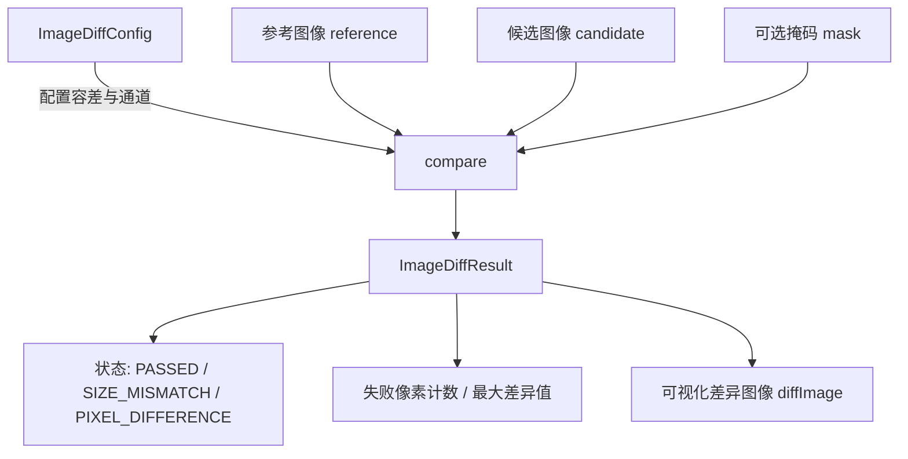

# imagediff -- 图像差异比较库

## 模块概述

`imagediff` 是 Filament 项目中的图像差异比较工具库。它提供了像素级别的图像对比功能，支持可配置的容差阈值、通道掩码和组合逻辑（AND/OR），主要用于渲染回归测试中的 golden image 比对。

## 目录结构

```
libs/imagediff/
├── CMakeLists.txt              # 构建配置
├── include/
│   └── imagediff/
│       └── ImageDiff.h         # 公共 API 头文件
├── src/
│   └── ImageDiff.cpp           # 核心实现
├── tests/
│   └── test_ImageDiff.cpp      # 单元测试
└── README.md                   # 原始说明文档
```

## 架构图



## 核心功能

- **图像比较**: 支持 `LinearImage`（浮点）和 `Bitmap`（8 位 RGBA）两种输入格式
- **灵活配置**: 通过 `ImageDiffConfig` 设置通道掩码（R/G/B/A）、最大绝对差异阈值、失败像素比例容忍度
- **组合逻辑**: 支持 LEAF/AND/OR 三种模式，允许多个比较条件的逻辑组合
- **通道 Swizzle**: 支持 RGBA 和 BGRA 两种通道顺序
- **掩码支持**: 可选的灰度掩码图像，控制哪些像素参与比较
- **差异可视化**: 可生成可视化差异图像用于调试
- **JSON 序列化**: 支持从 JSON 解析配置、将结果序列化为 JSON

## 依赖关系

| 依赖模块 | 类型 | 说明 |
|---------|------|------|
| `image` | PUBLIC | 提供 LinearImage 图像数据结构 |
| `utils` | PUBLIC | 提供 CString 等基础工具 |
| `jsmn`  | PRIVATE | JSON 解析库，用于配置解析 |
| `gtest` | TEST | 单元测试框架 |

## 关键文件说明

### `include/imagediff/ImageDiff.h`

定义了核心公共 API，包括：
- `ImageDiffConfig` -- 比较配置结构体，包含模式（LEAF/AND/OR）、通道掩码、容差阈值、子条件列表
- `ImageDiffResult` -- 比较结果结构体，包含状态、失败像素数、各通道最大差异、差异图像
- `compare()` -- 两个重载版本，分别接受 `LinearImage` 和 `Bitmap` 输入
- `parseConfig()` / `serializeResult()` -- JSON 序列化与反序列化

### `src/ImageDiff.cpp`

核心比较逻辑的实现，将 8 位位图内部转换为浮点数以保持阈值一致性，并支持递归评估 AND/OR 组合条件。
