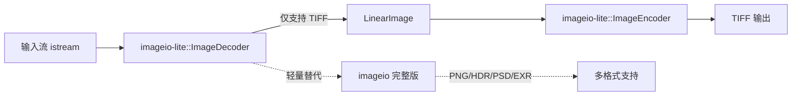

# imageio-lite -- 轻量级图像输入输出库

## 模块概述

`imageio-lite` 是 `imageio` 的轻量级替代版本，专为运行时场景设计。它仅支持 TIFF 格式，减少了对第三方库的依赖（不需要 libpng、tinyexr、basis_encoder 等），适用于嵌入式环境和移动端应用中对二进制大小敏感的场景。

## 目录结构

```
libs/imageio-lite/
├── CMakeLists.txt                      # 构建配置
├── README.md                           # 原始说明文档
├── include/
│   └── imageio-lite/
│       ├── ImageDecoder.h              # 轻量图像解码器
│       └── ImageEncoder.h              # 轻量图像编码器
├── src/
│   ├── ImageDecoder.cpp                # 解码实现
│   └── ImageEncoder.cpp                # 编码实现
└── tests/
    └── test_imageio-lite.cpp           # 单元测试
```

## 架构图



## 核心功能

- **TIFF 解码**: 从输入流解码 TIFF 格式图像，返回 `LinearImage` 浮点数据
- **TIFF 编码**: 将 `LinearImage` 编码为 TIFF 格式输出
- **色彩空间支持**: 支持 LINEAR 和 SRGB 色彩空间选择
- **最小依赖**: 仅依赖 `image`、`math`、`utils`，无需额外第三方图像库
- **API 兼容**: 与 `imageio` 保持相似的 API 设计风格（ImageDecoder/ImageEncoder 模式）

## 依赖关系

| 依赖模块 | 类型 | 说明 |
|---------|------|------|
| `image` | PUBLIC | 提供 LinearImage 核心数据结构 |
| `math` | PUBLIC | 数学运算支持 |
| `utils` | PUBLIC | 提供 CString 等基础工具 |
| `gtest` | TEST | 单元测试框架 |

## 关键文件说明

### `include/imageio-lite/ImageDecoder.h`

轻量图像解码器，位于 `imageio_lite` 命名空间。API 与 `imageio` 的 `ImageDecoder` 类似，但仅支持 TIFF 格式。提供 `decode()` 静态方法，接受输入流和色彩空间参数。

### `include/imageio-lite/ImageEncoder.h`

轻量图像编码器，将 `LinearImage` 数据编码为 TIFF 格式输出流。

### 与 imageio 的对比

| 特性 | imageio | imageio-lite |
|------|---------|-------------|
| 支持格式 | PNG/HDR/PSD/EXR | 仅 TIFF |
| 第三方依赖 | png/tinyexr/basis/zlib | 无 |
| 适用场景 | 离线工具链 | 运行时/嵌入式 |
| 二进制大小 | 较大 | 极小 |
