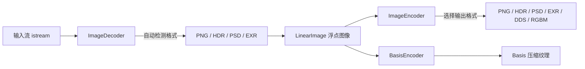

# imageio -- 图像输入输出库

## 模块概述

`imageio` 是 Filament 项目中功能完整的图像读写库。它支持多种图像格式（PNG、HDR、PSD、EXR）的解码与编码，并提供 HDR 图像解码和 Basis 纹理压缩编码功能。该库面向离线工具链使用，依赖较多第三方库。

## 目录结构

```
libs/imageio/
├── CMakeLists.txt                  # 构建配置
├── include/
│   └── imageio/
│       ├── BasisEncoder.h          # Basis 纹理压缩编码器
│       ├── HDRDecoder.h            # HDR 格式解码器
│       ├── ImageDecoder.h          # 通用图像解码器
│       ├── ImageDiffer.h           # 图像差异比较工具
│       └── ImageEncoder.h          # 通用图像编码器
└── src/
    ├── BasisEncoder.cpp
    ├── HDRDecoder.cpp
    ├── ImageDecoder.cpp
    ├── ImageDiffer.cpp
    └── ImageEncoder.cpp
```

## 架构图



## 核心功能

- **多格式解码**: 支持 PNG、HDR（Radiance）、PSD（Photoshop）、EXR（OpenEXR）格式的解码
- **多格式编码**: 支持 PNG、PNG_LINEAR、HDR、RGBM、PSD、EXR、DDS 等多种输出格式
- **色彩空间转换**: 解码时支持 LINEAR 和 SRGB 色彩空间指定
- **HDR 解码**: 专用的 HDR 格式解码器，处理 Radiance RGBE 格式
- **Basis 压缩**: 集成 Basis Universal 编码器，支持纹理压缩
- **图像差异比较**: 内置 ImageDiffer 工具用于图像对比

## 依赖关系

| 依赖模块 | 类型 | 说明 |
|---------|------|------|
| `image` | PUBLIC | 提供 LinearImage 核心数据结构 |
| `math` | PUBLIC | 数学运算支持 |
| `png` | PUBLIC | PNG 格式编解码（libpng） |
| `tinyexr` | PUBLIC | EXR 格式编解码 |
| `utils` | PUBLIC | 基础工具库 |
| `z` | PUBLIC | zlib 压缩库 |
| `basis_encoder` | PUBLIC | Basis Universal 纹理压缩编码器 |
| `wsock32` | PRIVATE (Win32) | Windows 网络库 |

## 关键文件说明

### `include/imageio/ImageDecoder.h`
通用图像解码器，通过输入流自动检测格式（PNG/HDR/PSD/EXR），返回 `LinearImage` 浮点图像数据。

### `include/imageio/ImageEncoder.h`
通用图像编码器，支持 PNG、HDR、PSD、EXR、DDS、RGBM 等多种输出格式，支持自动格式选择和压缩参数配置。

### `include/imageio/BasisEncoder.h`
Basis Universal 纹理压缩编码器封装，用于将图像数据压缩为 GPU 友好的通用格式。

### `include/imageio/HDRDecoder.h`
专用 HDR（Radiance RGBE）格式解码器，处理高动态范围图像数据。
