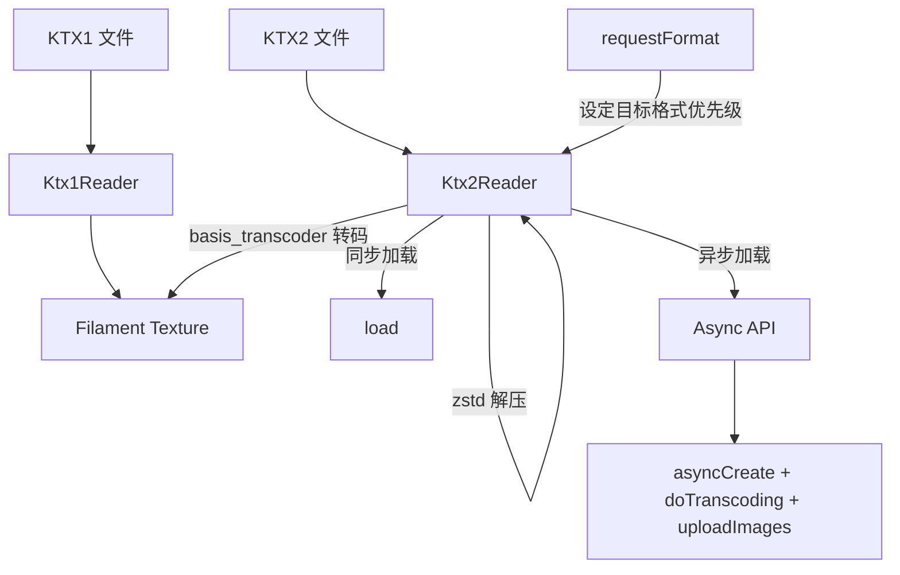

# ktxreader -- KTX 纹理读取库

## 模块概述

`ktxreader` 是 Filament 项目中用于加载 KTX（Khronos Texture）格式纹理的库。它支持 KTX1 和 KTX2 两种版本格式，能够将 KTX 文件直接转换为 Filament 的 `Texture` 对象。KTX2 支持 Basis Universal 超级压缩格式，并通过 `basis_transcoder` 进行实时转码。

## 目录结构

```
libs/ktxreader/
├── CMakeLists.txt                  # 构建配置
├── include/
│   └── ktxreader/
│       ├── Ktx1Reader.h            # KTX1 格式读取器
│       └── Ktx2Reader.h            # KTX2 格式读取器
├── src/
│   ├── Ktx1Reader.cpp              # KTX1 实现
│   └── Ktx2Reader.cpp              # KTX2 实现
└── tests/
    ├── test_ktxreader.cpp           # 单元测试
    ├── color_grid_uastc_zstd.ktx2   # KTX2 测试文件
    └── lightroom_ibl.ktx            # KTX1 测试文件
```

## 架构图



## 核心功能

- **KTX1 读取**: 支持各种未压缩和压缩格式（ETC2、ASTC、S3TC/DXT、BPTC、RGTC、EAC 等）
- **KTX2 读取**: 支持 Basis Universal 超级压缩（UASTC），通过 zstd 解压后转码为目标格式
- **格式协商**: `Ktx2Reader::requestFormat()` 允许按优先级指定目标纹理格式，自动匹配平台能力
- **同步/异步加载**: KTX2 同时提供 `load()` 同步接口和 `Async` 异步接口
- **异步转码**: `Async` API 支持后台线程转码 mipmap，前台线程上传纹理数据
- **Transfer Function**: 支持 LINEAR 和 sRGB 传输函数校验与过滤

## 依赖关系

| 依赖模块 | 类型 | 说明 |
|---------|------|------|
| `filament` | PUBLIC | Filament 引擎，提供 Engine 和 Texture |
| `image` | PUBLIC | 提供 Ktx1Bundle 数据结构 |
| `utils` | PUBLIC | 基础工具（FixedCapacityVector 等） |
| `basis_transcoder` | PUBLIC | Basis Universal 转码器 |
| `gtest` | TEST | 单元测试框架 |

## 关键文件说明

### `include/ktxreader/Ktx1Reader.h`
KTX1 格式读取器，以命名空间函数方式提供。核心函数 `createTexture()` 从 `Ktx1Bundle` 创建 Filament 纹理并填充所有 mipmap 层级。包含大量压缩格式枚举映射（S3TC、ASTC、ETC2、EAC、BPTC 等）。

### `include/ktxreader/Ktx2Reader.h`
KTX2 格式读取器，以类方式提供。支持格式优先级请求机制和异步转码 API，适用于需要在加载大型纹理时保持帧率的场景。
