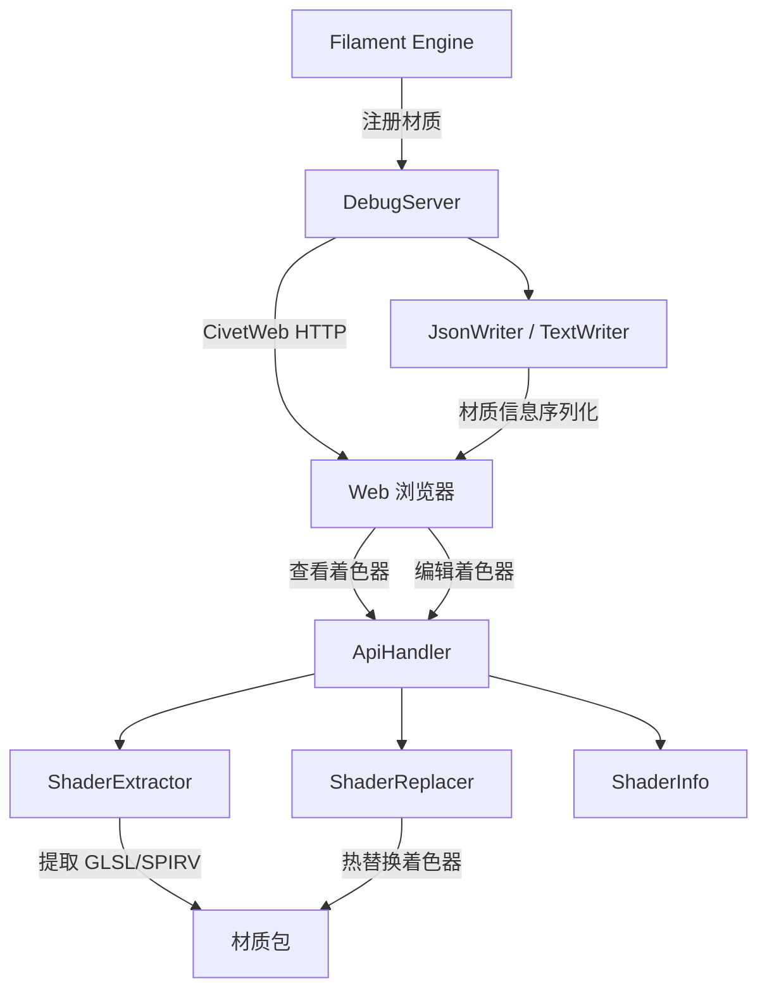

# matdbg -- 材质调试器

## 模块概述

`matdbg` 是 Filament 的材质调试库，提供了一个嵌入式 HTTP 服务器，允许开发者通过 Web 浏览器实时查看和编辑引擎中加载的材质着色器代码。它支持 GLSL/SPIRV 着色器的提取、替换和信息查询，是 Filament 材质开发和调试的核心工具。

## 目录结构

```
libs/matdbg/
├── CMakeLists.txt                  # 构建配置
├── README.md                       # 原始说明文档
├── include/
│   └── matdbg/
│       ├── DebugServer.h           # HTTP 调试服务器
│       ├── JsonWriter.h            # JSON 格式材质信息输出
│       ├── ShaderExtractor.h       # 着色器代码提取
│       ├── ShaderInfo.h            # 着色器变体信息
│       ├── ShaderReplacer.h        # 着色器热替换
│       └── TextWriter.h            # 文本格式材质信息输出
├── src/
│   ├── ApiHandler.cpp/h            # HTTP API 请求处理器
│   ├── CommonWriter.cpp/h          # 公共输出逻辑
│   ├── DebugServer.cpp             # 调试服务器实现
│   ├── JsonWriter.cpp              # JSON 输出实现
│   ├── ShaderExtractor.cpp         # 着色器提取实现
│   ├── ShaderInfo.cpp              # 着色器信息实现
│   ├── ShaderReplacer.cpp          # 着色器替换实现
│   ├── SourceFormatter.cpp/h       # 源码格式化
│   └── TextWriter.cpp              # 文本输出实现
└── web/
    ├── api.js                      # 前端 API 通信层
    ├── app.js                      # 前端应用逻辑
    └── index.html                  # Web 界面入口
```

## 架构图



## 核心功能

- **HTTP 调试服务器**: 基于 CivetWeb 的嵌入式 HTTP 服务器，支持材质查看和编辑
- **材质注册管理**: 跟踪引擎中所有已加载的材质包，提供唯一 MaterialKey 标识
- **着色器提取**: 从编译后的材质包中提取特定变体的 GLSL 或 SPIRV 着色器源码
- **着色器热替换**: 运行时替换着色器代码，无需重启应用即可看到效果
- **变体查询**: 支持查询当前活跃的着色器变体（active variants）
- **多格式输出**: 支持 JSON 和纯文本两种材质信息输出格式
- **Web 前端**: 内置 HTML/JS 前端界面，嵌入为二进制资源

## 依赖关系

| 依赖模块 | 类型 | 说明 |
|---------|------|------|
| `civetweb` | PUBLIC | 嵌入式 HTTP 服务器 |
| `filabridge` | PUBLIC | 材质格式桥接层 |
| `filaflat` | PUBLIC | 材质包扁平化读取 |
| `filamat` | PUBLIC | 材质编译工具链 |
| `glslang` | PUBLIC | GLSL 编译器 |
| `SPIRV` / `spirv-cross-glsl` / `SPIRV-Tools` | PUBLIC | SPIRV 处理工具链 |
| `utils` | PUBLIC | 基础工具库 |
| `backend_headers` | PUBLIC | 后端驱动枚举定义 |

## 关键文件说明

### `include/matdbg/DebugServer.h`
调试服务器核心类，管理 HTTP 服务生命周期、材质记录表、以及编辑/查询回调。通过 `addMaterial()` 注册材质，通过 `setEditCallback()` 监听着色器修改。

### `src/ApiHandler.cpp`
HTTP API 处理器，处理来自 Web 前端的 REST 请求，包括材质列表查询、着色器代码获取和替换。

### `web/` 目录
内置的 Web 前端资源，通过 `resgen` 工具编译为二进制数据嵌入到库中。
