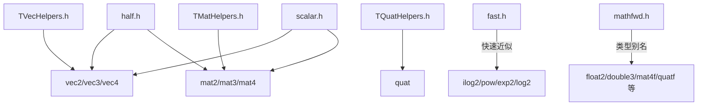

# math -- 数学库

## 模块概述

`math` 是 Filament 的核心数学库，提供向量、矩阵、四元数等图形学基础数学类型。该库采用模板化设计，以 header-only 方式实现（仅有一个 dummy.cpp），支持 `float`、`double`、`half` 等多种精度类型。编译时启用快速浮点运算优化（`-ffast-math`）。

## 目录结构

```
libs/math/
├── CMakeLists.txt              # 构建配置
├── include/
│   └── math/
│       ├── vec2.h              # 二维向量
│       ├── vec3.h              # 三维向量
│       ├── vec4.h              # 四维向量
│       ├── mat2.h              # 2x2 矩阵
│       ├── mat3.h              # 3x3 矩阵
│       ├── mat4.h              # 4x4 矩阵
│       ├── quat.h              # 四元数
│       ├── half.h              # 半精度浮点
│       ├── scalar.h            # 标量工具函数
│       ├── fast.h              # 快速数学近似函数
│       ├── norm.h              # 归一化类型
│       ├── mathfwd.h           # 前向声明与类型别名
│       ├── compiler.h          # 编译器兼容宏
│       ├── TMatHelpers.h       # 矩阵模板辅助工具
│       ├── TQuatHelpers.h      # 四元数模板辅助工具
│       └── TVecHelpers.h       # 向量模板辅助工具
├── src/
│   └── dummy.cpp               # 占位源文件（header-only 库）
├── benchmarks/
│   └── benchmark_fast.cpp      # 快速数学函数性能基准
└── tests/
    ├── test_fast.cpp            # 快速函数测试
    ├── test_half.cpp            # 半精度测试
    ├── test_mat.cpp             # 矩阵测试
    ├── test_vec.cpp             # 向量测试
    └── test_quat.cpp            # 四元数测试
```

## 架构图



## 核心功能

- **向量类型**: `TVec2`/`TVec3`/`TVec4` 模板类，支持 swizzle 访问（xy/rgb/stp）、算术运算、比较运算
- **矩阵类型**: `TMat22`/`TMat33`/`TMat44` 模板类，支持矩阵乘法、转置、逆矩阵等操作
- **四元数**: `TQuaternion` 模板类，支持旋转表示、插值、归一化等操作
- **半精度浮点**: `half` 类型，用于 GPU 数据传输时的精度/带宽优化
- **快速数学**: `fast::` 命名空间提供 `ilog2`、`pow`、`exp2`、`log2` 等快速近似实现
- **归一化类型**: `norm.h` 定义 snorm/unorm 等归一化整数类型
- **类型别名**: `mathfwd.h` 提供常用的类型别名如 `float2`、`float3`、`float4`、`mat4f`、`quatf` 等

## 依赖关系

`math` 库是 Filament 最底层的库之一，不依赖其他 Filament 模块，仅使用 C++ 标准库。

## 关键文件说明

### `include/math/mathfwd.h`
前向声明文件，定义了所有常用的类型别名。这是其他模块最常 include 的头文件，提供 `float2`、`float3`、`mat4f`、`quatf`、`half4` 等便捷类型名。

### `include/math/TVecHelpers.h`
向量模板辅助基类，通过 CRTP 模式为所有向量类型提供通用的算术运算符（+、-、*、/）、比较运算符和工具函数。

### `include/math/fast.h`
快速数学近似函数集合，牺牲少量精度换取显著性能提升，适用于对性能敏感的实时渲染代码。
