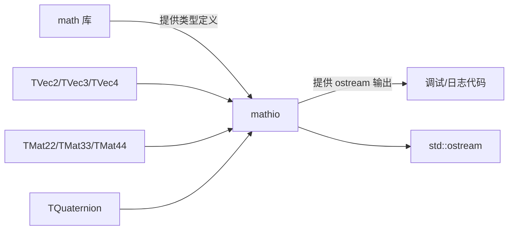

# mathio -- 数学类型输入输出工具

## 模块概述

`mathio` 是 Filament 数学库的 I/O 扩展模块，为 `math` 库中的向量、矩阵、四元数等类型提供 `std::ostream` 输出运算符（`operator<<`）重载。该库将 I/O 功能从核心数学库中分离，避免在不需要文本输出的场景中引入不必要的依赖。

## 目录结构

```
libs/mathio/
├── CMakeLists.txt              # 构建配置
├── include/
│   └── mathio/
│       └── ostream.h           # 输出运算符声明
└── src/
    └── ostream.cpp             # 输出运算符实现
```

## 架构图



## 核心功能

- **向量输出**: 为 `TVec2<T>`、`TVec3<T>`、`TVec4<T>` 提供格式化文本输出
- **矩阵输出**: 为 `TMat22<T>`、`TMat33<T>`、`TMat44<T>` 提供格式化文本输出
- **四元数输出**: 为 `TQuaternion<T>` 提供格式化文本输出
- **模板化设计**: 所有输出运算符均为模板函数，支持 `float`、`double`、`half` 等类型

## 依赖关系

| 依赖模块 | 类型 | 说明 |
|---------|------|------|
| `math` | PRIVATE | 提供数学类型的模板定义 |

## 关键文件说明

### `include/mathio/ostream.h`

声明了所有数学类型的 `operator<<` 重载模板，位于 `filament::math::details` 命名空间中。包括：

- `operator<<(ostream&, TVec2<T>)` -- 二维向量输出
- `operator<<(ostream&, TVec3<T>)` -- 三维向量输出
- `operator<<(ostream&, TVec4<T>)` -- 四维向量输出
- `operator<<(ostream&, TMat22<T>)` -- 2x2 矩阵输出
- `operator<<(ostream&, TMat33<T>)` -- 3x3 矩阵输出
- `operator<<(ostream&, TMat44<T>)` -- 4x4 矩阵输出
- `operator<<(ostream&, TQuaternion<T>)` -- 四元数输出

### `src/ostream.cpp`

所有输出运算符的具体实现，定义各类型的格式化文本表示方式。

### 设计理念

将 I/O 功能从 `math` 库中分离是一种常见的模块化设计。核心 `math` 库保持零依赖且 header-only，而需要调试输出的代码可以额外链接 `mathio`。这避免了在生产代码中引入 `<iostream>` 的开销。
