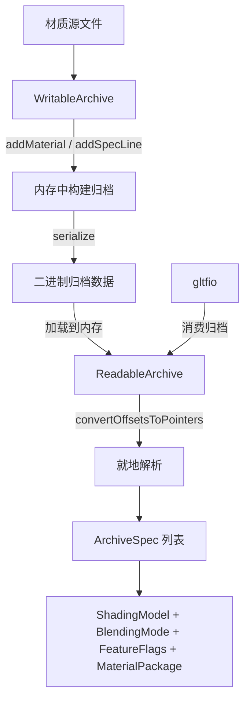

# uberz -- Uber Shader 归档库

## 模块概述

`uberz`（uberzlib）是 Filament 的 Uber Shader 归档库，用于管理预编译材质包（material packages）的打包、序列化和读取。它定义了一种 parse-free 的二进制归档格式，将多个材质及其特性标志（feature flags）捆绑在一起。该库主要由 `gltfio` 在加载 glTF 资产时使用。

## 目录结构

```
libs/uberz/
├── CMakeLists.txt                  # 构建配置
├── README.md                       # 原始说明文档
├── include/
│   └── uberz/
│       ├── ArchiveEnums.h          # 归档特性枚举定义
│       ├── ReadableArchive.h       # 可读归档（二进制反序列化）
│       └── WritableArchive.h       # 可写归档（序列化构建）
└── src/
    ├── ReadableArchive.cpp         # 可读归档实现
    └── WritableArchive.cpp         # 可写归档实现
```

## 架构图



## 核心功能

- **归档写入**: `WritableArchive` 支持逐个添加材质包和特性规格说明，最终序列化为紧凑二进制格式
- **归档读取**: `ReadableArchive` 提供 parse-free 的二进制格式，直接将内存块转换为结构体指针
- **特性标志系统**: 每个材质关联一组 `ArchiveFlag`，标记特性为 UNSUPPORTED / OPTIONAL / REQUIRED
- **着色模型绑定**: 每个 `ArchiveSpec` 关联 `Shading`（着色模型）和 `BlendingMode`（混合模式）
- **zstd 压缩**: 使用 zstd 压缩减小归档文件体积
- **偏移量转指针**: `convertOffsetsToPointers()` 将文件中的偏移量就地转换为内存指针，实现零拷贝解析

## 依赖关系

| 依赖模块 | 类型 | 说明 |
|---------|------|------|
| `math` | PUBLIC | 数学支持 |
| `utils` | PUBLIC | 基础工具（CString、FixedCapacityVector 等） |
| `filabridge` | PUBLIC | 材质枚举定义（Shading、BlendingMode） |
| `zstd` | PUBLIC | Zstandard 压缩库 |

## 关键文件说明

### `include/uberz/ArchiveEnums.h`
定义 `ArchiveFeature` 枚举，表示材质特性的支持状态：`UNSUPPORTED`（不支持）、`OPTIONAL`（可选）、`REQUIRED`（必需）。

### `include/uberz/ReadableArchive.h`
可读归档的 POD 结构体定义，包含 `ReadableArchive`（顶层容器）、`ArchiveSpec`（材质规格）、`ArchiveFlag`（特性标志）。设计为 parse-free 格式，通过内存映射和偏移量转换实现高效读取。

### `include/uberz/WritableArchive.h`
可写归档类，提供 `addMaterial()`、`addSpecLine()`、`serialize()` 等方法。支持通过文本规格行或低级 API（`setShadingModel`/`setBlendingModel`/`setFeatureFlag`）构建归档。
