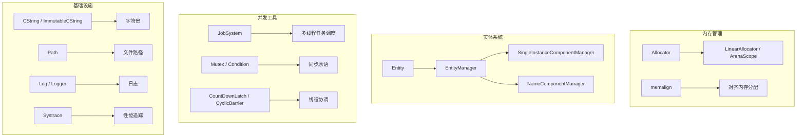

# utils -- 核心工具库

## 模块概述

`utils` 是 Filament 引擎的核心基础工具库，为整个项目提供跨平台的底层基础设施。包括内存分配器、实体系统（ECS）、任务系统、同步原语、字符串工具、路径操作、日志系统、系统追踪等功能。几乎所有 Filament 模块都依赖此库。

## 目录结构

```
libs/utils/
├── CMakeLists.txt                  # 构建配置（含平台条件编译）
├── include/
│   └── utils/
│       ├── Allocator.h             # 线性/区域内存分配器
│       ├── Entity.h                # 轻量实体标识符
│       ├── EntityManager.h         # 实体管理器（ECS 核心）
│       ├── JobSystem.h             # 多线程任务调度系统
│       ├── CString.h              # 引用计数字符串
│       ├── FixedCapacityVector.h   # 固定容量向量
│       ├── StructureOfArrays.h     # SOA 数据布局
│       ├── Log.h / Logger.h        # 日志系统
│       ├── Path.h                  # 跨平台文件路径
│       ├── Mutex.h / Condition.h   # 同步原语
│       ├── Systrace.h              # 系统追踪
│       ├── Hash.h                  # 哈希工具
│       ├── bitset.h                # 位集合
│       ├── compiler.h              # 编译器兼容宏
│       └── ...                     # 更多工具头文件
├── src/
│   ├── Allocator.cpp               # 分配器实现
│   ├── EntityManager.cpp           # 实体管理器实现
│   ├── JobSystem.cpp               # 任务系统实现
│   ├── CString.cpp                 # 字符串实现
│   ├── Path.cpp                    # 路径操作（通用部分）
│   ├── darwin/ linux/ win32/ web/  # 平台特定实现
│   ├── android/                    # Android 特定实现（Systrace/Thermal/PerfHint）
│   └── ...
├── test/                           # 单元测试（25+ 测试文件）
└── benchmark/                      # 性能基准测试
```

## 架构图



## 核心功能

- **内存分配**: `Allocator` 提供线性分配器、区域作用域分配器和对齐内存分配
- **实体系统**: `Entity`/`EntityManager` 实现轻量级 ECS 实体标识和代际管理
- **任务系统**: `JobSystem` 实现基于工作窃取的多线程任务调度
- **字符串工具**: `CString`（引用计数）和 `ImmutableCString`（不可变、可 intern）
- **容器工具**: `FixedCapacityVector`、`StructureOfArrays`、`LruCache`、`bitset` 等
- **同步原语**: 跨平台 `Mutex`、`Condition`、`CountDownLatch`、`CyclicBarrier`
- **文件路径**: 跨平台 `Path` 类，支持 Windows/macOS/Linux/Android/Web
- **日志系统**: `Log`/`Logger` 提供分级日志输出
- **系统追踪**: `Systrace` 集成 Android Systrace 和 Apple signpost

## 依赖关系

| 依赖模块 | 类型 | 说明 |
|---------|------|------|
| `tsl` | PUBLIC | Robin Map 哈希表实现 |
| `getopt` | PUBLIC (条件) | 命令行参数解析（如系统未提供） |
| `log` / `android` | PUBLIC (Android) | Android 日志与系统 API |
| `Shlwapi` | PUBLIC (Windows) | Windows 路径 API |
| `Foundation` | PRIVATE (Apple) | macOS/iOS Foundation 框架 |
| `Threads` | PRIVATE (Linux) | POSIX 线程库 |

## 关键文件说明

### `include/utils/JobSystem.h`
基于工作窃取算法的多线程任务调度系统，是 Filament 引擎并行渲染的基础。支持任务依赖图和并行 for 循环。

### `include/utils/EntityManager.h`
ECS 实体管理器，使用代际索引（generational index）模式管理实体的创建和销毁，支持高效的实体复用。

### `include/utils/Allocator.h`
线性分配器和区域作用域分配器，为渲染帧中的临时分配提供高性能、零碎片化的内存管理。

### `include/utils/StructureOfArrays.h`
SOA（Structure of Arrays）数据布局模板，将组件数据按列存储以优化缓存局部性，是 ECS 组件管理的核心数据结构。
