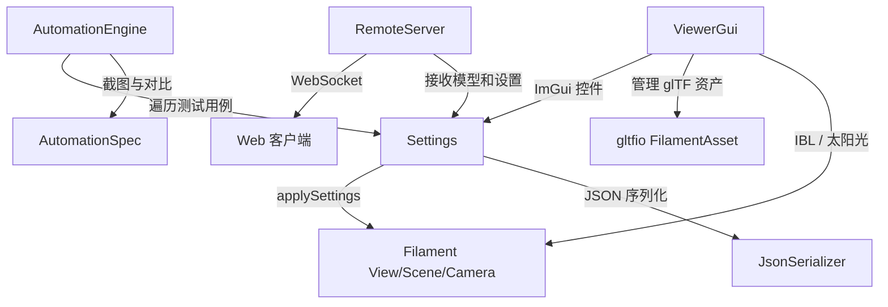

# viewer -- 查看器库

## 模块概述

`viewer` 是 Filament 的 glTF 模型查看器库，提供基于 ImGui 的交互式 UI 控件、渲染设置管理、JSON 序列化/反序列化、自动化测试引擎和远程控制服务器。该库封装了 Filament 视图、光照、材质、后处理等各项参数的管理，支持跨平台使用（包括 Web 端）。

## 目录结构

```
libs/viewer/
├── CMakeLists.txt                      # 构建配置
├── README.md                           # 原始说明文档
├── include/
│   └── viewer/
│       ├── AutomationEngine.h          # 自动化测试引擎
│       ├── AutomationSpec.h            # 自动化测试规格
│       ├── RemoteServer.h              # WebSocket 远程服务器
│       ├── Settings.h                  # 渲染设置数据结构
│       └── ViewerGui.h                # ImGui 查看器界面
├── src/
│   ├── AutomationEngine.cpp
│   ├── AutomationSpec.cpp
│   ├── RemoteServer.cpp
│   ├── Settings.cpp                    # 设置逻辑
│   ├── Settings_generated.cpp/h        # 代码生成的设置序列化
│   ├── ViewerGui.cpp
│   └── jsonParseUtils.h               # JSON 解析工具
└── tests/
    └── test_settings.cpp               # 设置序列化测试
```

## 架构图



## 核心功能

- **ImGui 查看器**: `ViewerGui` 构建完整的侧边栏 UI，控制动画、光照、后处理、材质等参数
- **设置管理**: `Settings` 结构体封装 View、Material、Light、Camera、Animation、Render 等全部渲染设置
- **设置应用**: 多个 `applySettings()` 重载将设置推送到 Filament 的 View、Scene、Camera 等对象
- **JSON 序列化**: `JsonSerializer` 支持设置的 JSON 读写，用于保存/恢复配置
- **色彩分级**: `createColorGrading()` 根据设置创建 `ColorGrading` 对象，支持多种色调映射算法
- **自动化测试**: `AutomationEngine` 遍历设置排列组合，自动截图并对比
- **远程控制**: `RemoteServer` 通过 WebSocket 接收模型数据和设置更新
- **动画控制**: 支持 glTF 动画播放、交叉淡入淡出、变形目标权重调整

## 依赖关系

| 依赖模块 | 类型 | 说明 |
|---------|------|------|
| `filament` | PUBLIC | Filament 渲染引擎核心 |
| `gltfio_core` | PUBLIC | glTF 资产加载与管理 |
| `imgui` | PUBLIC | ImGui 即时模式 GUI 库 |
| `filagui` | PUBLIC | Filament ImGui 集成层 |
| `jsmn` | PUBLIC | 轻量 JSON 解析器 |
| `civetweb` | PUBLIC | HTTP/WebSocket 服务器 |
| `imageio-lite` | PUBLIC | 轻量图像 I/O（截图功能） |

## 关键文件说明

### `include/viewer/Settings.h`
定义了完整的渲染设置体系，包括 `ViewSettings`（视图设置）、`LightSettings`（光照设置）、`ColorGradingSettings`（色彩分级）、`CameraSettings`（相机参数）、`MaterialSettings`（材质属性）等。提供 `applySettings()` 函数族将设置推送到 Filament 对象。

### `include/viewer/ViewerGui.h`
ImGui 查看器界面核心类，管理 glTF 资产的加载、显示和交互。提供动画播放、IBL 调整、后处理开关、抗锯齿选项等完整的查看器功能。

### `include/viewer/AutomationEngine.h`
自动化测试引擎，支持批量模式运行测试用例，自动在每帧间切换设置并截图，用于渲染回归测试。

### `include/viewer/RemoteServer.h`
WebSocket 远程控制服务器，允许 Web 客户端向查看器推送模型文件和设置数据，支持消息队列管理。
