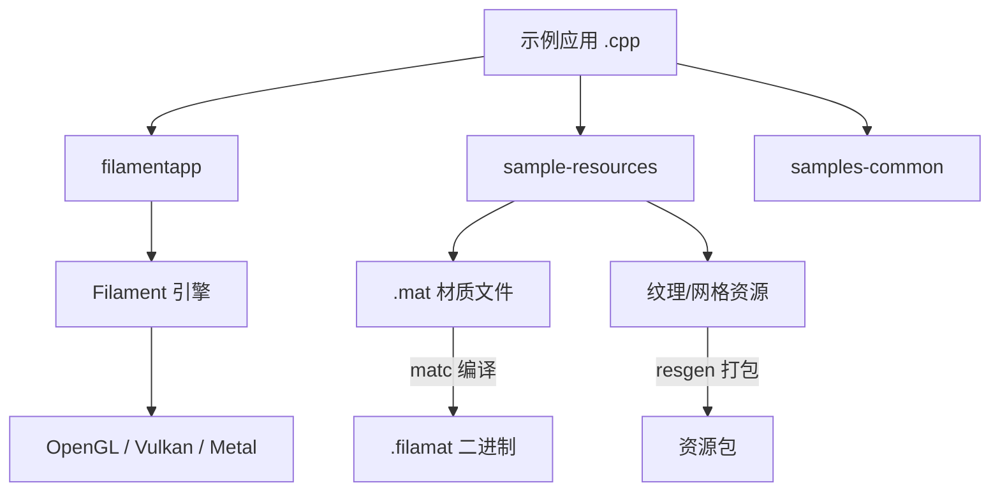

# 示例应用 (`samples/`)

## 模块概述

`samples/` 目录包含 Filament 渲染引擎的桌面端示例应用集合。这些示例使用 C++ 编写，演示了 Filament 的各种渲染功能，从基础三角形绘制到完整的 PBR 材质、glTF 模型查看、骨骼动画、阴影测试等高级特性。构建系统基于 CMake，编译的材质和资源通过 `resgen` 打包。

## 目录结构

```
samples/
├── CMakeLists.txt              # CMake 构建脚本 (定义所有示例目标)
├── common/                     # 示例公共工具
│   ├── arguments.cpp           # 命令行参数解析
│   ├── configuration.h/cpp     # 配置管理
├── materials/                  # 示例材质定义 (.mat 文件, 26个)
│   ├── sandboxLit.mat          # 标准 PBR 光照材质
│   ├── sandboxCloth.mat        # 布料着色模型
│   ├── sandboxSubsurface.mat   # 次表面散射材质
│   ├── heightfield.mat         # 高度场材质
│   └── ...
├── hellotriangle.cpp           # 最基础的三角形渲染
├── hellopbr.cpp                # PBR 材质渲染入门
├── suzanne.cpp                 # Suzanne 猴头完整 PBR 示例
├── gltf_viewer.cpp             # glTF 2.0 模型查看器
├── material_sandbox.cpp        # 材质参数实时调试
├── animation.cpp               # 骨骼动画示例
├── shadowtest.cpp              # 阴影渲染测试
├── hellomorphing.cpp           # 顶点变形动画
├── helloskinning.cpp           # 骨骼蒙皮动画
├── hellostereo.cpp             # 立体渲染 (VR)
├── multiple_windows.cpp        # 多窗口渲染
├── depthtesting.cpp            # 深度测试示例
├── rendertarget.cpp            # 离屏渲染目标
├── sample_cloth.cpp            # 布料渲染
├── sample_full_pbr.cpp         # 完整 PBR 流程
├── sample_normal_map.cpp       # 法线贴图
└── ...                         # 共计 30+ 个示例
```

## 架构图



## 核心功能

- **基础渲染**: `hellotriangle` 演示最小化的 Filament 渲染管线设置
- **PBR 材质**: `hellopbr`、`suzanne`、`sample_full_pbr` 展示完整的基于物理的渲染
- **材质调试**: `material_sandbox` 提供实时材质参数调整界面
- **glTF 支持**: `gltf_viewer` 和 `gltf_instances` 支持加载和查看 glTF 2.0 模型
- **动画系统**: 涵盖骨骼蒙皮 (`helloskinning`)、顶点变形 (`hellomorphing`)、UV 变形等
- **高级渲染**: 阴影测试、深度测试、离屏渲染、多窗口、立体渲染 (VR)
- **资源管线**: CMake 集成 `matc` (材质编译)、`cmgen` (环境贴图)、`mipgen` (Mip 生成)、`filamesh` (网格转换)

## 依赖关系

| 依赖模块 | 说明 |
|---------|------|
| `filament/` | 核心渲染引擎 |
| `libs/filamentapp/` | 示例应用框架 (窗口管理、事件循环) |
| `libs/filameshio/` | Filamesh 网格文件读取 |
| `libs/gltfio/` | glTF 2.0 资产加载 |
| `libs/viewer/` | 查看器 UI 组件 |
| `libs/imageio/` | 图像文件读写 |
| `libs/geometry/` | 几何工具 |
| `tools/matc` | 材质编译工具 |
| `tools/cmgen` | 环境贴图生成工具 |
| `assets/` | 3D 模型和环境资源 |

## 关键文件说明

| 文件 | 说明 |
|-----|------|
| `CMakeLists.txt` | 定义 30+ 个示例目标的构建逻辑，包含材质编译、资源打包、环境贴图生成的完整管线 |
| `gltf_viewer.cpp` | 功能最完整的示例，集成 glTF 加载、IBL 光照、地面阴影、Overdraw 可视化 |
| `material_sandbox.cpp/h` | 材质参数实时调试工具，支持多种着色模型切换 |
| `materials/sandboxLit.mat` | 标准 PBR 光照材质定义，展示 Filament 材质格式语法 |
| `hellotriangle.cpp` | 入门级示例，展示 Engine、SwapChain、Renderer、View 的最小化使用方式 |
| `common/arguments.cpp` | 公共命令行参数处理，被所有示例共享 |
