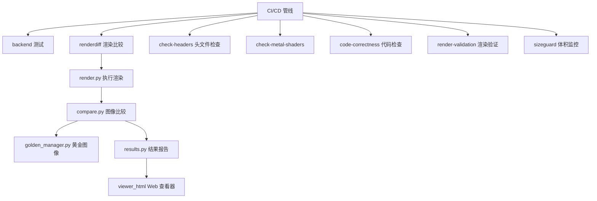

# 测试基础设施 (`test/`)

## 模块概述

`test/` 目录包含 Filament 项目的测试基础设施和自动化测试工具集。涵盖后端功能测试、渲染差异比较 (renderdiff)、代码正确性检查、Metal 着色器验证、头文件一致性检查、渲染验证和二进制体积监控等多个维度的质量保障工具。

## 目录结构

```
test/
├── backend/                    # 图形后端测试
│   ├── test.sh                 # 后端测试入口脚本
│   └── README.md               # 测试说明
├── renderdiff/                 # 渲染差异比较系统
│   ├── generate.sh             # 黄金图像生成脚本
│   ├── local_test.sh           # 本地渲染测试脚本
│   ├── README.md               # 系统说明
│   ├── src/
│   │   ├── render.py           # 渲染执行器
│   │   ├── compare.py          # 图像差异比较
│   │   ├── golden_manager.py   # 黄金图像管理
│   │   ├── results.py          # 测试结果处理
│   │   ├── test_config.py      # 测试配置定义
│   │   ├── update_golden.py    # 黄金图像更新工具
│   │   ├── viewer.py           # 结果查看器
│   │   ├── commit_msg.py       # 提交信息生成
│   │   ├── utils.py            # 通用工具函数
│   │   └── viewer_html/        # Web 查看器界面
│   │       ├── index.html
│   │       ├── app.js
│   │       └── ...
│   └── tests/                  # 测试用例目录
├── render-validation/          # 渲染验证工具
│   ├── validation_app.py       # 验证应用
│   └── requirements.txt        # Python 依赖
├── check-headers/              # 头文件一致性检查
│   └── test.sh
├── check-metal-shaders/        # Metal 着色器验证
│   └── test.sh
├── code-correctness/           # 代码正确性检查
│   ├── test.sh
│   └── src/
│       ├── run.py              # 检查执行器
│       └── utils.py
└── sizeguard/                  # 二进制体积监控
```

## 架构图



## 核心功能

- **渲染差异比较 (renderdiff)**: 对比当前渲染输出与黄金基准图像，检测视觉回归问题
- **后端测试 (backend)**: 验证 OpenGL、Vulkan、Metal 等图形后端的功能正确性
- **Metal 着色器验证**: 专门检查 Metal 着色器的编译和正确性
- **头文件检查**: 验证公开头文件的自包含性和一致性
- **代码正确性**: 基于 Python 的静态代码质量检查
- **渲染验证**: 验证渲染输出在不同平台和配置下的正确性
- **体积监控 (sizeguard)**: 追踪构建产物的二进制大小变化
- **Web 结果查看器**: 提供 HTML/JS 界面可视化查看渲染对比结果

## 依赖关系

| 依赖模块 | 说明 |
|---------|------|
| `filament/` | 被测试的核心渲染引擎 |
| `tools/` | 构建工具 (matc 等) |
| Python 3 | 测试脚本运行环境 |
| PIL/Pillow | 图像比较的 Python 库 |
| Bash | Shell 测试脚本 |

## 关键文件说明

| 文件 | 说明 |
|-----|------|
| `renderdiff/src/render.py` | 渲染差异测试的核心执行器，调用 Filament 渲染场景并捕获输出 |
| `renderdiff/src/compare.py` | 像素级图像差异比较器，计算渲染输出与黄金图像的偏差 |
| `renderdiff/src/golden_manager.py` | 管理黄金基准图像的存储、检索和更新 |
| `renderdiff/src/viewer_html/` | 基于 Web 的测试结果可视化查看器 |
| `backend/test.sh` | 图形后端 (Vulkan/Metal/GL) 功能测试入口 |
| `code-correctness/src/run.py` | 代码静态检查执行器，检查编码规范和潜在问题 |
| `render-validation/validation_app.py` | 渲染结果验证应用，检查渲染输出的正确性 |
