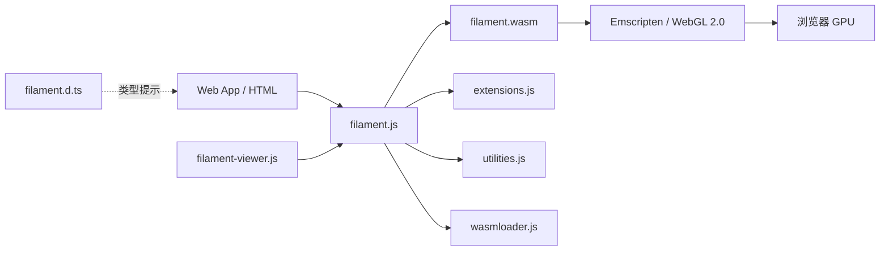

# Web/JavaScript 绑定 (`web/`)

## 模块概述

`web/` 目录包含 Filament 渲染引擎的 WebAssembly (WASM) 绑定和 JavaScript API 封装。通过 Emscripten 将 C++ 引擎编译为 WASM 模块，提供完整的 TypeScript 类型定义，使 Web 开发者能在浏览器中使用 Filament 进行高质量 3D 渲染。

## 目录结构

```
web/
├── docs/                           # API 文档
│   └── tutorial_triangle.md (等)
├── filament-js/                    # 核心 JS/WASM 绑定
│   ├── package.json                # npm 包配置 (v1.70.0)
│   ├── filament.d.ts               # TypeScript 类型定义
│   ├── jsbindings.cpp              # 手写 Embind C++ 绑定
│   ├── jsbindings_generated.cpp    # 自动生成的 Embind 绑定
│   ├── jsenums.cpp                 # 手写枚举绑定
│   ├── jsenums_generated.cpp       # 自动生成的枚举绑定
│   ├── extensions.js               # 手写 JS 扩展方法
│   ├── extensions_generated.js     # 自动生成的 JS 扩展
│   ├── utilities.js                # JS 工具函数
│   ├── wasmloader.js               # WASM 模块加载器
│   ├── filament-viewer.js          # 内置 glTF 查看器组件
│   ├── CMakeLists.txt              # Emscripten 构建配置
│   ├── test.ts                     # TypeScript 类型测试
│   └── README.md                   # 使用说明
└── samples/                        # Web 示例
    ├── triangle.html               # 基础三角形
    ├── helmet.html                 # DamagedHelmet glTF 模型
    ├── suzanne.html                # Suzanne 猴头模型
    ├── animation.html              # 骨骼动画
    ├── skinning.html               # 蒙皮动画
    ├── morphing.html               # 变形动画
    ├── parquet.html                # 地板材质展示
    └── remote.html                 # 远程模型加载
```

## 架构图



## 核心功能

- **WASM 编译**: 通过 Emscripten 将 Filament C++ 引擎编译为 WebAssembly，运行在 WebGL 2.0 上
- **Embind 绑定**: 使用 Emscripten 的 Embind 机制将 C++ 类和方法暴露给 JavaScript
- **TypeScript 支持**: 提供完整的 `filament.d.ts` 类型定义文件，支持 IDE 智能提示
- **资产异步加载**: `wasmloader.js` 提供 WASM 模块和资产文件的异步加载与初始化
- **glTF 查看器**: `filament-viewer.js` 提供开箱即用的 glTF 模型查看组件
- **gl-matrix 集成**: 依赖 `gl-matrix` 库进行矩阵和向量运算
- **npm 发布**: 作为 `filament` npm 包发布，支持 CDN (jsdelivr/unpkg) 直接引用

## 依赖关系

| 依赖模块 | 说明 |
|---------|------|
| `filament/` | 核心渲染引擎 C++ 源码 |
| `libs/gltfio/` | glTF 资产加载 |
| `libs/filamat/` | 材质编译 |
| Emscripten SDK | WASM 编译工具链 |
| `gl-matrix` | JavaScript 矩阵/向量数学库 (npm) |

## 关键文件说明

| 文件 | 说明 |
|-----|------|
| `filament-js/jsbindings.cpp` | 核心绑定文件，使用 Embind 将 Engine、Scene、Renderer 等 C++ 类暴露给 JS |
| `filament-js/jsbindings_generated.cpp` | 由代码生成器自动生成的绑定代码 |
| `filament-js/filament.d.ts` | 完整的 TypeScript 类型声明，定义所有公开 API 的类型签名 |
| `filament-js/wasmloader.js` | WASM 模块的异步加载和初始化逻辑 |
| `filament-js/extensions.js` | 为 JS 对象添加便捷扩展方法 (如 Buffer 创建快捷方式) |
| `filament-js/CMakeLists.txt` | Emscripten 构建配置，定义编译标志和链接的 Filament 库 |
| `filament-js/package.json` | npm 包元数据，定义版本号、入口文件和发布文件列表 |
